<!-- Generated from benchmark-results/latest.json. Run `pnpm turbo run generate-performance --filter=docs` to update. -->

These results compare QRCodeSDK with **qrcode** and three **qrcode-generator** encoder configurations. Benchmarks are environment-specific and should be read as relative comparisons, not universal guarantees.

All **qrcode-generator** rows use the repository patch that applies each fixture's explicit mask and skips automatic mask evaluation. The **default** row uses the package's stock low-byte converter, **TextEncoder** uses the platform encoder, and **bundled UTF-8** uses the package's handwritten UTF-8 converter. The default converter truncates UTF-16 code units, so its Unicode byte fixtures do not encode content equivalent to the other rows. TextEncoder and bundled UTF-8 produce the same bytes for the valid Unicode fixtures.

## Benchmark environment

- Generated: `2026-08-03T15:39:38.334Z`
- Runtime: `v24.19.0` on `linux x64`
- CPU: `AMD Ryzen 7 3700X 8-Core Processor` (16 logical cores)
- Libraries: `qrcodesdk@0.0.1`, `qrcode@1.5.4`, `qrcode-generator-default@2.0.4`, `qrcode-generator@2.0.4`, `qrcode-generator-utf8@2.0.4`
- Samples: 5 timed samples after 5 static warm-up passes and 1 exhaustive warm-up pass
- SVG output: 4 px/module with a 4-module quiet zone

The charts show relative median time, where lower is better and QRCodeSDK is fixed at `1.00×`. Expand the exact benchmark data beneath each section for median time, min–max range, and throughput calculated from the median.

## Matrix generation

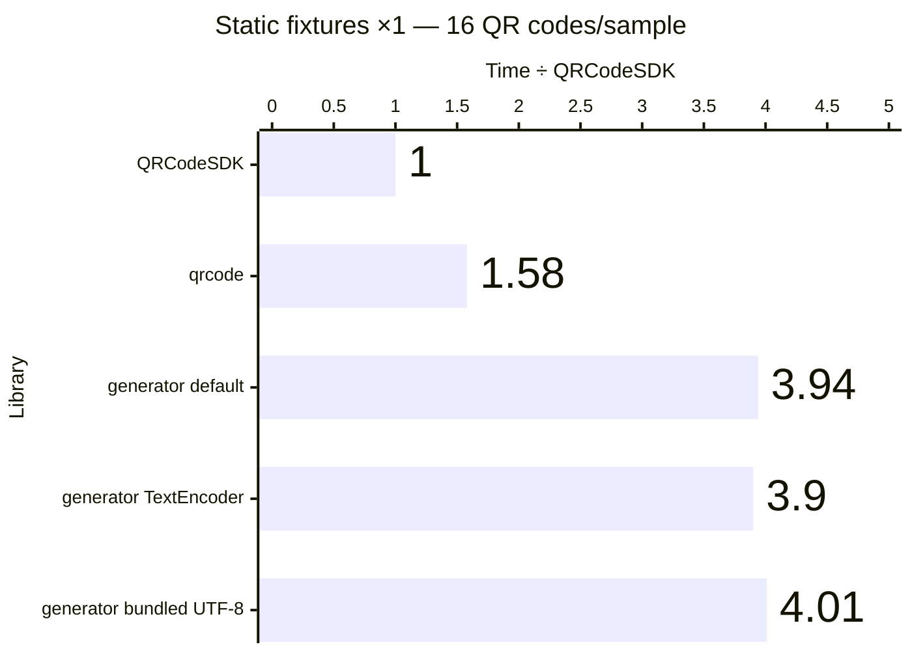

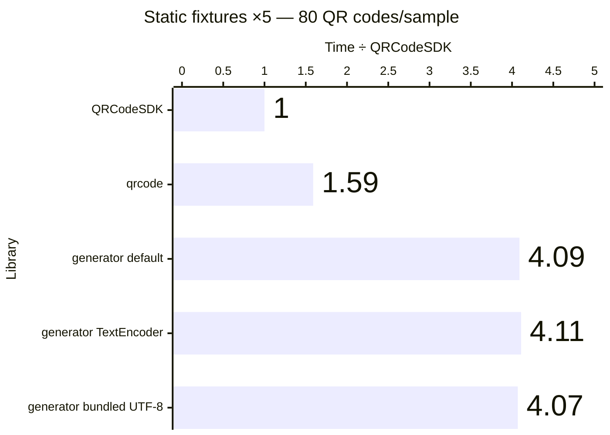

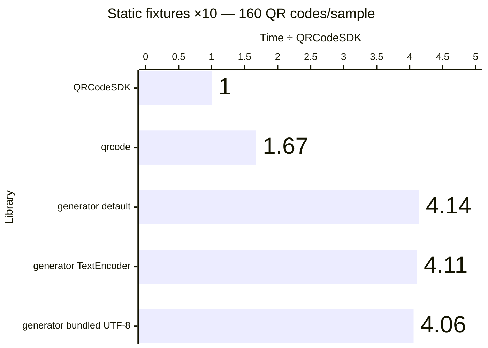

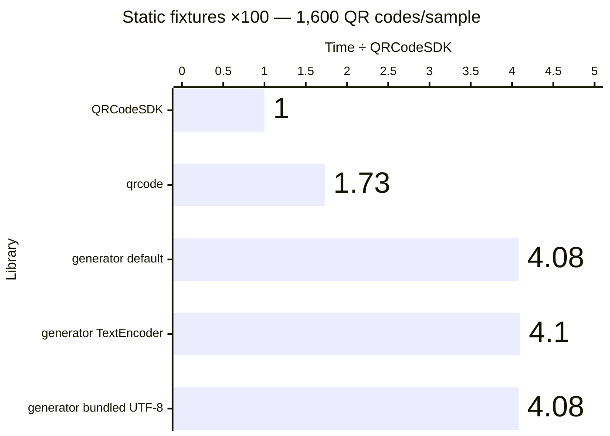

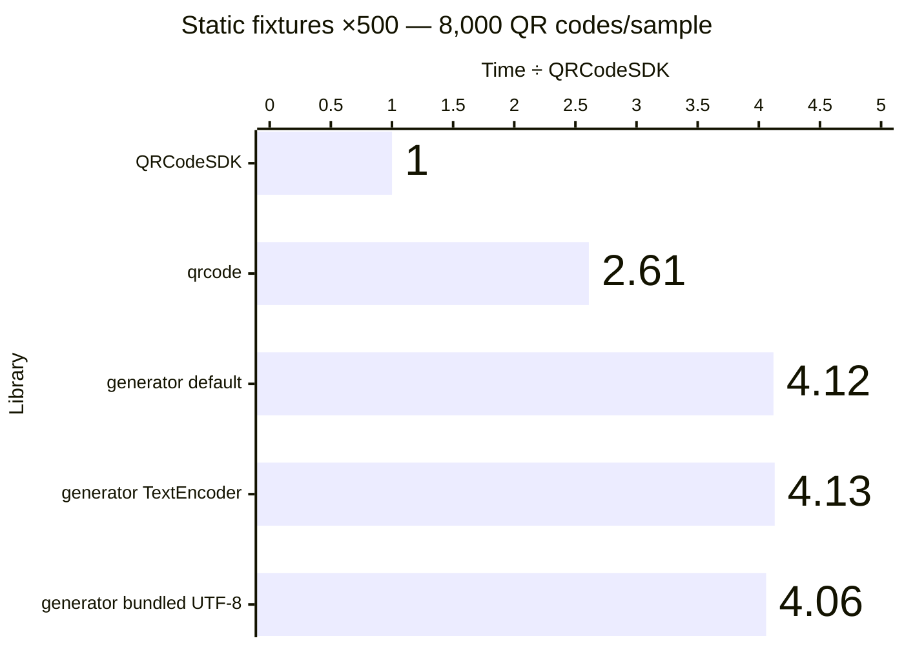

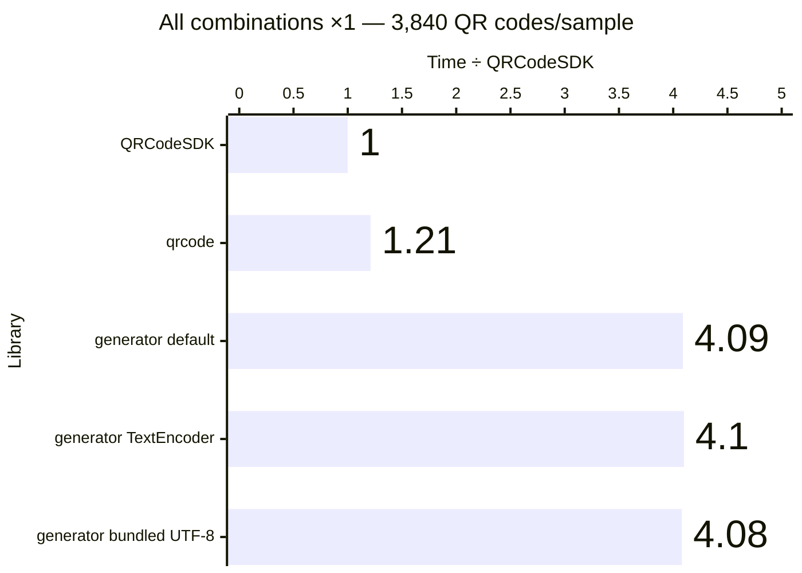

Exact benchmark data

| Workload             | QR codes/sample | Library                                 | Median (ms) |      Min–max (ms) | QR codes/second | Time ÷ QRCodeSDK |
| -------------------- | --------------: | --------------------------------------- | ----------: | ----------------: | --------------: | ---------------: |
| Static fixtures ×1   |              16 | QRCodeSDK v0.0.1                        |       2.866 |       2.777–3.427 |           5,582 |            1.00× |
| Static fixtures ×1   |              16 | qrcode v1.5.4                           |       4.537 |       4.370–5.246 |           3,527 |            1.58× |
| Static fixtures ×1   |              16 | qrcode-generator (default) v2.0.4       |      11.286 |     11.018–11.365 |           1,418 |            3.94× |
| Static fixtures ×1   |              16 | qrcode-generator (TextEncoder) v2.0.4   |      11.187 |     11.083–11.484 |           1,430 |            3.90× |
| Static fixtures ×1   |              16 | qrcode-generator (bundled UTF-8) v2.0.4 |      11.482 |     10.969–11.627 |           1,393 |            4.01× |
| Static fixtures ×5   |              80 | QRCodeSDK v0.0.1                        |      13.753 |     13.669–14.030 |           5,817 |            1.00× |
| Static fixtures ×5   |              80 | qrcode v1.5.4                           |      21.851 |     21.734–23.266 |           3,661 |            1.59× |
| Static fixtures ×5   |              80 | qrcode-generator (default) v2.0.4       |      56.313 |     55.520–61.216 |           1,421 |            4.09× |
| Static fixtures ×5   |              80 | qrcode-generator (TextEncoder) v2.0.4   |      56.508 |     56.320–60.125 |           1,416 |            4.11× |
| Static fixtures ×5   |              80 | qrcode-generator (bundled UTF-8) v2.0.4 |      55.971 |     55.076–56.843 |           1,429 |            4.07× |
| Static fixtures ×10  |             160 | QRCodeSDK v0.0.1                        |      27.399 |     27.366–27.605 |           5,840 |            1.00× |
| Static fixtures ×10  |             160 | qrcode v1.5.4                           |      45.800 |     44.873–47.517 |           3,493 |            1.67× |
| Static fixtures ×10  |             160 | qrcode-generator (default) v2.0.4       |     113.412 |   112.077–115.158 |           1,411 |            4.14× |
| Static fixtures ×10  |             160 | qrcode-generator (TextEncoder) v2.0.4   |     112.600 |   111.679–114.461 |           1,421 |            4.11× |
| Static fixtures ×10  |             160 | qrcode-generator (bundled UTF-8) v2.0.4 |     111.339 |   110.996–112.360 |           1,437 |            4.06× |
| Static fixtures ×100 |           1,600 | QRCodeSDK v0.0.1                        |     274.948 |   273.460–328.763 |           5,819 |            1.00× |
| Static fixtures ×100 |           1,600 | qrcode v1.5.4                           |     474.766 |   472.106–588.395 |           3,370 |            1.73× |
| Static fixtures ×100 |           1,600 | qrcode-generator (default) v2.0.4       |    1121.267 | 1112.977–1220.036 |           1,427 |            4.08× |
| Static fixtures ×100 |           1,600 | qrcode-generator (TextEncoder) v2.0.4   |    1126.766 | 1119.904–1139.869 |           1,420 |            4.10× |
| Static fixtures ×100 |           1,600 | qrcode-generator (bundled UTF-8) v2.0.4 |    1122.087 | 1111.648–1154.516 |           1,426 |            4.08× |
| Static fixtures ×500 |           8,000 | QRCodeSDK v0.0.1                        |    1372.356 | 1367.448–1397.900 |           5,829 |            1.00× |
| Static fixtures ×500 |           8,000 | qrcode v1.5.4                           |    3583.740 | 3319.557–4032.701 |           2,232 |            2.61× |
| Static fixtures ×500 |           8,000 | qrcode-generator (default) v2.0.4       |    5656.755 | 5577.567–5687.318 |           1,414 |            4.12× |
| Static fixtures ×500 |           8,000 | qrcode-generator (TextEncoder) v2.0.4   |    5663.113 | 5607.343–5689.634 |           1,413 |            4.13× |
| Static fixtures ×500 |           8,000 | qrcode-generator (bundled UTF-8) v2.0.4 |    5567.084 | 5561.776–5636.328 |           1,437 |            4.06× |
| All combinations ×1  |           3,840 | QRCodeSDK v0.0.1                        |    1018.807 | 1012.780–1024.605 |           3,769 |            1.00× |
| All combinations ×1  |           3,840 | qrcode v1.5.4                           |    1229.959 | 1099.938–1246.023 |           3,122 |            1.21× |
| All combinations ×1  |           3,840 | qrcode-generator (default) v2.0.4       |    4165.604 | 4152.917–4197.176 |             922 |            4.09× |
| All combinations ×1  |           3,840 | qrcode-generator (TextEncoder) v2.0.4   |    4176.569 | 4151.119–4210.150 |             919 |            4.10× |
| All combinations ×1  |           3,840 | qrcode-generator (bundled UTF-8) v2.0.4 |    4158.805 | 4143.568–4301.101 |             923 |            4.08× |

## SVG generation

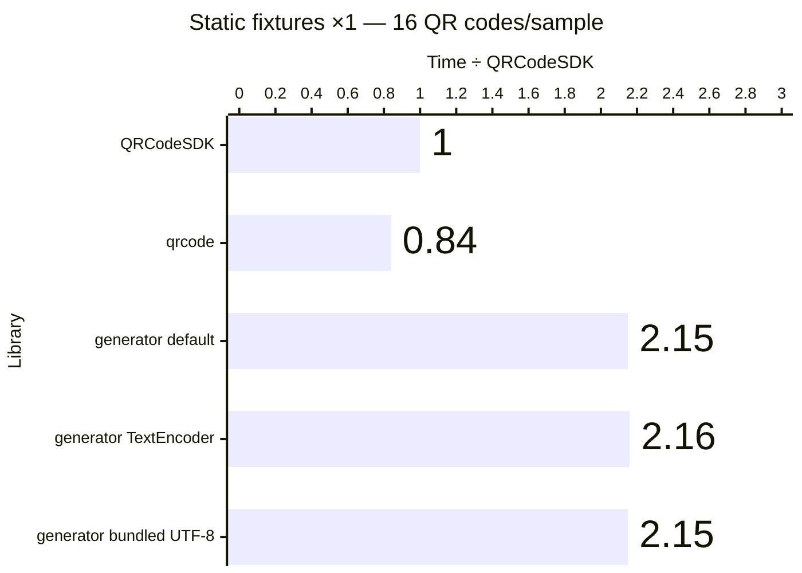

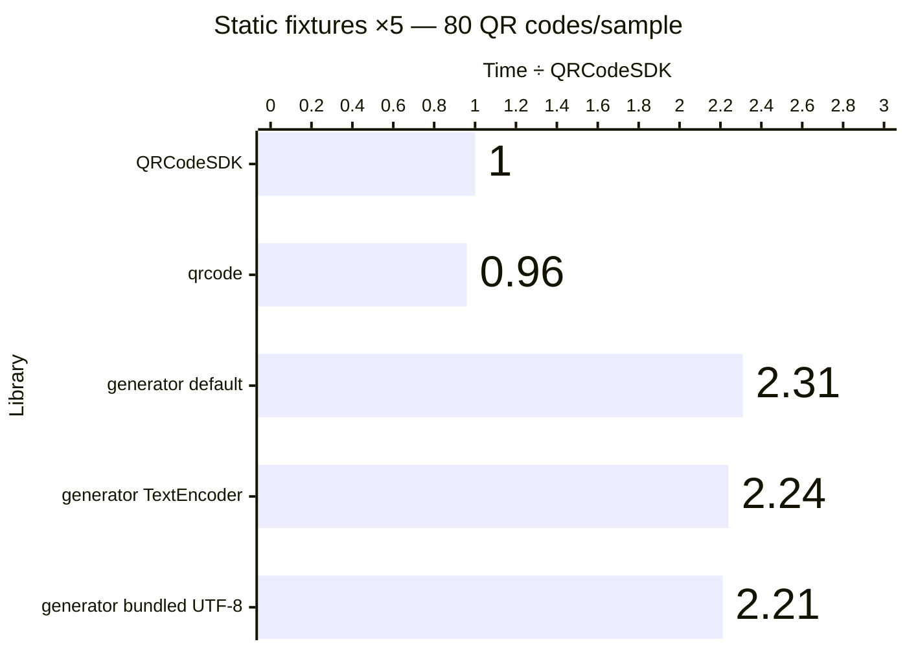

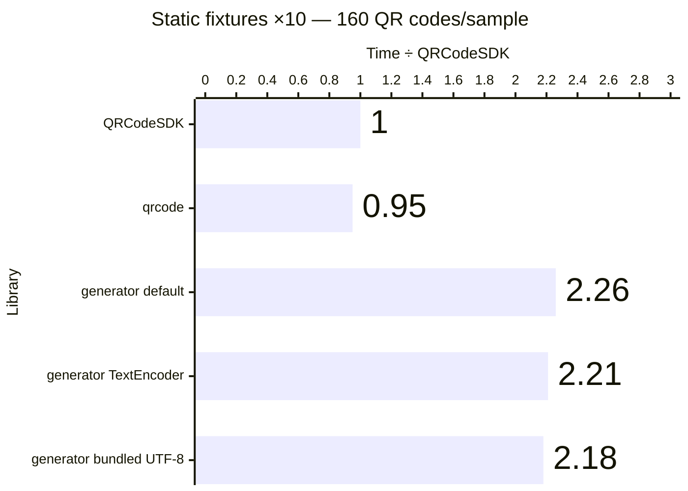

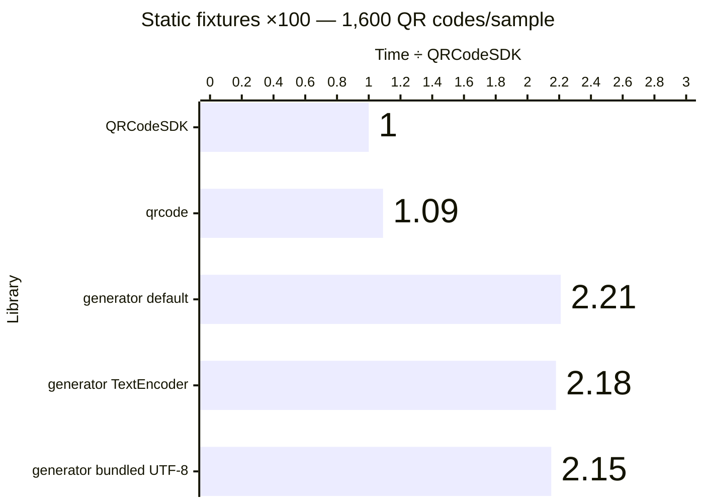

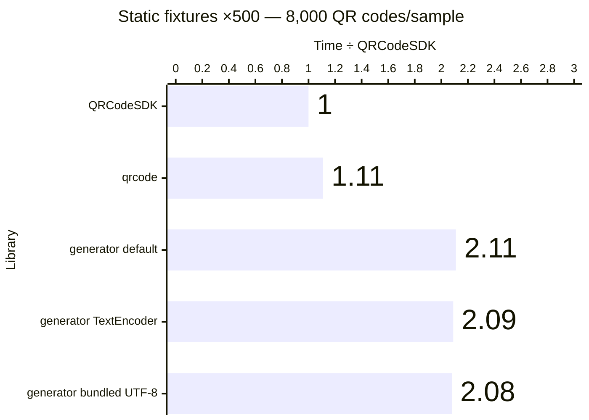

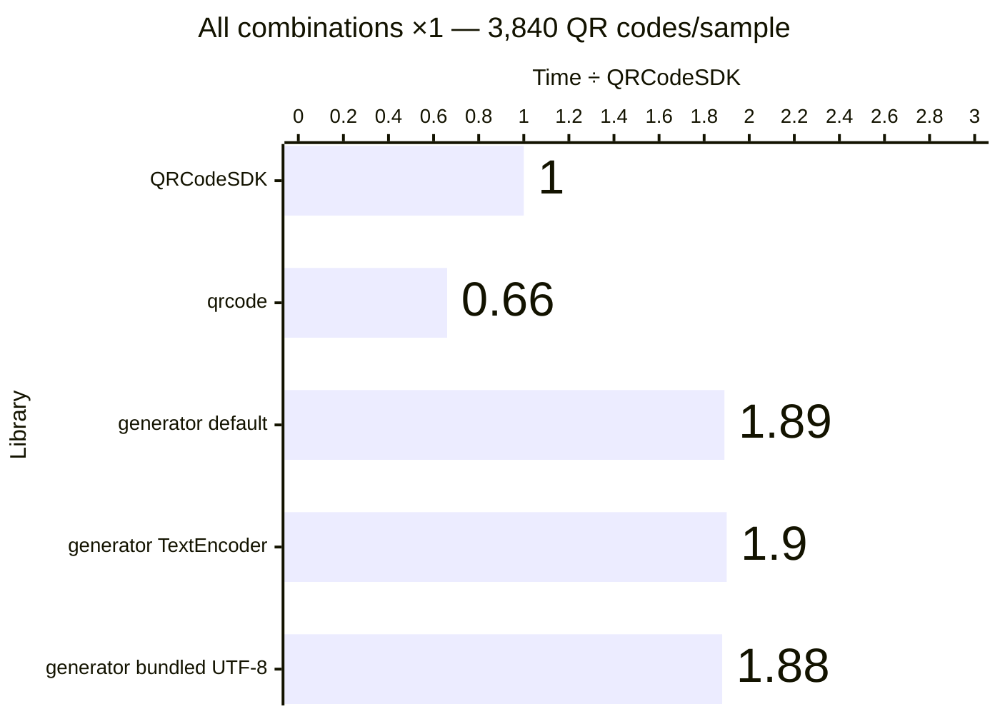

Exact benchmark data

| Workload             | QR codes/sample | Library                                 | Median (ms) |      Min–max (ms) | QR codes/second | Time ÷ QRCodeSDK |
| -------------------- | --------------: | --------------------------------------- | ----------: | ----------------: | --------------: | ---------------: |
| Static fixtures ×1   |              16 | QRCodeSDK v0.0.1                        |       6.686 |       6.058–7.229 |           2,393 |            1.00× |
| Static fixtures ×1   |              16 | qrcode v1.5.4                           |       5.588 |       5.502–5.735 |           2,863 |            0.84× |
| Static fixtures ×1   |              16 | qrcode-generator (default) v2.0.4       |      14.350 |     13.422–15.105 |           1,115 |            2.15× |
| Static fixtures ×1   |              16 | qrcode-generator (TextEncoder) v2.0.4   |      14.414 |     13.792–15.862 |           1,110 |            2.16× |
| Static fixtures ×1   |              16 | qrcode-generator (bundled UTF-8) v2.0.4 |      14.373 |     14.166–16.084 |           1,113 |            2.15× |
| Static fixtures ×5   |              80 | QRCodeSDK v0.0.1                        |      30.488 |     30.147–31.684 |           2,624 |            1.00× |
| Static fixtures ×5   |              80 | qrcode v1.5.4                           |      29.344 |     28.418–30.768 |           2,726 |            0.96× |
| Static fixtures ×5   |              80 | qrcode-generator (default) v2.0.4       |      70.501 |     69.087–74.433 |           1,135 |            2.31× |
| Static fixtures ×5   |              80 | qrcode-generator (TextEncoder) v2.0.4   |      68.232 |     67.527–72.683 |           1,172 |            2.24× |
| Static fixtures ×5   |              80 | qrcode-generator (bundled UTF-8) v2.0.4 |      67.239 |     67.149–69.780 |           1,190 |            2.21× |
| Static fixtures ×10  |             160 | QRCodeSDK v0.0.1                        |      62.406 |     61.088–62.921 |           2,564 |            1.00× |
| Static fixtures ×10  |             160 | qrcode v1.5.4                           |      59.357 |     56.626–70.798 |           2,696 |            0.95× |
| Static fixtures ×10  |             160 | qrcode-generator (default) v2.0.4       |     141.092 |   137.626–176.802 |           1,134 |            2.26× |
| Static fixtures ×10  |             160 | qrcode-generator (TextEncoder) v2.0.4   |     137.881 |   135.404–146.467 |           1,160 |            2.21× |
| Static fixtures ×10  |             160 | qrcode-generator (bundled UTF-8) v2.0.4 |     136.034 |   134.762–145.862 |           1,176 |            2.18× |
| Static fixtures ×100 |           1,600 | QRCodeSDK v0.0.1                        |     646.125 |   636.593–650.992 |           2,476 |            1.00× |
| Static fixtures ×100 |           1,600 | qrcode v1.5.4                           |     707.374 |   675.279–737.249 |           2,262 |            1.09× |
| Static fixtures ×100 |           1,600 | qrcode-generator (default) v2.0.4       |    1425.556 | 1383.182–1441.510 |           1,122 |            2.21× |
| Static fixtures ×100 |           1,600 | qrcode-generator (TextEncoder) v2.0.4   |    1405.792 | 1381.202–1572.048 |           1,138 |            2.18× |
| Static fixtures ×100 |           1,600 | qrcode-generator (bundled UTF-8) v2.0.4 |    1386.345 | 1377.800–1406.379 |           1,154 |            2.15× |
| Static fixtures ×500 |           8,000 | QRCodeSDK v0.0.1                        |    3303.852 | 3211.391–3359.332 |           2,421 |            1.00× |
| Static fixtures ×500 |           8,000 | qrcode v1.5.4                           |    3672.086 | 3647.899–4032.162 |           2,179 |            1.11× |
| Static fixtures ×500 |           8,000 | qrcode-generator (default) v2.0.4       |    6968.085 | 6910.791–7194.710 |           1,148 |            2.11× |
| Static fixtures ×500 |           8,000 | qrcode-generator (TextEncoder) v2.0.4   |    6909.480 | 6831.413–7214.761 |           1,158 |            2.09× |
| Static fixtures ×500 |           8,000 | qrcode-generator (bundled UTF-8) v2.0.4 |    6876.602 | 6824.061–6975.016 |           1,163 |            2.08× |
| All combinations ×1  |           3,840 | QRCodeSDK v0.0.1                        |    2827.653 | 2778.215–2859.712 |           1,358 |            1.00× |
| All combinations ×1  |           3,840 | qrcode v1.5.4                           |    1877.959 | 1808.568–1966.021 |           2,045 |            0.66× |
| All combinations ×1  |           3,840 | qrcode-generator (default) v2.0.4       |    5333.475 | 5254.850–5463.411 |             720 |            1.89× |
| All combinations ×1  |           3,840 | qrcode-generator (TextEncoder) v2.0.4   |    5374.008 | 5233.207–5591.342 |             715 |            1.90× |
| All combinations ×1  |           3,840 | qrcode-generator (bundled UTF-8) v2.0.4 |    5317.934 | 5258.342–5541.589 |             722 |            1.88× |

