<!-- Generated from benchmark-results/latest.json. Run `pnpm turbo run generate-performance --filter=docs` to update. -->

These results compare QRCodeSDK with **qrcode** and three **qrcode-generator** encoder configurations. Benchmarks are environment-specific and should be read as relative comparisons, not universal guarantees.

All **qrcode-generator** rows use the repository patch that applies each fixture's explicit mask and skips automatic mask evaluation. The **default** row uses the package's stock low-byte converter, **TextEncoder** uses the platform encoder, and **bundled UTF-8** uses the package's handwritten UTF-8 converter. The default converter truncates UTF-16 code units, so its Unicode byte fixtures do not encode content equivalent to the other rows. TextEncoder and bundled UTF-8 produce the same bytes for the valid Unicode fixtures.

## Benchmark environment

- Generated: `2026-08-03T14:50:26.611Z`
- Runtime: `v24.19.0` on `linux x64`
- CPU: `AMD Ryzen 7 3700X 8-Core Processor` (16 logical cores)
- Libraries: `qrcodesdk@0.0.1`, `qrcode@1.5.4`, `qrcode-generator-default@2.0.4`, `qrcode-generator@2.0.4`, `qrcode-generator-utf8@2.0.4`
- Samples: 5 timed samples after 5 static warm-up passes and 1 exhaustive warm-up pass
- SVG output: 4 px/module with a 4-module quiet zone

The charts show relative median time, where lower is better and QRCodeSDK is fixed at `1.00×`. Expand the exact benchmark data beneath each section for median time, min–max range, and throughput calculated from the median.

## Matrix generation

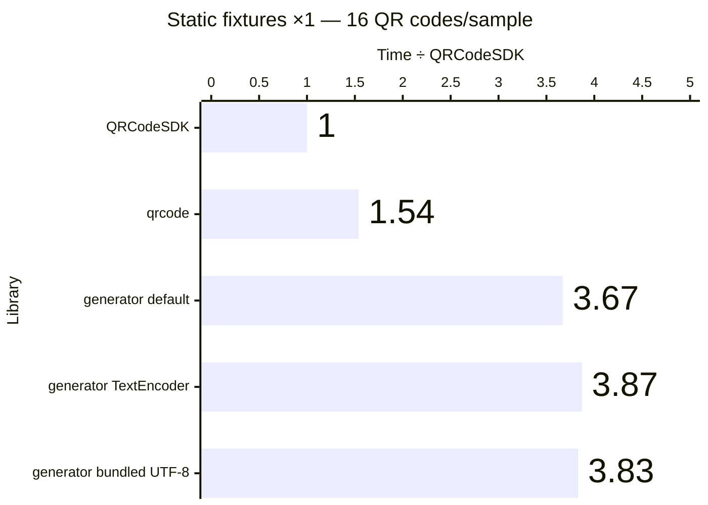

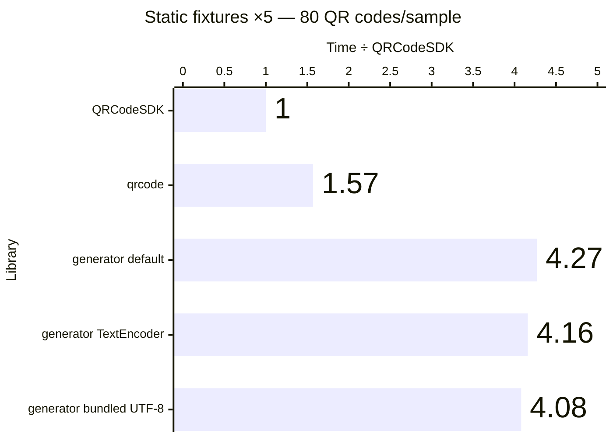

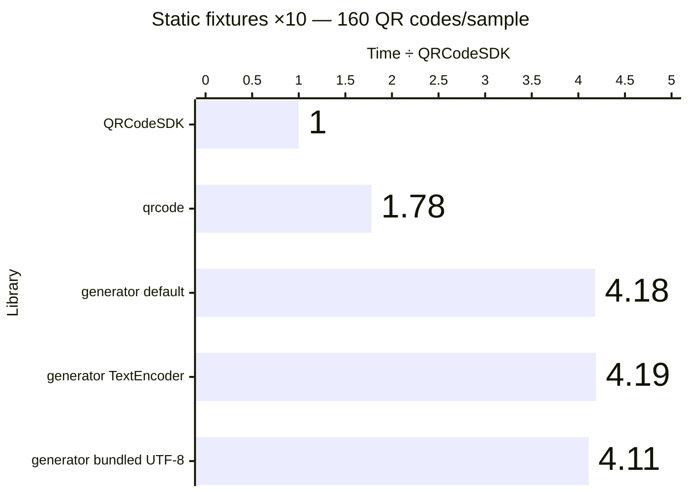

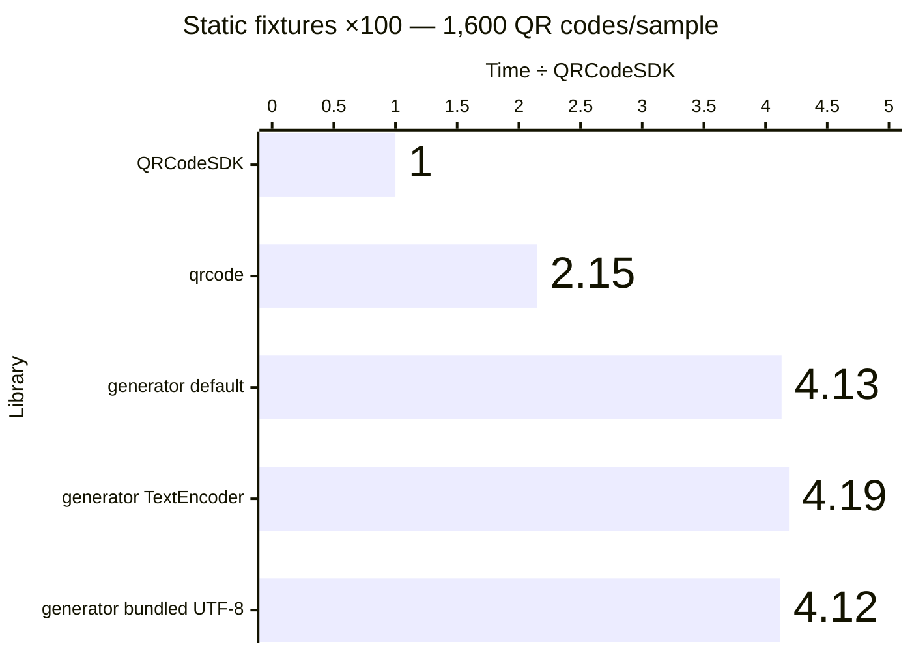

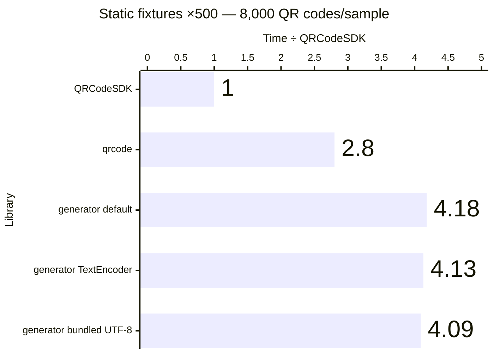

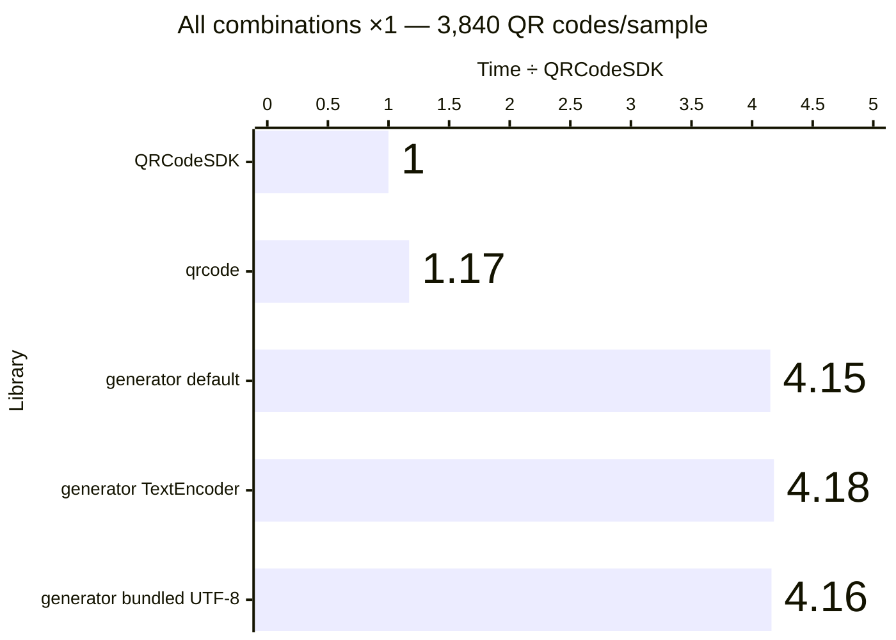

Exact benchmark data

| Workload             | QR codes/sample | Library                                 | Median (ms) |      Min–max (ms) | QR codes/second | Time ÷ QRCodeSDK |
| -------------------- | --------------: | --------------------------------------- | ----------: | ----------------: | --------------: | ---------------: |
| Static fixtures ×1   |              16 | QRCodeSDK v0.0.1                        |       3.003 |       2.730–3.574 |           5,328 |            1.00× |
| Static fixtures ×1   |              16 | qrcode v1.5.4                           |       4.615 |       4.404–5.240 |           3,467 |            1.54× |
| Static fixtures ×1   |              16 | qrcode-generator (default) v2.0.4       |      11.025 |     10.904–11.205 |           1,451 |            3.67× |
| Static fixtures ×1   |              16 | qrcode-generator (TextEncoder) v2.0.4   |      11.629 |     11.085–12.346 |           1,376 |            3.87× |
| Static fixtures ×1   |              16 | qrcode-generator (bundled UTF-8) v2.0.4 |      11.488 |     10.979–11.703 |           1,393 |            3.83× |
| Static fixtures ×5   |              80 | QRCodeSDK v0.0.1                        |      13.634 |     13.400–14.601 |           5,868 |            1.00× |
| Static fixtures ×5   |              80 | qrcode v1.5.4                           |      21.421 |     21.274–21.781 |           3,735 |            1.57× |
| Static fixtures ×5   |              80 | qrcode-generator (default) v2.0.4       |      58.243 |     55.437–58.640 |           1,374 |            4.27× |
| Static fixtures ×5   |              80 | qrcode-generator (TextEncoder) v2.0.4   |      56.703 |     55.982–58.899 |           1,411 |            4.16× |
| Static fixtures ×5   |              80 | qrcode-generator (bundled UTF-8) v2.0.4 |      55.683 |     55.068–58.413 |           1,437 |            4.08× |
| Static fixtures ×10  |             160 | QRCodeSDK v0.0.1                        |      27.460 |     27.141–27.967 |           5,827 |            1.00× |
| Static fixtures ×10  |             160 | qrcode v1.5.4                           |      48.990 |     44.591–50.870 |           3,266 |            1.78× |
| Static fixtures ×10  |             160 | qrcode-generator (default) v2.0.4       |     114.683 |   110.803–117.277 |           1,395 |            4.18× |
| Static fixtures ×10  |             160 | qrcode-generator (TextEncoder) v2.0.4   |     115.009 |   112.878–121.904 |           1,391 |            4.19× |
| Static fixtures ×10  |             160 | qrcode-generator (bundled UTF-8) v2.0.4 |     112.853 |   112.158–113.757 |           1,418 |            4.11× |
| Static fixtures ×100 |           1,600 | QRCodeSDK v0.0.1                        |     270.620 |   265.897–271.612 |           5,912 |            1.00× |
| Static fixtures ×100 |           1,600 | qrcode v1.5.4                           |     582.216 |   567.101–637.884 |           2,748 |            2.15× |
| Static fixtures ×100 |           1,600 | qrcode-generator (default) v2.0.4       |    1117.197 | 1114.120–1140.887 |           1,432 |            4.13× |
| Static fixtures ×100 |           1,600 | qrcode-generator (TextEncoder) v2.0.4   |    1133.364 | 1117.994–1149.032 |           1,412 |            4.19× |
| Static fixtures ×100 |           1,600 | qrcode-generator (bundled UTF-8) v2.0.4 |    1115.360 | 1112.943–1131.932 |           1,435 |            4.12× |
| Static fixtures ×500 |           8,000 | QRCodeSDK v0.0.1                        |    1367.521 | 1331.703–1378.328 |           5,850 |            1.00× |
| Static fixtures ×500 |           8,000 | qrcode v1.5.4                           |    3831.431 | 3726.860–3919.544 |           2,088 |            2.80× |
| Static fixtures ×500 |           8,000 | qrcode-generator (default) v2.0.4       |    5716.710 | 5630.820–5763.791 |           1,399 |            4.18× |
| Static fixtures ×500 |           8,000 | qrcode-generator (TextEncoder) v2.0.4   |    5648.168 | 5647.542–5812.160 |           1,416 |            4.13× |
| Static fixtures ×500 |           8,000 | qrcode-generator (bundled UTF-8) v2.0.4 |    5595.492 | 5527.441–5679.500 |           1,430 |            4.09× |
| All combinations ×1  |           3,840 | QRCodeSDK v0.0.1                        |     987.212 |  971.238–1051.697 |           3,890 |            1.00× |
| All combinations ×1  |           3,840 | qrcode v1.5.4                           |    1158.624 | 1121.526–1299.412 |           3,314 |            1.17× |
| All combinations ×1  |           3,840 | qrcode-generator (default) v2.0.4       |    4097.930 | 4077.773–4193.902 |             937 |            4.15× |
| All combinations ×1  |           3,840 | qrcode-generator (TextEncoder) v2.0.4   |    4126.332 | 4109.462–4192.604 |             931 |            4.18× |
| All combinations ×1  |           3,840 | qrcode-generator (bundled UTF-8) v2.0.4 |    4105.805 | 4090.655–4363.761 |             935 |            4.16× |

## SVG generation

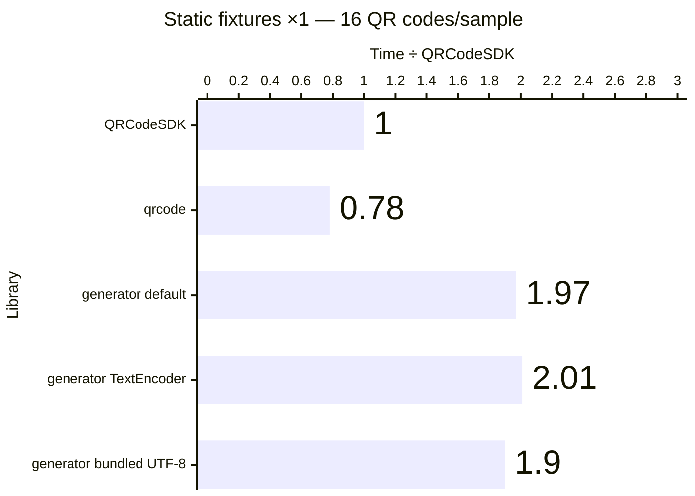

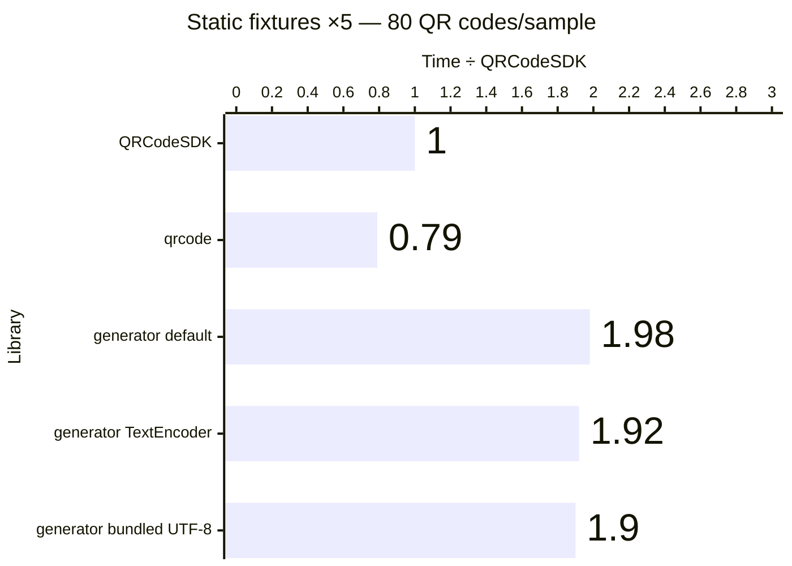

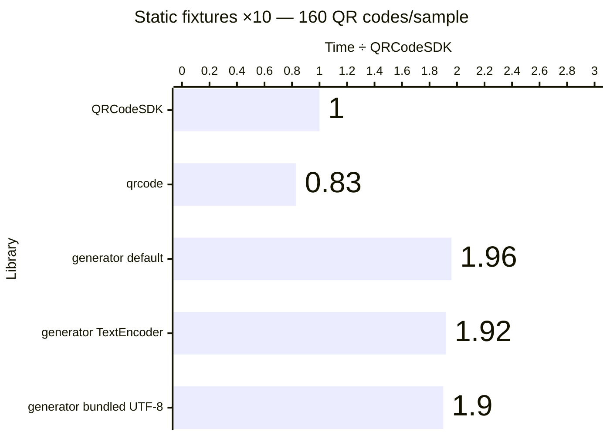

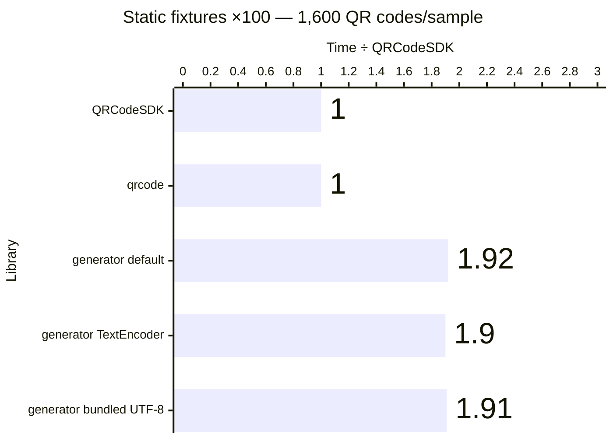

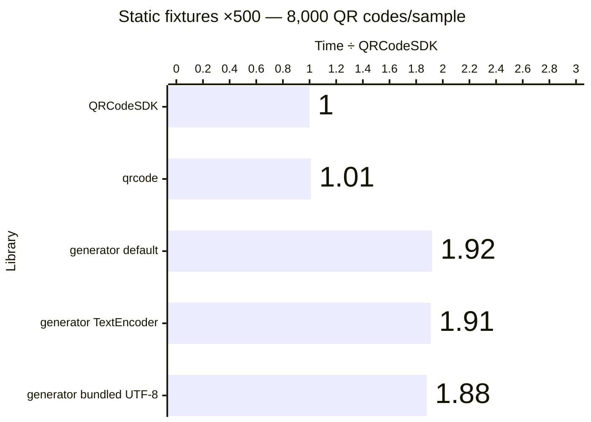

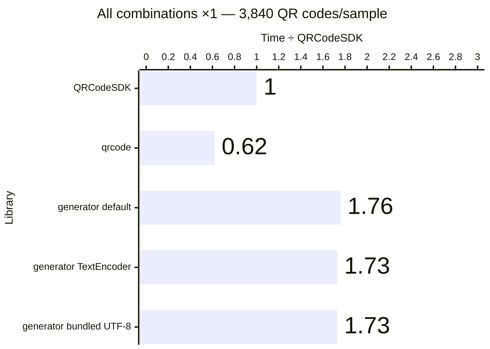

Exact benchmark data

| Workload             | QR codes/sample | Library                                 | Median (ms) |      Min–max (ms) | QR codes/second | Time ÷ QRCodeSDK |
| -------------------- | --------------: | --------------------------------------- | ----------: | ----------------: | --------------: | ---------------: |
| Static fixtures ×1   |              16 | QRCodeSDK v0.0.1                        |       7.038 |       6.924–8.674 |           2,273 |            1.00× |
| Static fixtures ×1   |              16 | qrcode v1.5.4                           |       5.520 |       5.438–5.551 |           2,899 |            0.78× |
| Static fixtures ×1   |              16 | qrcode-generator (default) v2.0.4       |      13.867 |     13.250–14.752 |           1,154 |            1.97× |
| Static fixtures ×1   |              16 | qrcode-generator (TextEncoder) v2.0.4   |      14.128 |     13.926–14.936 |           1,132 |            2.01× |
| Static fixtures ×1   |              16 | qrcode-generator (bundled UTF-8) v2.0.4 |      13.402 |     13.384–14.657 |           1,194 |            1.90× |
| Static fixtures ×5   |              80 | QRCodeSDK v0.0.1                        |      35.514 |     34.937–36.160 |           2,253 |            1.00× |
| Static fixtures ×5   |              80 | qrcode v1.5.4                           |      28.163 |     26.723–31.874 |           2,841 |            0.79× |
| Static fixtures ×5   |              80 | qrcode-generator (default) v2.0.4       |      70.421 |     68.997–70.895 |           1,136 |            1.98× |
| Static fixtures ×5   |              80 | qrcode-generator (TextEncoder) v2.0.4   |      68.177 |     67.198–70.210 |           1,173 |            1.92× |
| Static fixtures ×5   |              80 | qrcode-generator (bundled UTF-8) v2.0.4 |      67.575 |     66.853–68.438 |           1,184 |            1.90× |
| Static fixtures ×10  |             160 | QRCodeSDK v0.0.1                        |      71.165 |     69.193–73.927 |           2,248 |            1.00× |
| Static fixtures ×10  |             160 | qrcode v1.5.4                           |      58.999 |     56.025–63.647 |           2,712 |            0.83× |
| Static fixtures ×10  |             160 | qrcode-generator (default) v2.0.4       |     139.512 |   138.035–163.616 |           1,147 |            1.96× |
| Static fixtures ×10  |             160 | qrcode-generator (TextEncoder) v2.0.4   |     136.856 |   134.815–140.992 |           1,169 |            1.92× |
| Static fixtures ×10  |             160 | qrcode-generator (bundled UTF-8) v2.0.4 |     135.037 |   134.016–137.846 |           1,185 |            1.90× |
| Static fixtures ×100 |           1,600 | QRCodeSDK v0.0.1                        |     722.967 |   713.828–736.828 |           2,213 |            1.00× |
| Static fixtures ×100 |           1,600 | qrcode v1.5.4                           |     725.674 |   674.156–739.867 |           2,205 |            1.00× |
| Static fixtures ×100 |           1,600 | qrcode-generator (default) v2.0.4       |    1390.939 | 1377.954–1490.333 |           1,150 |            1.92× |
| Static fixtures ×100 |           1,600 | qrcode-generator (TextEncoder) v2.0.4   |    1377.222 | 1356.722–1446.118 |           1,162 |            1.90× |
| Static fixtures ×100 |           1,600 | qrcode-generator (bundled UTF-8) v2.0.4 |    1378.509 | 1367.601–1601.537 |           1,161 |            1.91× |
| Static fixtures ×500 |           8,000 | QRCodeSDK v0.0.1                        |    3623.274 | 3573.905–3636.686 |           2,208 |            1.00× |
| Static fixtures ×500 |           8,000 | qrcode v1.5.4                           |    3676.329 | 3625.352–3915.771 |           2,176 |            1.01× |
| Static fixtures ×500 |           8,000 | qrcode-generator (default) v2.0.4       |    6952.120 | 6764.467–6969.252 |           1,151 |            1.92× |
| Static fixtures ×500 |           8,000 | qrcode-generator (TextEncoder) v2.0.4   |    6913.144 | 6887.438–6945.031 |           1,157 |            1.91× |
| Static fixtures ×500 |           8,000 | qrcode-generator (bundled UTF-8) v2.0.4 |    6826.905 | 6774.149–6854.786 |           1,172 |            1.88× |
| All combinations ×1  |           3,840 | QRCodeSDK v0.0.1                        |    3007.023 | 2953.070–3033.355 |           1,277 |            1.00× |
| All combinations ×1  |           3,840 | qrcode v1.5.4                           |    1858.836 | 1823.626–1911.045 |           2,066 |            0.62× |
| All combinations ×1  |           3,840 | qrcode-generator (default) v2.0.4       |    5290.018 | 5239.925–5304.148 |             726 |            1.76× |
| All combinations ×1  |           3,840 | qrcode-generator (TextEncoder) v2.0.4   |    5204.589 | 5197.540–5346.255 |             738 |            1.73× |
| All combinations ×1  |           3,840 | qrcode-generator (bundled UTF-8) v2.0.4 |    5208.159 | 5194.960–5277.905 |             737 |            1.73× |

