<!-- Generated from benchmark-results/latest.json. Run `pnpm turbo run generate-performance --filter=docs` to update. -->

These results compare QRCodeSDK with **qrcode** and three **qrcode-generator** encoder configurations. Benchmarks are environment-specific and should be read as relative comparisons, not universal guarantees.

All **qrcode-generator** rows use the repository patch that applies each fixture's explicit mask and skips automatic mask evaluation. The **default** row uses the package's stock low-byte converter, **TextEncoder** uses the platform encoder, and **bundled UTF-8** uses the package's handwritten UTF-8 converter. The default converter truncates UTF-16 code units, so its Unicode byte fixtures do not encode content equivalent to the other rows. TextEncoder and bundled UTF-8 produce the same bytes for the valid Unicode fixtures.

## Benchmark environment

- Generated: `2026-07-27T13:18:15.943Z`
- Runtime: `v24.18.0` on `linux x64`
- CPU: `AMD Ryzen 7 3700X 8-Core Processor` (16 logical cores)
- Libraries: `qrcodesdk@0.0.0`, `qrcode@1.5.4`, `qrcode-generator-default@2.0.4`, `qrcode-generator@2.0.4`, `qrcode-generator-utf8@2.0.4`
- Samples: 5 timed samples after 5 static warm-up passes and 1 exhaustive warm-up pass
- SVG output: 8 px/module with a 4-module quiet zone

The charts show relative median time, where lower is better and QRCodeSDK is fixed at `1.00×`. Expand the exact benchmark data beneath each section for median time, min–max range, and throughput calculated from the median.

## Matrix generation

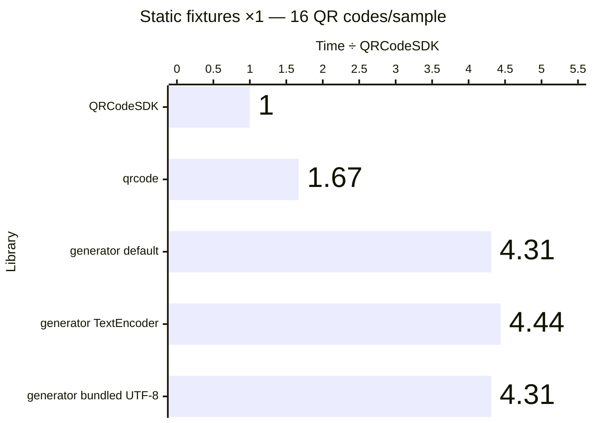

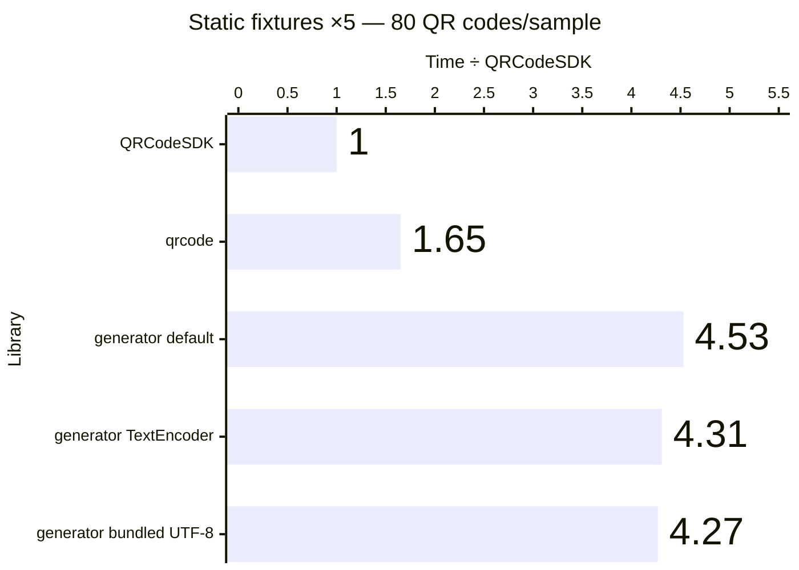

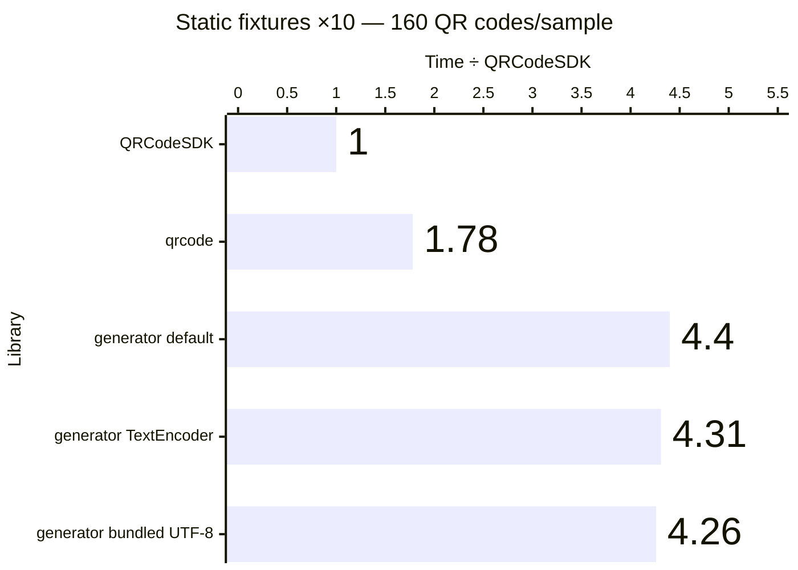

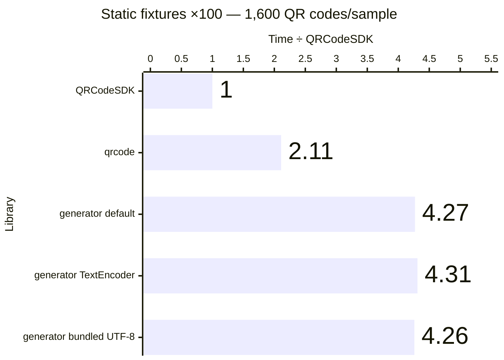

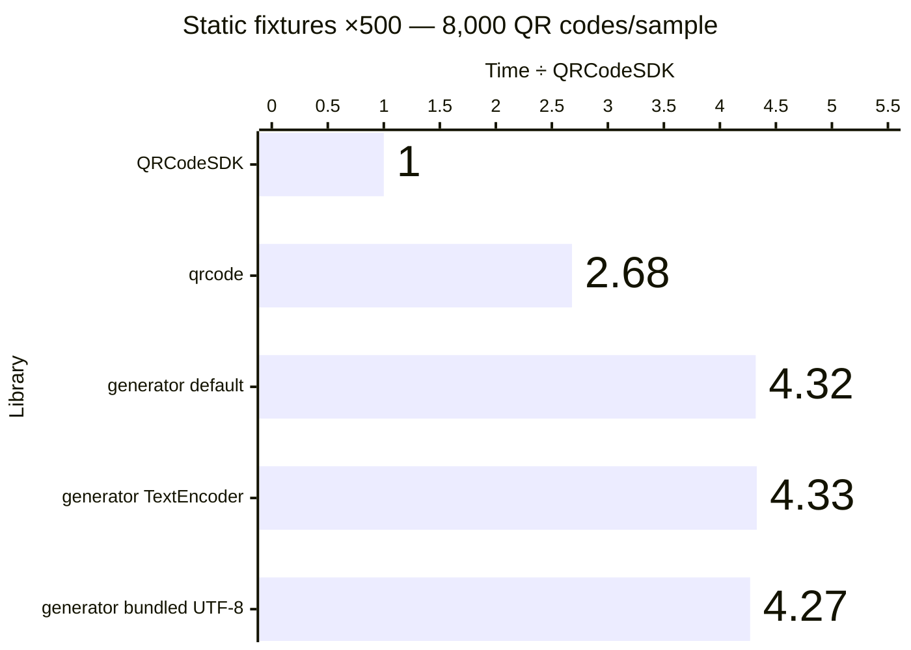

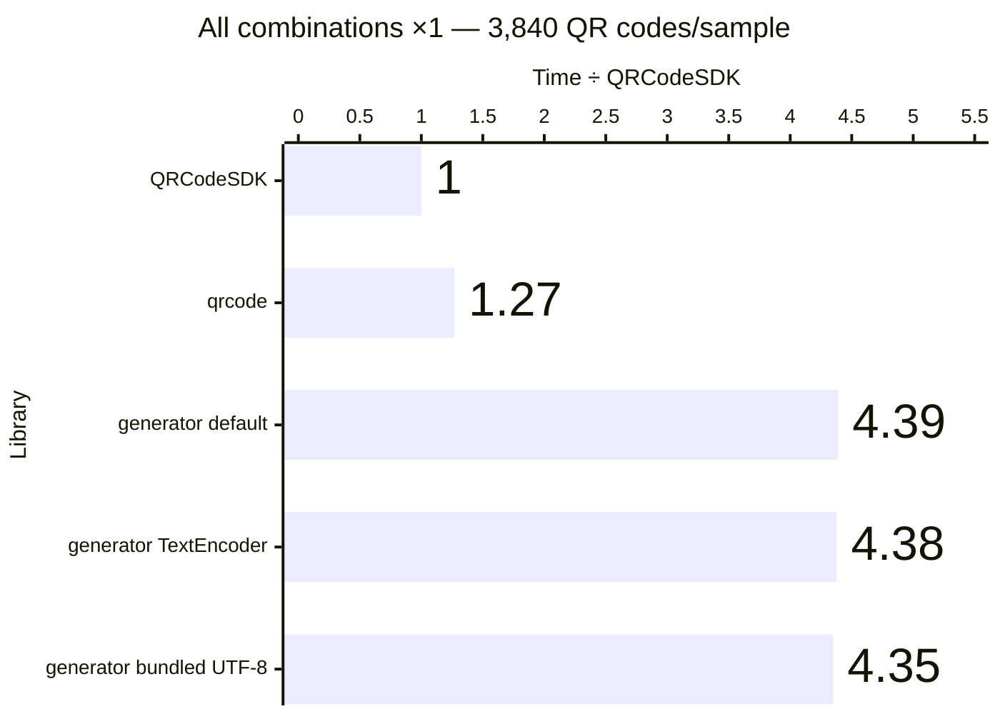

Exact benchmark data

| Workload             | QR codes/sample | Library                                 | Median (ms) |      Min–max (ms) | QR codes/second | Time ÷ QRCodeSDK |
| -------------------- | --------------: | --------------------------------------- | ----------: | ----------------: | --------------: | ---------------: |
| Static fixtures ×1   |              16 | QRCodeSDK v0.0.0                        |       2.667 |       2.659–4.119 |           5,998 |            1.00× |
| Static fixtures ×1   |              16 | qrcode v1.5.4                           |       4.465 |       4.455–5.065 |           3,583 |            1.67× |
| Static fixtures ×1   |              16 | qrcode-generator (default) v2.0.4       |      11.503 |     11.014–11.736 |           1,391 |            4.31× |
| Static fixtures ×1   |              16 | qrcode-generator (TextEncoder) v2.0.4   |      11.852 |     11.543–12.747 |           1,350 |            4.44× |
| Static fixtures ×1   |              16 | qrcode-generator (bundled UTF-8) v2.0.4 |      11.495 |     11.303–11.701 |           1,392 |            4.31× |
| Static fixtures ×5   |              80 | QRCodeSDK v0.0.0                        |      13.403 |     13.109–13.881 |           5,969 |            1.00× |
| Static fixtures ×5   |              80 | qrcode v1.5.4                           |      22.050 |     21.931–23.719 |           3,628 |            1.65× |
| Static fixtures ×5   |              80 | qrcode-generator (default) v2.0.4       |      60.753 |     57.553–61.089 |           1,317 |            4.53× |
| Static fixtures ×5   |              80 | qrcode-generator (TextEncoder) v2.0.4   |      57.735 |     56.653–65.380 |           1,386 |            4.31× |
| Static fixtures ×5   |              80 | qrcode-generator (bundled UTF-8) v2.0.4 |      57.269 |     55.761–58.016 |           1,397 |            4.27× |
| Static fixtures ×10  |             160 | QRCodeSDK v0.0.0                        |      26.476 |     26.409–27.215 |           6,043 |            1.00× |
| Static fixtures ×10  |             160 | qrcode v1.5.4                           |      47.166 |     42.813–51.226 |           3,392 |            1.78× |
| Static fixtures ×10  |             160 | qrcode-generator (default) v2.0.4       |     116.483 |   111.636–119.980 |           1,374 |            4.40× |
| Static fixtures ×10  |             160 | qrcode-generator (TextEncoder) v2.0.4   |     114.124 |   113.232–117.886 |           1,402 |            4.31× |
| Static fixtures ×10  |             160 | qrcode-generator (bundled UTF-8) v2.0.4 |     112.714 |   111.614–114.962 |           1,420 |            4.26× |
| Static fixtures ×100 |           1,600 | QRCodeSDK v0.0.0                        |     263.161 |   260.673–266.592 |           6,080 |            1.00× |
| Static fixtures ×100 |           1,600 | qrcode v1.5.4                           |     555.124 |   478.087–588.005 |           2,882 |            2.11× |
| Static fixtures ×100 |           1,600 | qrcode-generator (default) v2.0.4       |    1123.409 | 1106.258–1130.066 |           1,424 |            4.27× |
| Static fixtures ×100 |           1,600 | qrcode-generator (TextEncoder) v2.0.4   |    1134.954 | 1127.019–1182.317 |           1,410 |            4.31× |
| Static fixtures ×100 |           1,600 | qrcode-generator (bundled UTF-8) v2.0.4 |    1119.912 | 1118.325–1134.722 |           1,429 |            4.26× |
| Static fixtures ×500 |           8,000 | QRCodeSDK v0.0.0                        |    1310.382 | 1297.086–1327.849 |           6,105 |            1.00× |
| Static fixtures ×500 |           8,000 | qrcode v1.5.4                           |    3511.402 | 3267.776–3617.338 |           2,278 |            2.68× |
| Static fixtures ×500 |           8,000 | qrcode-generator (default) v2.0.4       |    5656.480 | 5525.724–5740.960 |           1,414 |            4.32× |
| Static fixtures ×500 |           8,000 | qrcode-generator (TextEncoder) v2.0.4   |    5679.890 | 5576.770–5807.218 |           1,408 |            4.33× |
| Static fixtures ×500 |           8,000 | qrcode-generator (bundled UTF-8) v2.0.4 |    5597.301 | 5572.658–5912.671 |           1,429 |            4.27× |
| All combinations ×1  |           3,840 | QRCodeSDK v0.0.0                        |     965.486 |  957.717–1125.197 |           3,977 |            1.00× |
| All combinations ×1  |           3,840 | qrcode v1.5.4                           |    1223.852 | 1157.504–1268.569 |           3,138 |            1.27× |
| All combinations ×1  |           3,840 | qrcode-generator (default) v2.0.4       |    4239.699 | 4199.437–4269.008 |             906 |            4.39× |
| All combinations ×1  |           3,840 | qrcode-generator (TextEncoder) v2.0.4   |    4231.563 | 4205.253–4496.102 |             907 |            4.38× |
| All combinations ×1  |           3,840 | qrcode-generator (bundled UTF-8) v2.0.4 |    4195.655 | 4153.943–4233.745 |             915 |            4.35× |

## SVG generation

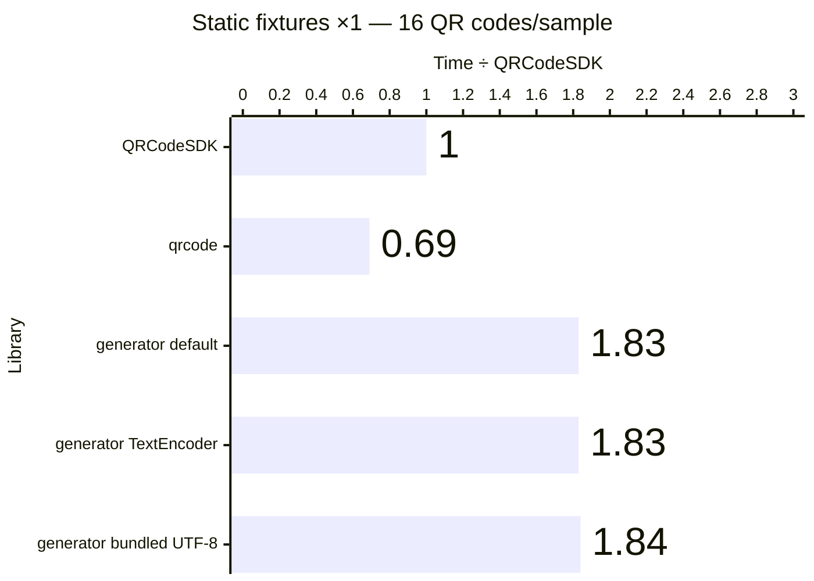

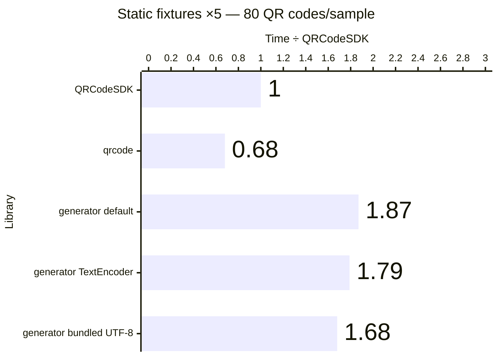

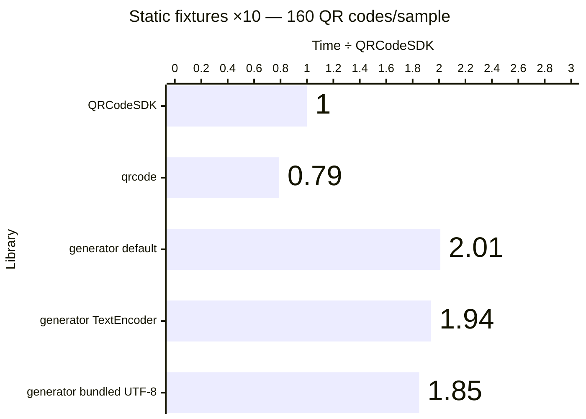

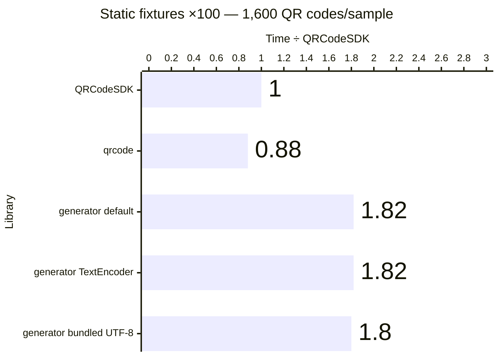

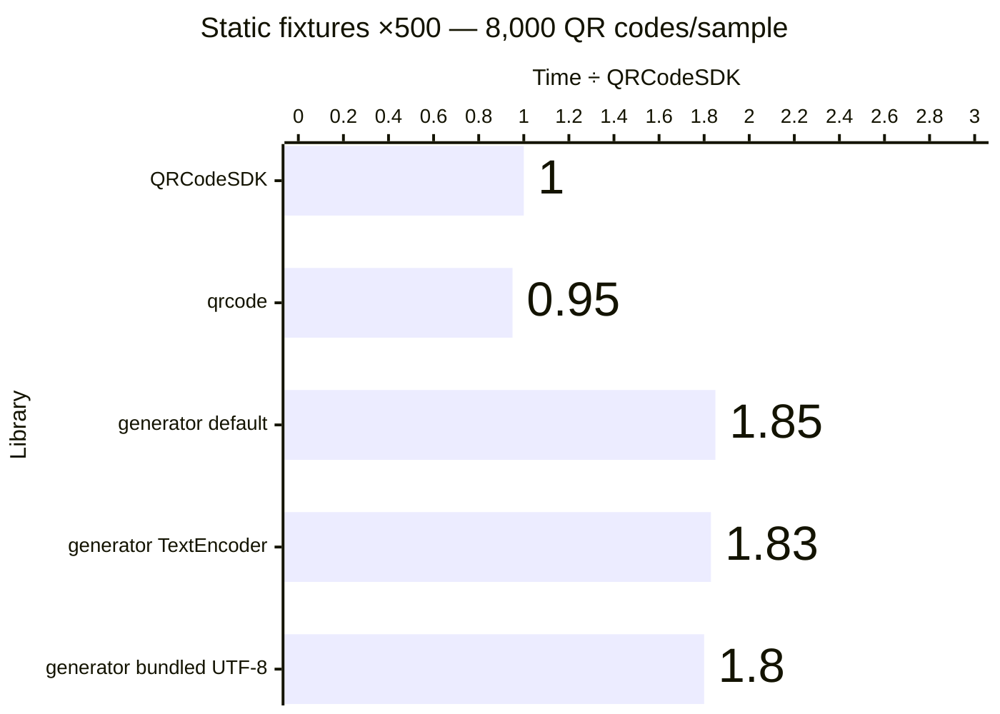

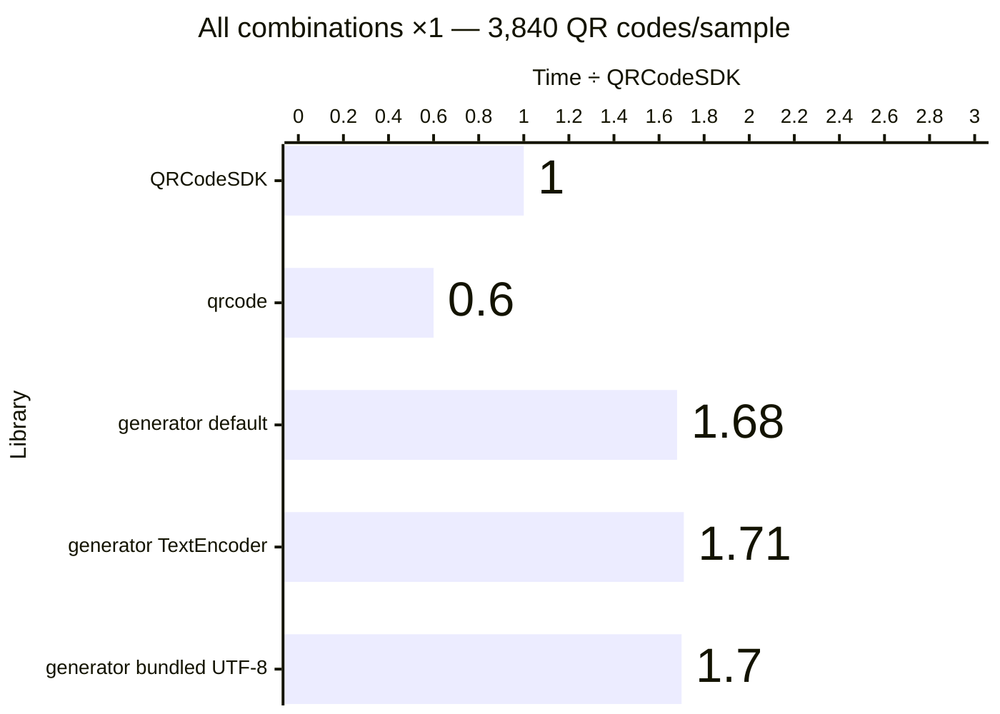

Exact benchmark data

| Workload             | QR codes/sample | Library                                 | Median (ms) |      Min–max (ms) | QR codes/second | Time ÷ QRCodeSDK |
| -------------------- | --------------: | --------------------------------------- | ----------: | ----------------: | --------------: | ---------------: |
| Static fixtures ×1   |              16 | QRCodeSDK v0.0.0                        |       8.511 |       7.786–9.095 |           1,880 |            1.00× |
| Static fixtures ×1   |              16 | qrcode v1.5.4                           |       5.903 |       5.690–6.565 |           2,710 |            0.69× |
| Static fixtures ×1   |              16 | qrcode-generator (default) v2.0.4       |      15.597 |     15.272–16.313 |           1,026 |            1.83× |
| Static fixtures ×1   |              16 | qrcode-generator (TextEncoder) v2.0.4   |      15.538 |     14.662–17.329 |           1,030 |            1.83× |
| Static fixtures ×1   |              16 | qrcode-generator (bundled UTF-8) v2.0.4 |      15.637 |     15.154–15.810 |           1,023 |            1.84× |
| Static fixtures ×5   |              80 | QRCodeSDK v0.0.0                        |      44.130 |     39.395–47.931 |           1,813 |            1.00× |
| Static fixtures ×5   |              80 | qrcode v1.5.4                           |      30.061 |     29.502–39.347 |           2,661 |            0.68× |
| Static fixtures ×5   |              80 | qrcode-generator (default) v2.0.4       |      82.741 |     80.364–88.902 |             967 |            1.87× |
| Static fixtures ×5   |              80 | qrcode-generator (TextEncoder) v2.0.4   |      79.101 |    77.572–100.862 |           1,011 |            1.79× |
| Static fixtures ×5   |              80 | qrcode-generator (bundled UTF-8) v2.0.4 |      73.929 |     72.300–86.181 |           1,082 |            1.68× |
| Static fixtures ×10  |             160 | QRCodeSDK v0.0.0                        |      78.720 |     75.721–81.836 |           2,033 |            1.00× |
| Static fixtures ×10  |             160 | qrcode v1.5.4                           |      61.947 |     57.280–65.736 |           2,583 |            0.79× |
| Static fixtures ×10  |             160 | qrcode-generator (default) v2.0.4       |     158.138 |   145.021–174.198 |           1,012 |            2.01× |
| Static fixtures ×10  |             160 | qrcode-generator (TextEncoder) v2.0.4   |     152.719 |   149.233–184.141 |           1,048 |            1.94× |
| Static fixtures ×10  |             160 | qrcode-generator (bundled UTF-8) v2.0.4 |     145.838 |   145.078–205.798 |           1,097 |            1.85× |
| Static fixtures ×100 |           1,600 | QRCodeSDK v0.0.0                        |     790.683 |   750.911–811.539 |           2,024 |            1.00× |
| Static fixtures ×100 |           1,600 | qrcode v1.5.4                           |     695.006 |   692.991–740.590 |           2,302 |            0.88× |
| Static fixtures ×100 |           1,600 | qrcode-generator (default) v2.0.4       |    1435.690 | 1407.958–1454.331 |           1,114 |            1.82× |
| Static fixtures ×100 |           1,600 | qrcode-generator (TextEncoder) v2.0.4   |    1441.405 | 1404.406–1501.463 |           1,110 |            1.82× |
| Static fixtures ×100 |           1,600 | qrcode-generator (bundled UTF-8) v2.0.4 |    1425.804 | 1389.196–1496.321 |           1,122 |            1.80× |
| Static fixtures ×500 |           8,000 | QRCodeSDK v0.0.0                        |    3816.529 | 3770.308–3846.487 |           2,096 |            1.00× |
| Static fixtures ×500 |           8,000 | qrcode v1.5.4                           |    3637.001 | 3155.870–3908.043 |           2,200 |            0.95× |
| Static fixtures ×500 |           8,000 | qrcode-generator (default) v2.0.4       |    7050.495 | 6891.395–7429.754 |           1,135 |            1.85× |
| Static fixtures ×500 |           8,000 | qrcode-generator (TextEncoder) v2.0.4   |    6965.472 | 6938.583–7043.374 |           1,149 |            1.83× |
| Static fixtures ×500 |           8,000 | qrcode-generator (bundled UTF-8) v2.0.4 |    6886.279 | 6751.915–6912.485 |           1,162 |            1.80× |
| All combinations ×1  |           3,840 | QRCodeSDK v0.0.0                        |    3143.379 | 3095.780–3344.689 |           1,222 |            1.00× |
| All combinations ×1  |           3,840 | qrcode v1.5.4                           |    1885.309 | 1833.538–1918.871 |           2,037 |            0.60× |
| All combinations ×1  |           3,840 | qrcode-generator (default) v2.0.4       |    5294.433 | 5263.816–5374.409 |             725 |            1.68× |
| All combinations ×1  |           3,840 | qrcode-generator (TextEncoder) v2.0.4   |    5386.337 | 5235.679–5520.745 |             713 |            1.71× |
| All combinations ×1  |           3,840 | qrcode-generator (bundled UTF-8) v2.0.4 |    5332.930 | 5223.178–5513.856 |             720 |            1.70× |

