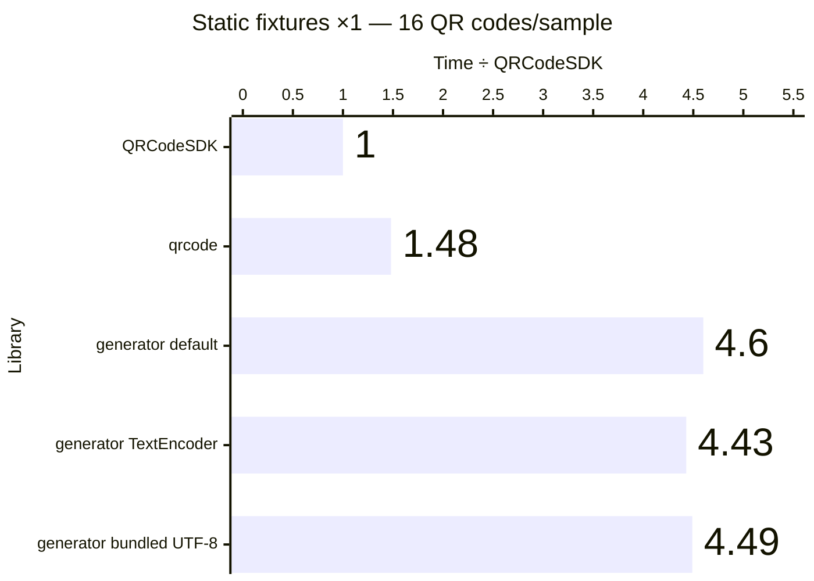
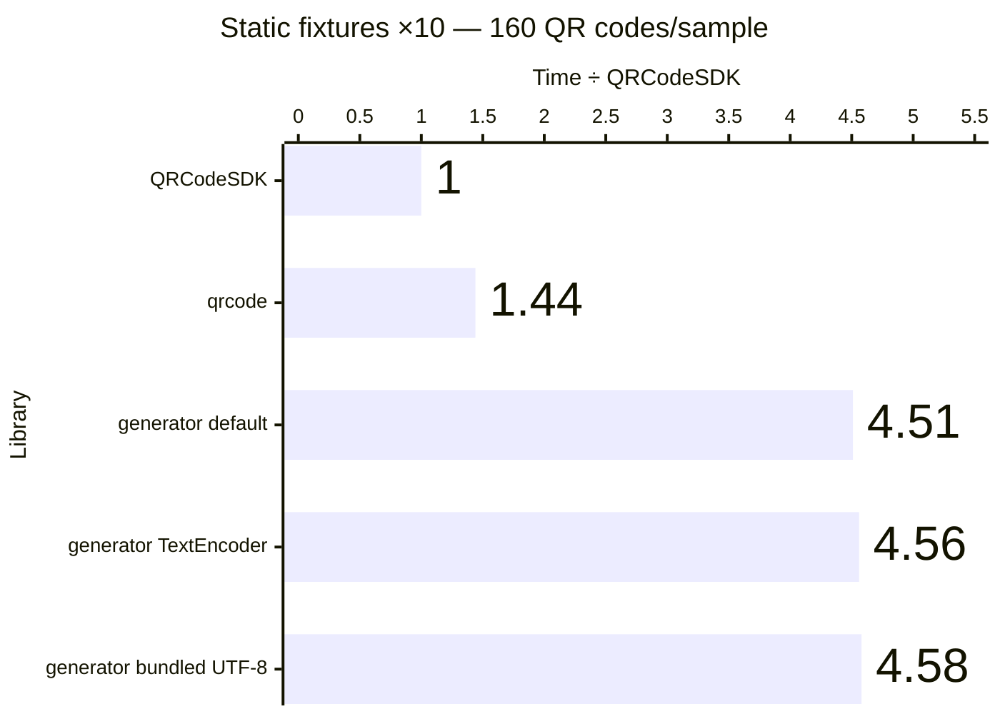
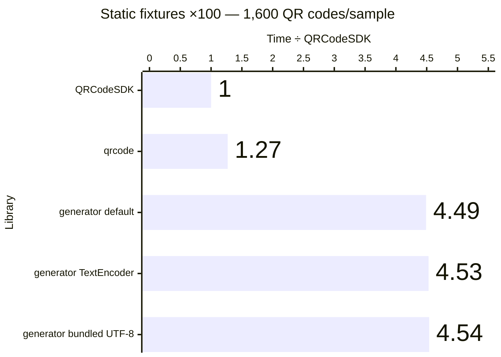
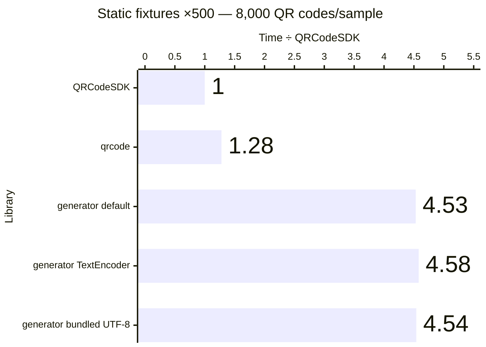
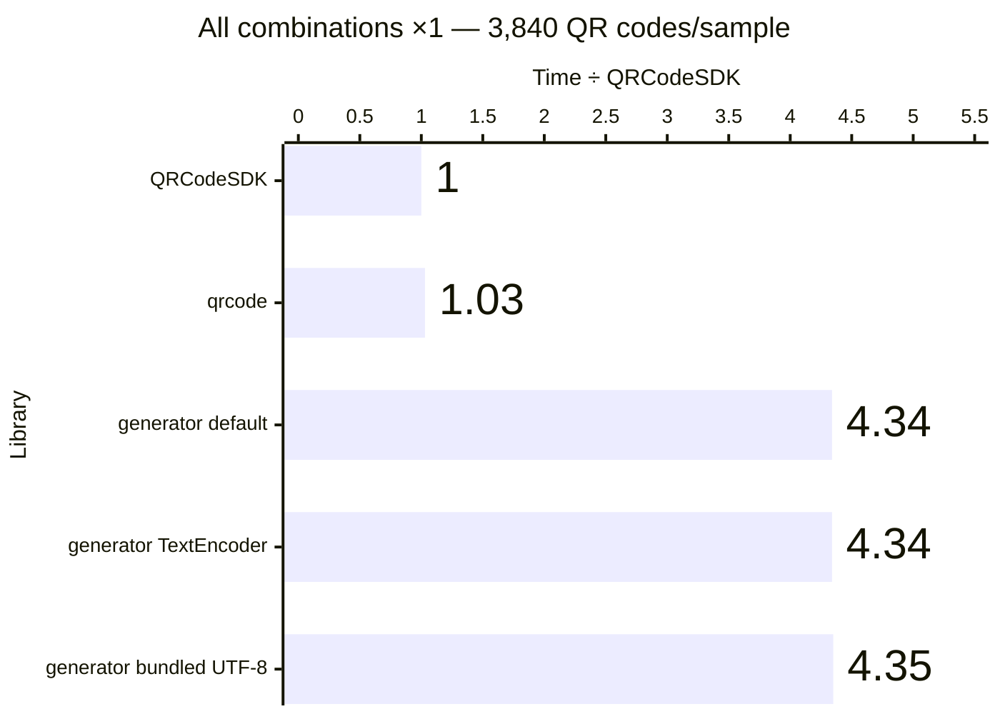
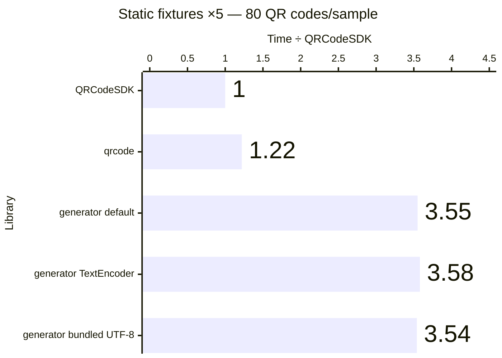
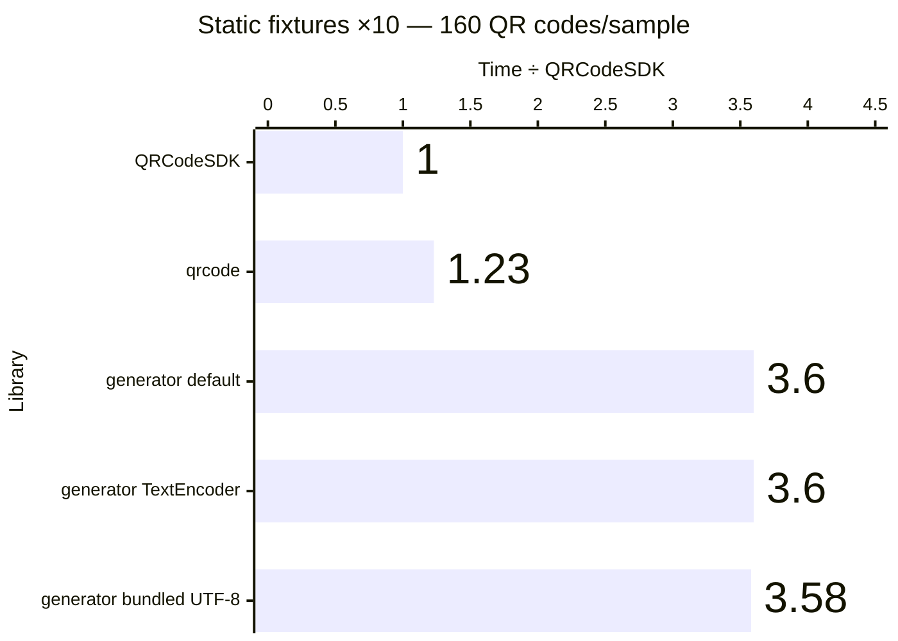
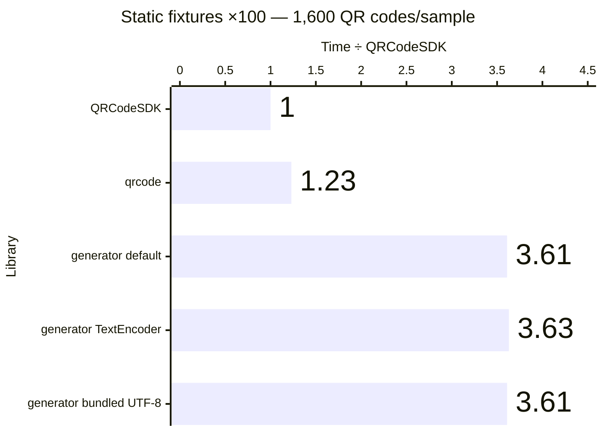
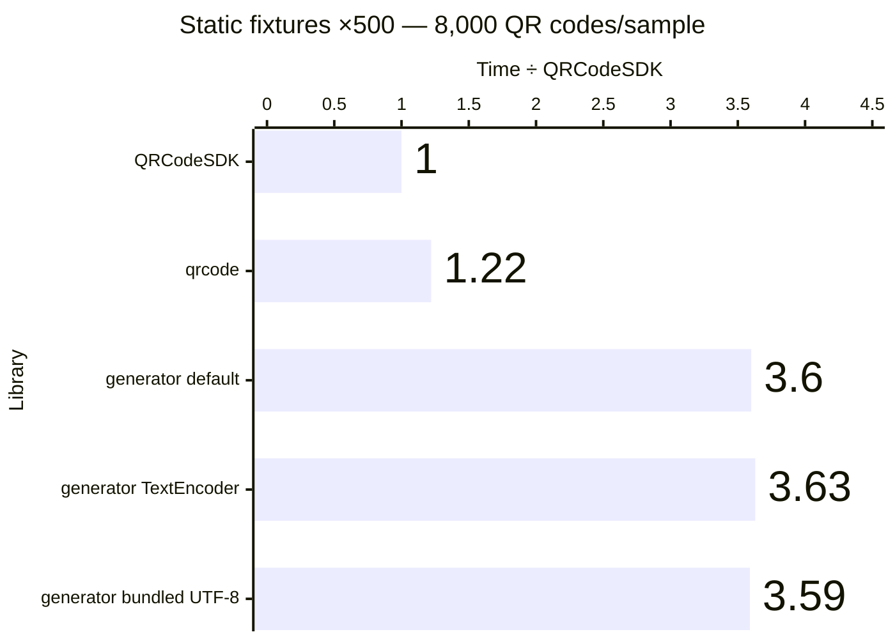
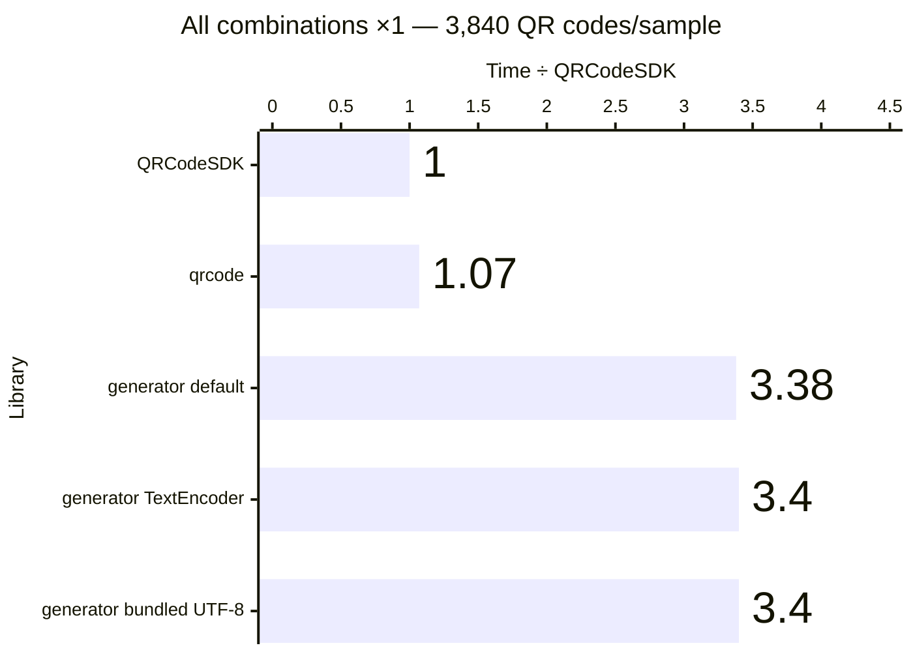

<!-- Generated from benchmark-results/latest.json. Run `pnpm turbo run generate-performance --filter=docs` to update. -->

These results compare QRCodeSDK with **qrcode** and three **qrcode-generator** encoder configurations. Benchmarks are environment-specific and should be read as relative comparisons, not universal guarantees.

All **qrcode-generator** rows use the repository patch that applies each fixture's explicit mask and skips automatic mask evaluation. The **default** row uses the package's stock low-byte converter, **TextEncoder** uses the platform encoder, and **bundled UTF-8** uses the package's handwritten UTF-8 converter. The default converter truncates UTF-16 code units, so its Unicode byte fixtures do not encode content equivalent to the other rows. TextEncoder and bundled UTF-8 produce the same bytes for the valid Unicode fixtures.

## Benchmark environment

- Generated: `2026-07-19T16:59:15.394Z`
- Runtime: `v24.18.0` on `darwin arm64`
- CPU: `Apple M2 Pro` (12 logical cores)
- Libraries: `qrcodesdk@0.0.0`, `qrcode@1.5.4`, `qrcode-generator-default@2.0.4`, `qrcode-generator@2.0.4`, `qrcode-generator-utf8@2.0.4`
- Samples: 5 timed samples after 5 static warm-up passes and 1 exhaustive warm-up pass
- SVG output: 8 px/module with a 4-module quiet zone

The charts show relative median time, where lower is better and QRCodeSDK is fixed at `1.00×`. Expand the exact benchmark data beneath each section for median time, min–max range, and throughput calculated from the median.

## Matrix generation

Exact benchmark data

| Workload             | QR codes/sample | Library                                 | Median (ms) |      Min–max (ms) | QR codes/second | Time ÷ QRCodeSDK |
| -------------------- | --------------: | --------------------------------------- | ----------: | ----------------: | --------------: | ---------------: |
| Static fixtures ×1   |              16 | QRCodeSDK v0.0.0                        |       2.032 |       2.004–2.112 |           7,874 |            1.00× |
| Static fixtures ×1   |              16 | qrcode v1.5.4                           |       3.005 |       2.917–3.325 |           5,325 |            1.48× |
| Static fixtures ×1   |              16 | qrcode-generator (default) v2.0.4       |       9.340 |      9.057–15.489 |           1,713 |            4.60× |
| Static fixtures ×1   |              16 | qrcode-generator (TextEncoder) v2.0.4   |       8.993 |      8.886–10.381 |           1,779 |            4.43× |
| Static fixtures ×1   |              16 | qrcode-generator (bundled UTF-8) v2.0.4 |       9.133 |      8.906–13.310 |           1,752 |            4.49× |
| Static fixtures ×5   |              80 | QRCodeSDK v0.0.0                        |       9.534 |       9.426–9.792 |           8,391 |            1.00× |
| Static fixtures ×5   |              80 | qrcode v1.5.4                           |      13.466 |     13.418–14.420 |           5,941 |            1.41× |
| Static fixtures ×5   |              80 | qrcode-generator (default) v2.0.4       |      43.023 |     42.566–45.670 |           1,859 |            4.51× |
| Static fixtures ×5   |              80 | qrcode-generator (TextEncoder) v2.0.4   |      42.903 |     42.417–43.910 |           1,865 |            4.50× |
| Static fixtures ×5   |              80 | qrcode-generator (bundled UTF-8) v2.0.4 |      42.486 |     42.358–43.052 |           1,883 |            4.46× |
| Static fixtures ×10  |             160 | QRCodeSDK v0.0.0                        |      18.910 |     18.824–19.641 |           8,461 |            1.00× |
| Static fixtures ×10  |             160 | qrcode v1.5.4                           |      27.204 |     26.748–28.130 |           5,881 |            1.44× |
| Static fixtures ×10  |             160 | qrcode-generator (default) v2.0.4       |      85.369 |     85.249–88.949 |           1,874 |            4.51× |
| Static fixtures ×10  |             160 | qrcode-generator (TextEncoder) v2.0.4   |      86.171 |     85.365–87.655 |           1,857 |            4.56× |
| Static fixtures ×10  |             160 | qrcode-generator (bundled UTF-8) v2.0.4 |      86.537 |     84.942–88.561 |           1,849 |            4.58× |
| Static fixtures ×100 |           1,600 | QRCodeSDK v0.0.0                        |     190.671 |   187.120–194.221 |           8,391 |            1.00× |
| Static fixtures ×100 |           1,600 | qrcode v1.5.4                           |     242.589 |   240.147–280.374 |           6,596 |            1.27× |
| Static fixtures ×100 |           1,600 | qrcode-generator (default) v2.0.4       |     856.492 |   849.281–861.372 |           1,868 |            4.49× |
| Static fixtures ×100 |           1,600 | qrcode-generator (TextEncoder) v2.0.4   |     862.903 |   857.561–865.865 |           1,854 |            4.53× |
| Static fixtures ×100 |           1,600 | qrcode-generator (bundled UTF-8) v2.0.4 |     866.274 |   855.877–878.347 |           1,847 |            4.54× |
| Static fixtures ×500 |           8,000 | QRCodeSDK v0.0.0                        |     943.242 |   939.340–946.988 |           8,481 |            1.00× |
| Static fixtures ×500 |           8,000 | qrcode v1.5.4                           |    1211.769 | 1206.094–1219.463 |           6,602 |            1.28× |
| Static fixtures ×500 |           8,000 | qrcode-generator (default) v2.0.4       |    4275.971 | 4267.968–4346.632 |           1,871 |            4.53× |
| Static fixtures ×500 |           8,000 | qrcode-generator (TextEncoder) v2.0.4   |    4320.248 | 4295.842–4371.474 |           1,852 |            4.58× |
| Static fixtures ×500 |           8,000 | qrcode-generator (bundled UTF-8) v2.0.4 |    4284.261 | 4269.394–4382.278 |           1,867 |            4.54× |
| All combinations ×1  |           3,840 | QRCodeSDK v0.0.0                        |     695.868 |   693.440–712.569 |           5,518 |            1.00× |
| All combinations ×1  |           3,840 | qrcode v1.5.4                           |     718.961 |   714.900–726.346 |           5,341 |            1.03× |
| All combinations ×1  |           3,840 | qrcode-generator (default) v2.0.4       |    3023.523 | 3019.305–3052.660 |           1,270 |            4.34× |
| All combinations ×1  |           3,840 | qrcode-generator (TextEncoder) v2.0.4   |    3019.378 | 3006.045–3060.910 |           1,272 |            4.34× |
| All combinations ×1  |           3,840 | qrcode-generator (bundled UTF-8) v2.0.4 |    3026.406 | 3018.294–3037.623 |           1,269 |            4.35× |

## SVG generation

Exact benchmark data

| Workload             | QR codes/sample | Library                                 | Median (ms) |      Min–max (ms) | QR codes/second | Time ÷ QRCodeSDK |
| -------------------- | --------------: | --------------------------------------- | ----------: | ----------------: | --------------: | ---------------: |
| Static fixtures ×1   |              16 | QRCodeSDK v0.0.0                        |       3.121 |       3.102–3.284 |           5,126 |            1.00× |
| Static fixtures ×1   |              16 | qrcode v1.5.4                           |       3.909 |       3.767–3.984 |           4,093 |            1.25× |
| Static fixtures ×1   |              16 | qrcode-generator (default) v2.0.4       |      11.517 |     10.826–11.712 |           1,389 |            3.69× |
| Static fixtures ×1   |              16 | qrcode-generator (TextEncoder) v2.0.4   |      11.046 |     10.895–11.309 |           1,448 |            3.54× |
| Static fixtures ×1   |              16 | qrcode-generator (bundled UTF-8) v2.0.4 |      11.180 |     10.982–11.228 |           1,431 |            3.58× |
| Static fixtures ×5   |              80 | QRCodeSDK v0.0.0                        |      15.331 |     14.830–15.916 |           5,218 |            1.00× |
| Static fixtures ×5   |              80 | qrcode v1.5.4                           |      18.727 |     18.274–18.746 |           4,272 |            1.22× |
| Static fixtures ×5   |              80 | qrcode-generator (default) v2.0.4       |      54.472 |     53.880–55.516 |           1,469 |            3.55× |
| Static fixtures ×5   |              80 | qrcode-generator (TextEncoder) v2.0.4   |      54.825 |     53.873–55.050 |           1,459 |            3.58× |
| Static fixtures ×5   |              80 | qrcode-generator (bundled UTF-8) v2.0.4 |      54.215 |     53.911–55.595 |           1,476 |            3.54× |
| Static fixtures ×10  |             160 | QRCodeSDK v0.0.0                        |      30.184 |     29.873–30.559 |           5,301 |            1.00× |
| Static fixtures ×10  |             160 | qrcode v1.5.4                           |      37.024 |     36.756–37.998 |           4,322 |            1.23× |
| Static fixtures ×10  |             160 | qrcode-generator (default) v2.0.4       |     108.613 |   107.842–110.397 |           1,473 |            3.60× |
| Static fixtures ×10  |             160 | qrcode-generator (TextEncoder) v2.0.4   |     108.801 |   107.522–110.746 |           1,471 |            3.60× |
| Static fixtures ×10  |             160 | qrcode-generator (bundled UTF-8) v2.0.4 |     108.124 |   107.541–110.306 |           1,480 |            3.58× |
| Static fixtures ×100 |           1,600 | QRCodeSDK v0.0.0                        |     299.798 |   298.716–301.692 |           5,337 |            1.00× |
| Static fixtures ×100 |           1,600 | qrcode v1.5.4                           |     368.998 |   367.486–387.035 |           4,336 |            1.23× |
| Static fixtures ×100 |           1,600 | qrcode-generator (default) v2.0.4       |    1083.161 | 1079.576–1089.045 |           1,477 |            3.61× |
| Static fixtures ×100 |           1,600 | qrcode-generator (TextEncoder) v2.0.4   |    1086.993 | 1083.967–1091.182 |           1,472 |            3.63× |
| Static fixtures ×100 |           1,600 | qrcode-generator (bundled UTF-8) v2.0.4 |    1080.918 | 1078.474–1092.716 |           1,480 |            3.61× |
| Static fixtures ×500 |           8,000 | QRCodeSDK v0.0.0                        |    1501.934 | 1499.045–1506.060 |           5,326 |            1.00× |
| Static fixtures ×500 |           8,000 | qrcode v1.5.4                           |    1837.461 | 1834.381–1840.342 |           4,354 |            1.22× |
| Static fixtures ×500 |           8,000 | qrcode-generator (default) v2.0.4       |    5411.436 | 5392.849–5476.739 |           1,478 |            3.60× |
| Static fixtures ×500 |           8,000 | qrcode-generator (TextEncoder) v2.0.4   |    5444.871 | 5431.411–5527.880 |           1,469 |            3.63× |
| Static fixtures ×500 |           8,000 | qrcode-generator (bundled UTF-8) v2.0.4 |    5398.175 | 5392.148–5437.381 |           1,482 |            3.59× |
| All combinations ×1  |           3,840 | QRCodeSDK v0.0.0                        |    1211.000 | 1195.027–1228.433 |           3,171 |            1.00× |
| All combinations ×1  |           3,840 | qrcode v1.5.4                           |    1289.759 | 1281.469–1323.456 |           2,977 |            1.07× |
| All combinations ×1  |           3,840 | qrcode-generator (default) v2.0.4       |    4098.965 | 4059.554–4126.416 |             937 |            3.38× |
| All combinations ×1  |           3,840 | qrcode-generator (TextEncoder) v2.0.4   |    4116.802 | 4060.076–4152.698 |             933 |            3.40× |
| All combinations ×1  |           3,840 | qrcode-generator (bundled UTF-8) v2.0.4 |    4118.988 | 4060.598–4173.748 |             932 |            3.40× |

