<!-- Generated from benchmark-results/latest.json. Run `pnpm turbo run generate-performance --filter=docs` to update. -->

These results compare QRCodeSDK with **qrcode** and three **qrcode-generator** encoder configurations. Benchmarks are environment-specific and should be read as relative comparisons, not universal guarantees.

The matrix and SVG fixtures supply explicit versions and masks. Their **qrcode-generator** rows use the repository patch that applies each fixture's mask and skips automatic mask evaluation. The automatic matrix fixtures omit both options so every library selects them. The **default** row uses the package's stock low-byte converter, **TextEncoder** uses the platform encoder, and **bundled UTF-8** uses the package's handwritten UTF-8 converter. The default converter truncates UTF-16 code units, so its Unicode byte fixtures do not encode content equivalent to the other rows. TextEncoder and bundled UTF-8 produce the same bytes for the valid Unicode fixtures.

## Benchmark environment

- Generated: `2026-08-16T17:54:50.879Z`
- Runtime: `v24.19.0` on `darwin arm64`
- CPU: `Apple M2 Pro` (12 logical cores)
- Libraries: `qrcodesdk@0.0.1`, `qrcode@1.5.4`, `qrcode-generator-default@2.0.4`, `qrcode-generator@2.0.4`, `qrcode-generator-utf8@2.0.4`
- Samples: 5 timed samples after 5 static warm-up passes and 1 exhaustive warm-up pass
- SVG output: 4 px/module with a 4-module quiet zone

The charts show relative median time, where lower is better and QRCodeSDK is fixed at `1.00×`. Expand the exact benchmark data beneath each section for median time, min–max range, and throughput calculated from the median.

## Matrix generation

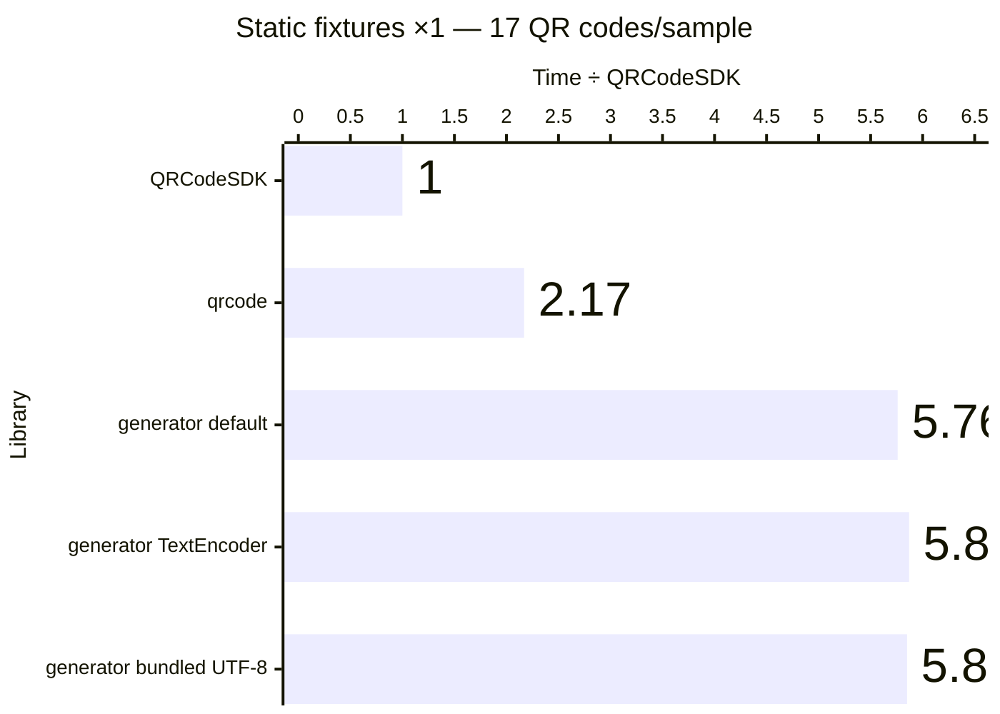

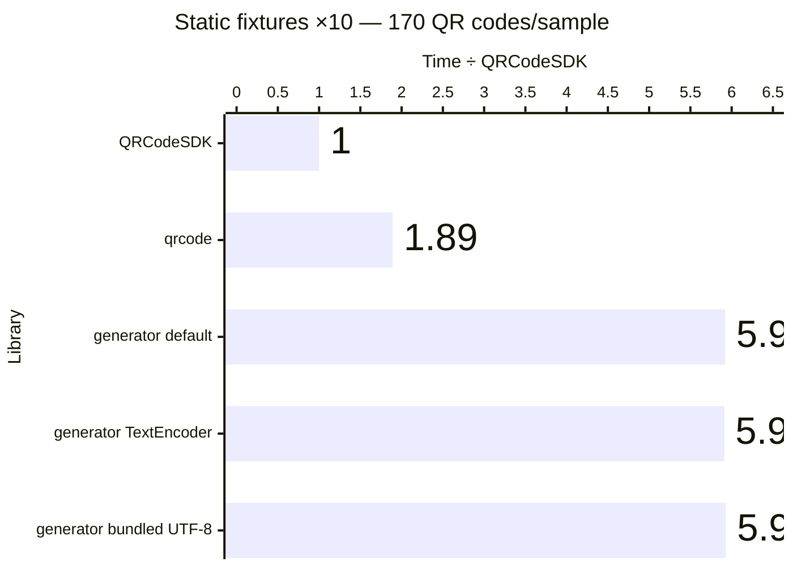

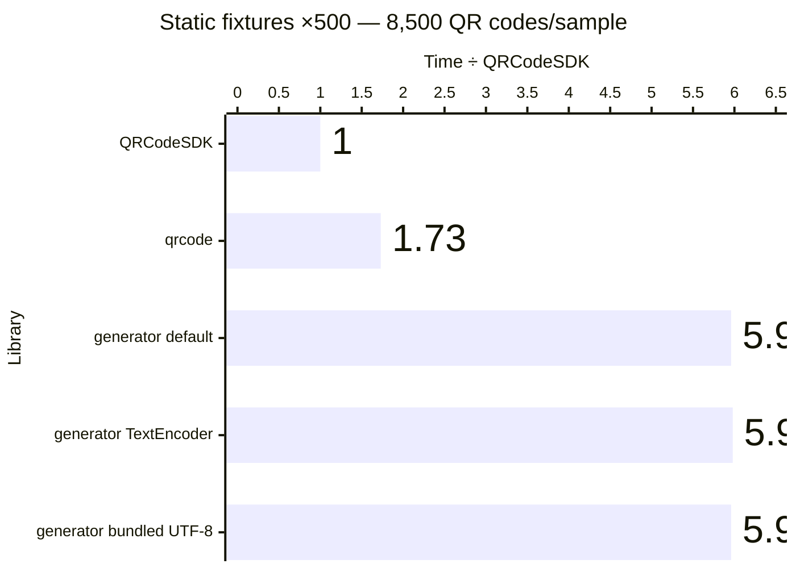

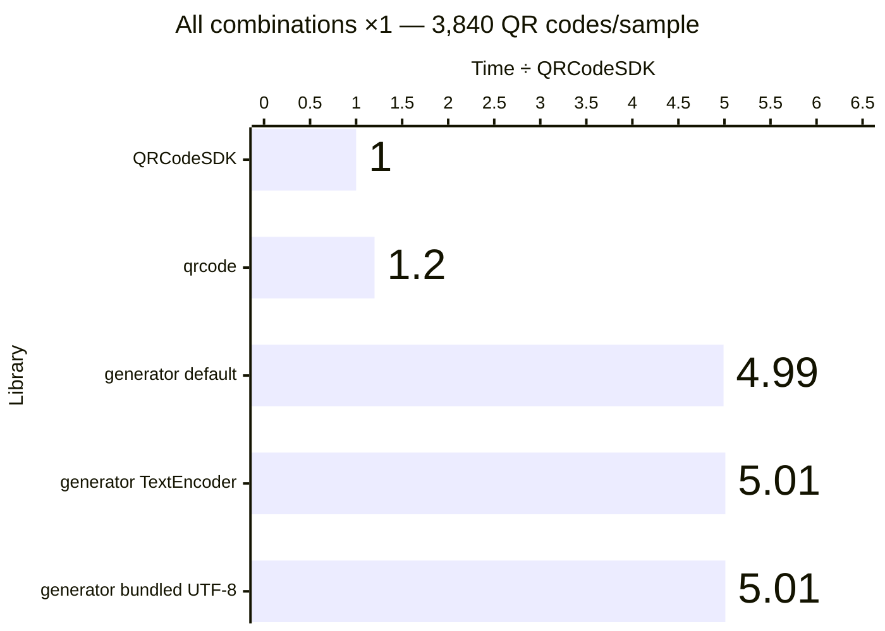

Exact benchmark data

| Workload             | QR codes/sample | Library                                 | Median (ms) |      Min–max (ms) | QR codes/second | Time ÷ QRCodeSDK |
| -------------------- | --------------: | --------------------------------------- | ----------: | ----------------: | --------------: | ---------------: |
| Static fixtures ×1   |              17 | QRCodeSDK v0.0.1                        |       1.532 |       1.499–1.636 |          11,098 |            1.00× |
| Static fixtures ×1   |              17 | qrcode v1.5.4                           |       3.324 |       3.148–3.381 |           5,115 |            2.17× |
| Static fixtures ×1   |              17 | qrcode-generator (default) v2.0.4       |       8.828 |       8.756–9.030 |           1,926 |            5.76× |
| Static fixtures ×1   |              17 | qrcode-generator (TextEncoder) v2.0.4   |       8.992 |       8.804–9.312 |           1,891 |            5.87× |
| Static fixtures ×1   |              17 | qrcode-generator (bundled UTF-8) v2.0.4 |       8.966 |       8.594–9.352 |           1,896 |            5.85× |
| Static fixtures ×10  |             170 | QRCodeSDK v0.0.1                        |      14.922 |     14.717–15.250 |          11,392 |            1.00× |
| Static fixtures ×10  |             170 | qrcode v1.5.4                           |      28.271 |     27.980–30.235 |           6,013 |            1.89× |
| Static fixtures ×10  |             170 | qrcode-generator (default) v2.0.4       |      88.289 |     87.978–89.677 |           1,925 |            5.92× |
| Static fixtures ×10  |             170 | qrcode-generator (TextEncoder) v2.0.4   |      88.139 |     87.869–88.433 |           1,929 |            5.91× |
| Static fixtures ×10  |             170 | qrcode-generator (bundled UTF-8) v2.0.4 |      88.545 |     87.869–89.857 |           1,920 |            5.93× |
| Static fixtures ×500 |           8,500 | QRCodeSDK v0.0.1                        |     739.132 |   735.878–751.727 |          11,500 |            1.00× |
| Static fixtures ×500 |           8,500 | qrcode v1.5.4                           |    1277.460 | 1260.155–1374.044 |           6,654 |            1.73× |
| Static fixtures ×500 |           8,500 | qrcode-generator (default) v2.0.4       |    4407.945 | 4399.294–4409.368 |           1,928 |            5.96× |
| Static fixtures ×500 |           8,500 | qrcode-generator (TextEncoder) v2.0.4   |    4417.218 | 4414.560–4426.037 |           1,924 |            5.98× |
| Static fixtures ×500 |           8,500 | qrcode-generator (bundled UTF-8) v2.0.4 |    4403.383 | 4400.332–4409.061 |           1,930 |            5.96× |
| All combinations ×1  |           3,840 | QRCodeSDK v0.0.1                        |     619.769 |   618.854–620.518 |           6,196 |            1.00× |
| All combinations ×1  |           3,840 | qrcode v1.5.4                           |     743.891 |   736.762–748.658 |           5,162 |            1.20× |
| All combinations ×1  |           3,840 | qrcode-generator (default) v2.0.4       |    3093.018 | 3083.959–3097.465 |           1,242 |            4.99× |
| All combinations ×1  |           3,840 | qrcode-generator (TextEncoder) v2.0.4   |    3104.137 | 3090.143–3111.683 |           1,237 |            5.01× |
| All combinations ×1  |           3,840 | qrcode-generator (bundled UTF-8) v2.0.4 |    3102.559 | 3090.018–3107.579 |           1,238 |            5.01× |

## Automatic matrix generation

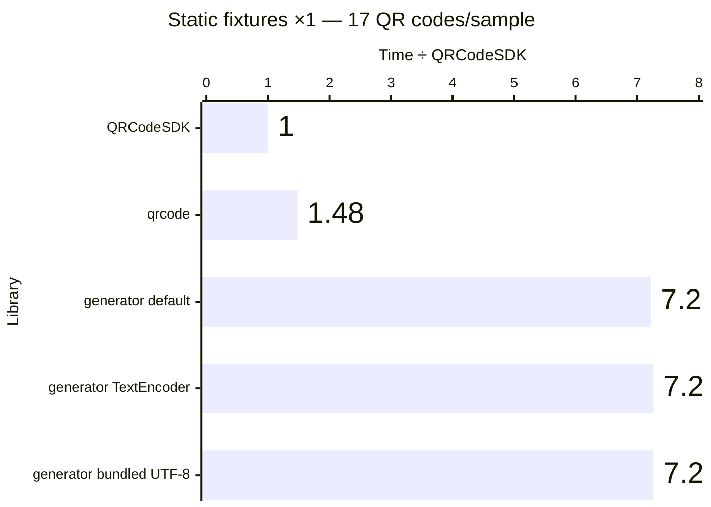

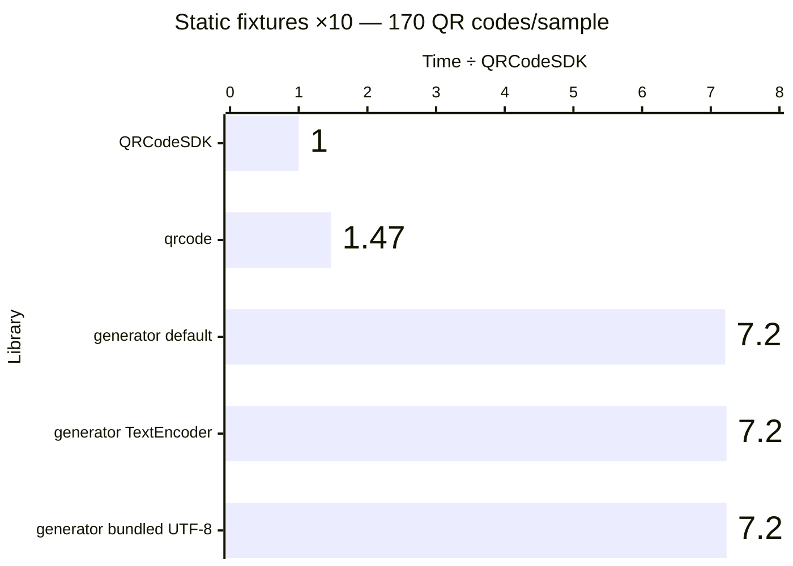

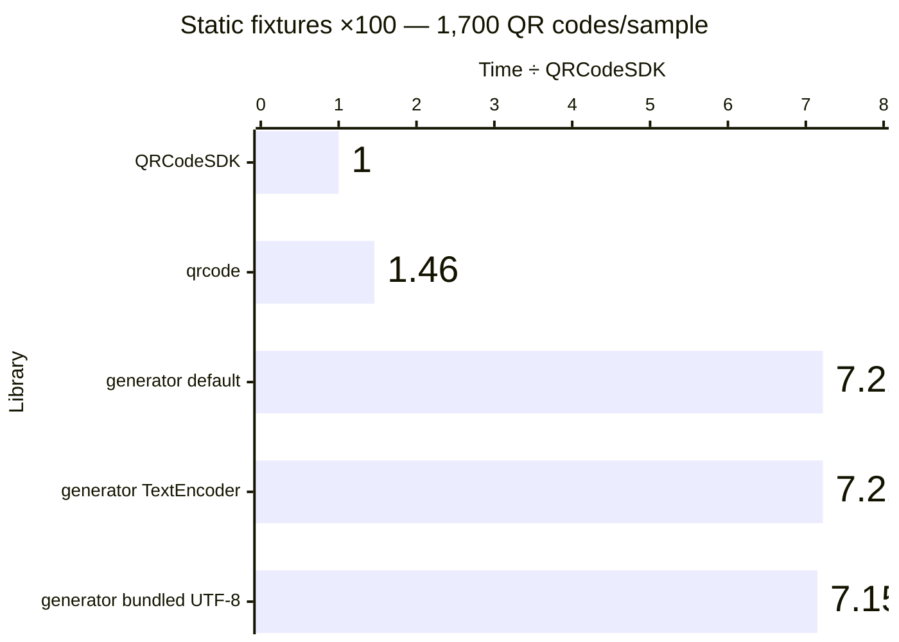

Exact benchmark data

| Workload             | QR codes/sample | Library                                 | Median (ms) |      Min–max (ms) | QR codes/second | Time ÷ QRCodeSDK |
| -------------------- | --------------: | --------------------------------------- | ----------: | ----------------: | --------------: | ---------------: |
| Static fixtures ×1   |              17 | QRCodeSDK v0.0.1                        |      12.928 |     12.860–13.179 |           1,315 |            1.00× |
| Static fixtures ×1   |              17 | qrcode v1.5.4                           |      19.089 |     18.805–26.209 |             891 |            1.48× |
| Static fixtures ×1   |              17 | qrcode-generator (default) v2.0.4       |      93.299 |     92.769–93.743 |             182 |            7.22× |
| Static fixtures ×1   |              17 | qrcode-generator (TextEncoder) v2.0.4   |      93.862 |     93.674–94.131 |             181 |            7.26× |
| Static fixtures ×1   |              17 | qrcode-generator (bundled UTF-8) v2.0.4 |      93.840 |     93.599–93.981 |             181 |            7.26× |
| Static fixtures ×10  |             170 | QRCodeSDK v0.0.1                        |     129.461 |   129.045–129.625 |           1,313 |            1.00× |
| Static fixtures ×10  |             170 | qrcode v1.5.4                           |     190.694 |   190.264–191.383 |             891 |            1.47× |
| Static fixtures ×10  |             170 | qrcode-generator (default) v2.0.4       |     932.926 |   932.141–933.158 |             182 |            7.21× |
| Static fixtures ×10  |             170 | qrcode-generator (TextEncoder) v2.0.4   |     936.007 |   935.376–936.851 |             182 |            7.23× |
| Static fixtures ×10  |             170 | qrcode-generator (bundled UTF-8) v2.0.4 |     935.812 |   934.123–951.743 |             182 |            7.23× |
| Static fixtures ×100 |           1,700 | QRCodeSDK v0.0.1                        |    1290.494 | 1288.644–1307.768 |           1,317 |            1.00× |
| Static fixtures ×100 |           1,700 | qrcode v1.5.4                           |    1881.766 | 1874.200–2291.480 |             903 |            1.46× |
| Static fixtures ×100 |           1,700 | qrcode-generator (default) v2.0.4       |    9323.703 | 9207.249–9337.353 |             182 |            7.22× |
| Static fixtures ×100 |           1,700 | qrcode-generator (TextEncoder) v2.0.4   |    9318.931 | 9233.688–9356.838 |             182 |            7.22× |
| Static fixtures ×100 |           1,700 | qrcode-generator (bundled UTF-8) v2.0.4 |    9228.304 | 9222.951–9362.114 |             184 |            7.15× |

## SVG generation

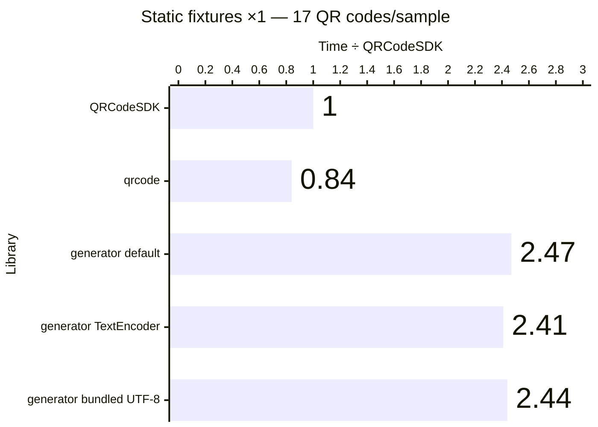

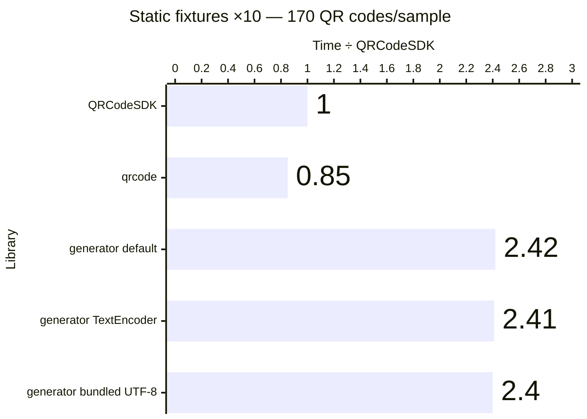

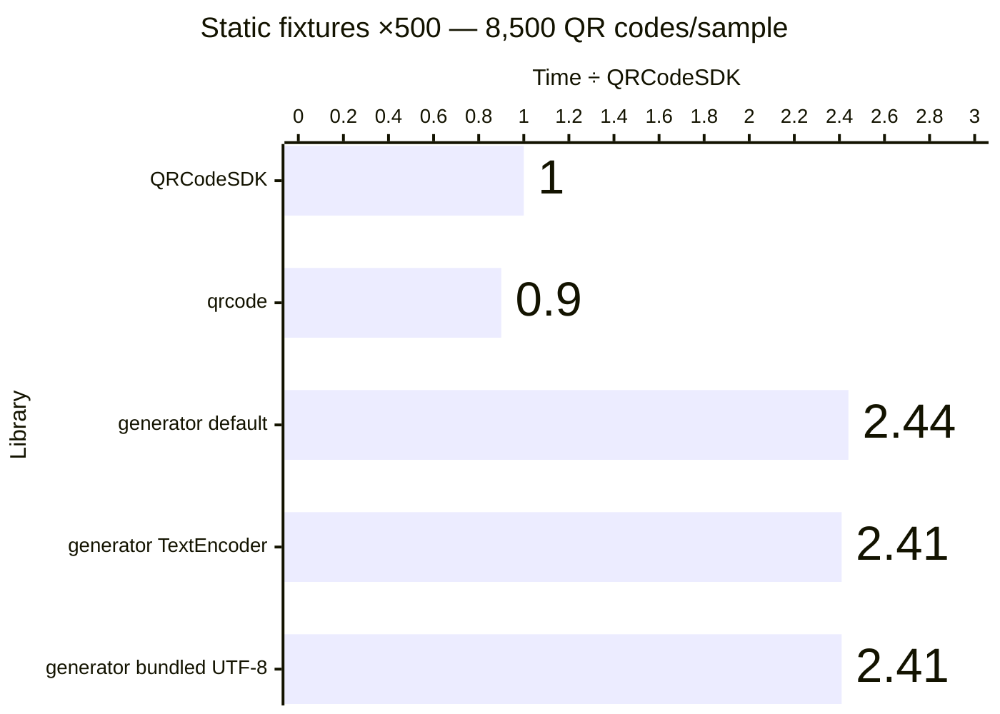

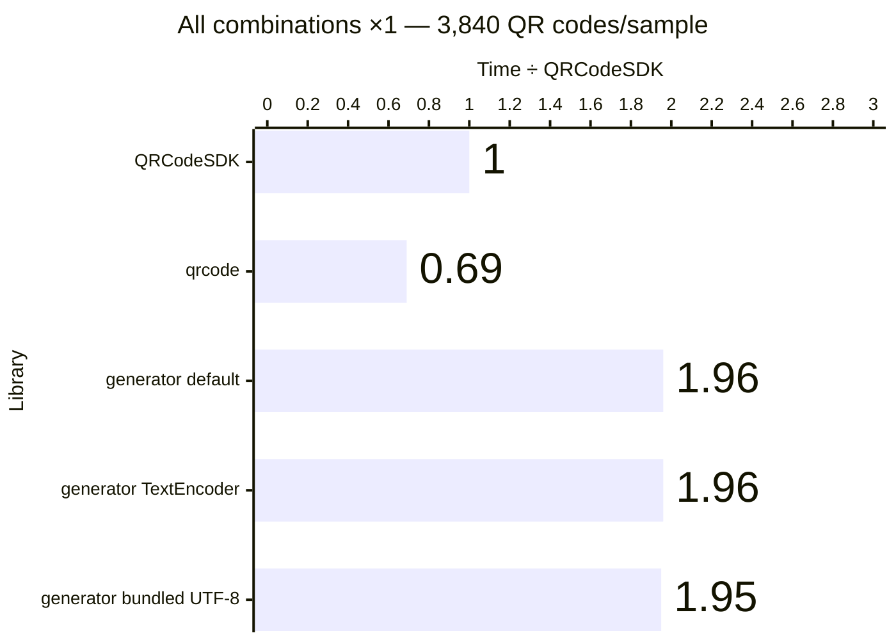

Exact benchmark data

| Workload             | QR codes/sample | Library                                 | Median (ms) |      Min–max (ms) | QR codes/second | Time ÷ QRCodeSDK |
| -------------------- | --------------: | --------------------------------------- | ----------: | ----------------: | --------------: | ---------------: |
| Static fixtures ×1   |              17 | QRCodeSDK v0.0.1                        |       4.577 |       4.467–4.954 |           3,714 |            1.00× |
| Static fixtures ×1   |              17 | qrcode v1.5.4                           |       3.864 |       3.783–4.243 |           4,400 |            0.84× |
| Static fixtures ×1   |              17 | qrcode-generator (default) v2.0.4       |      11.283 |     10.955–11.849 |           1,507 |            2.47× |
| Static fixtures ×1   |              17 | qrcode-generator (TextEncoder) v2.0.4   |      11.034 |     10.905–11.162 |           1,541 |            2.41× |
| Static fixtures ×1   |              17 | qrcode-generator (bundled UTF-8) v2.0.4 |      11.150 |     11.015–11.651 |           1,525 |            2.44× |
| Static fixtures ×10  |             170 | QRCodeSDK v0.0.1                        |      45.379 |     44.492–46.436 |           3,746 |            1.00× |
| Static fixtures ×10  |             170 | qrcode v1.5.4                           |      38.590 |     37.938–39.165 |           4,405 |            0.85× |
| Static fixtures ×10  |             170 | qrcode-generator (default) v2.0.4       |     109.700 |   108.746–111.915 |           1,550 |            2.42× |
| Static fixtures ×10  |             170 | qrcode-generator (TextEncoder) v2.0.4   |     109.312 |   108.825–109.844 |           1,555 |            2.41× |
| Static fixtures ×10  |             170 | qrcode-generator (bundled UTF-8) v2.0.4 |     109.032 |   108.621–110.060 |           1,559 |            2.40× |
| Static fixtures ×500 |           8,500 | QRCodeSDK v0.0.1                        |    2266.160 | 2265.363–2278.466 |           3,751 |            1.00× |
| Static fixtures ×500 |           8,500 | qrcode v1.5.4                           |    2031.395 | 1914.385–2044.569 |           4,184 |            0.90× |
| Static fixtures ×500 |           8,500 | qrcode-generator (default) v2.0.4       |    5521.908 | 5465.132–5559.920 |           1,539 |            2.44× |
| Static fixtures ×500 |           8,500 | qrcode-generator (TextEncoder) v2.0.4   |    5463.255 | 5461.755–5532.135 |           1,556 |            2.41× |
| Static fixtures ×500 |           8,500 | qrcode-generator (bundled UTF-8) v2.0.4 |    5458.177 | 5455.657–5472.386 |           1,557 |            2.41× |
| All combinations ×1  |           3,840 | QRCodeSDK v0.0.1                        |    2091.405 | 2090.407–2093.921 |           1,836 |            1.00× |
| All combinations ×1  |           3,840 | qrcode v1.5.4                           |    1438.393 | 1310.315–1451.977 |           2,670 |            0.69× |
| All combinations ×1  |           3,840 | qrcode-generator (default) v2.0.4       |    4105.740 | 4064.124–4127.481 |             935 |            1.96× |
| All combinations ×1  |           3,840 | qrcode-generator (TextEncoder) v2.0.4   |    4096.433 | 4065.205–4113.411 |             937 |            1.96× |
| All combinations ×1  |           3,840 | qrcode-generator (bundled UTF-8) v2.0.4 |    4080.287 | 4065.982–4087.705 |             941 |            1.95× |

