<!-- Generated from benchmark-results/latest.json. Run `pnpm turbo run generate-performance --filter=docs` to update. -->

The matrix, automatic matrix, and SVG benchmarks compare QRCodeSDK with **qrcode** and **qrcode-generator** using its stock text encoder. Styled SVG generation compares QRCodeSDK with **qr-code-styling**. Benchmarks are environment-specific and should be read as relative comparisons, not universal guarantees.

The matrix and SVG fixtures supply explicit versions and masks. The **qrcode-generator** rows use the repository patch that applies each fixture's mask and skips automatic mask evaluation. The automatic matrix fixtures omit both options so every library selects them.

Styled SVG generation uses all 60 shared styling fixtures at 1, 10, 50 repetitions. Both libraries select the mask automatically because **qr-code-styling** has no public mask option. Fixture module size and margin determine the matching pixel dimensions passed to **qr-code-styling**, which renders SVG through a shared JSDOM environment initialized before measurement.

## Benchmark environment

- Generated: `2026-08-28T14:39:23.845Z`
- Runtime: `v24.20.0` on `darwin arm64`
- CPU: `Apple M2 Pro` (12 logical cores)
- Libraries: `qrcodesdk@0.0.1`, `qrcode@1.5.4`, `qrcode-generator@2.0.4`, `qr-code-styling@1.9.2`
- Samples: 3 timed samples after 5 static warm-up passes and 1 exhaustive warm-up pass
- SVG output: 4 px/module with a 4-module quiet zone
- Styled SVG fixtures: 60, with fixture-derived dimensions and automatic mask selection

The charts show throughput calculated from the median time. Higher is better, and each chart lists the fastest library first. Expand the exact benchmark data beneath each section for median time, min–max range, and throughput.

## Matrix generation

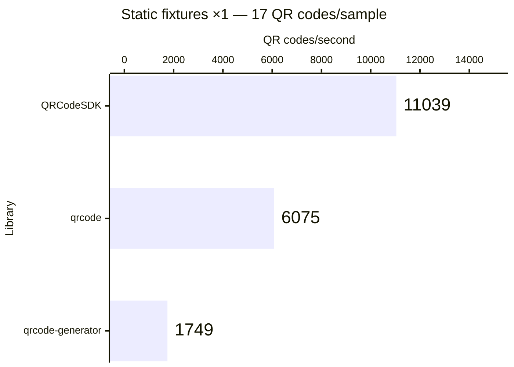

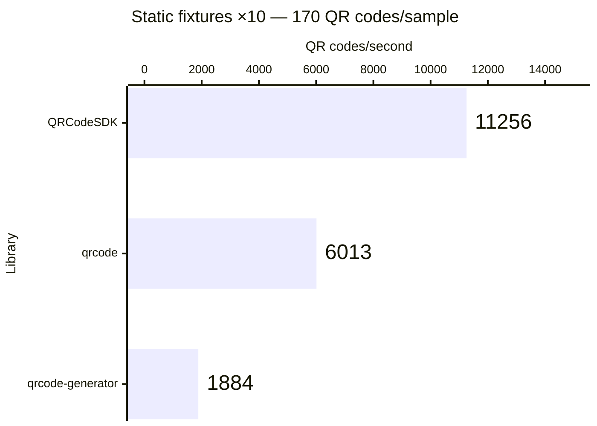

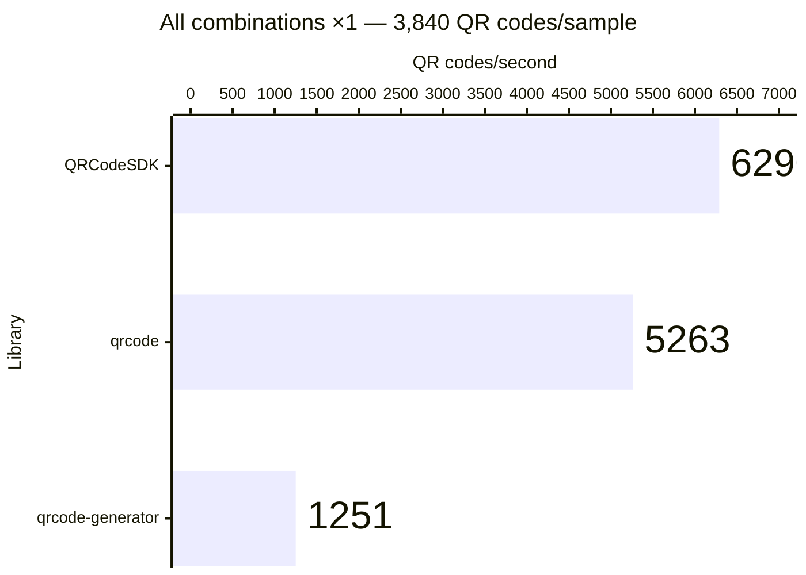

Exact benchmark data

| Workload             | QR codes/sample | Library                 | Median (ms) |      Min–max (ms) | QR codes/second |
| -------------------- | --------------: | ----------------------- | ----------: | ----------------: | --------------: |
| Static fixtures ×1   |              17 | QRCodeSDK v0.0.1        |       1.540 |       1.533–2.048 |          11,039 |
| Static fixtures ×1   |              17 | qrcode v1.5.4           |       2.798 |       2.762–3.116 |           6,075 |
| Static fixtures ×1   |              17 | qrcode-generator v2.0.4 |       9.722 |      9.272–11.148 |           1,749 |
| Static fixtures ×10  |             170 | QRCodeSDK v0.0.1        |      15.103 |     14.881–15.480 |          11,256 |
| Static fixtures ×10  |             170 | qrcode v1.5.4           |      28.273 |     27.391–29.572 |           6,013 |
| Static fixtures ×10  |             170 | qrcode-generator v2.0.4 |      90.233 |     89.257–92.322 |           1,884 |
| Static fixtures ×100 |           1,700 | QRCodeSDK v0.0.1        |     147.112 |   146.744–147.492 |          11,556 |
| Static fixtures ×100 |           1,700 | qrcode v1.5.4           |     282.038 |   279.812–284.265 |           6,028 |
| Static fixtures ×100 |           1,700 | qrcode-generator v2.0.4 |     883.527 |   881.699–894.575 |           1,924 |
| All combinations ×1  |           3,840 | QRCodeSDK v0.0.1        |     610.453 |   609.435–618.866 |           6,290 |
| All combinations ×1  |           3,840 | qrcode v1.5.4           |     729.677 |   723.874–743.933 |           5,263 |
| All combinations ×1  |           3,840 | qrcode-generator v2.0.4 |    3069.849 | 3068.997–3071.096 |           1,251 |

## Automatic matrix generation

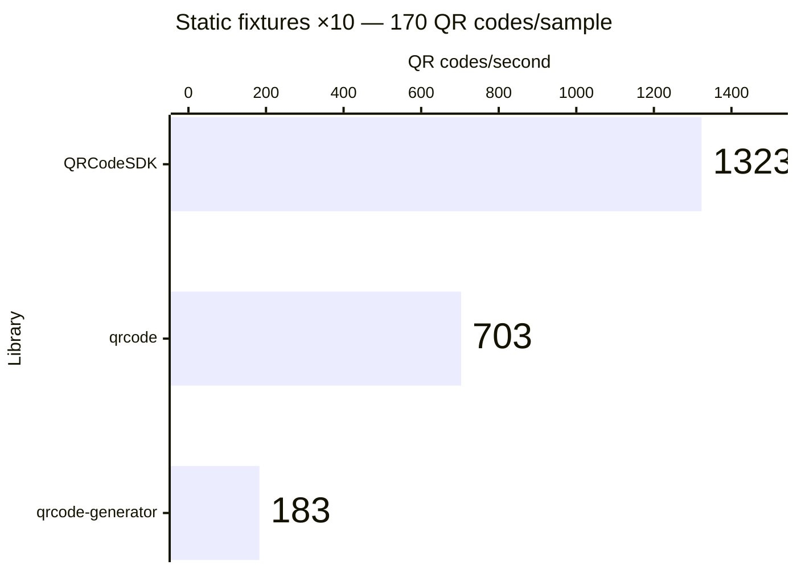

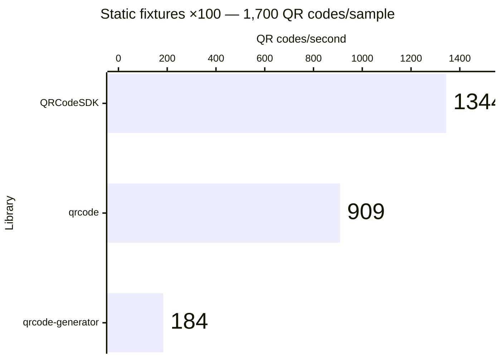

Exact benchmark data

| Workload             | QR codes/sample | Library                 | Median (ms) |      Min–max (ms) | QR codes/second |
| -------------------- | --------------: | ----------------------- | ----------: | ----------------: | --------------: |
| Static fixtures ×1   |              17 | QRCodeSDK v0.0.1        |      12.803 |     12.761–12.991 |           1,328 |
| Static fixtures ×1   |              17 | qrcode v1.5.4           |      24.304 |     23.842–24.498 |             699 |
| Static fixtures ×1   |              17 | qrcode-generator v2.0.4 |      93.523 |     93.379–93.651 |             182 |
| Static fixtures ×10  |             170 | QRCodeSDK v0.0.1        |     128.531 |   128.361–129.522 |           1,323 |
| Static fixtures ×10  |             170 | qrcode v1.5.4           |     241.918 |   238.508–242.008 |             703 |
| Static fixtures ×10  |             170 | qrcode-generator v2.0.4 |     926.909 |   924.778–936.985 |             183 |
| Static fixtures ×100 |           1,700 | QRCodeSDK v0.0.1        |    1264.648 | 1263.212–1290.640 |           1,344 |
| Static fixtures ×100 |           1,700 | qrcode v1.5.4           |    1869.523 | 1843.599–2227.754 |             909 |
| Static fixtures ×100 |           1,700 | qrcode-generator v2.0.4 |    9234.194 | 9188.708–9296.585 |             184 |

## SVG generation

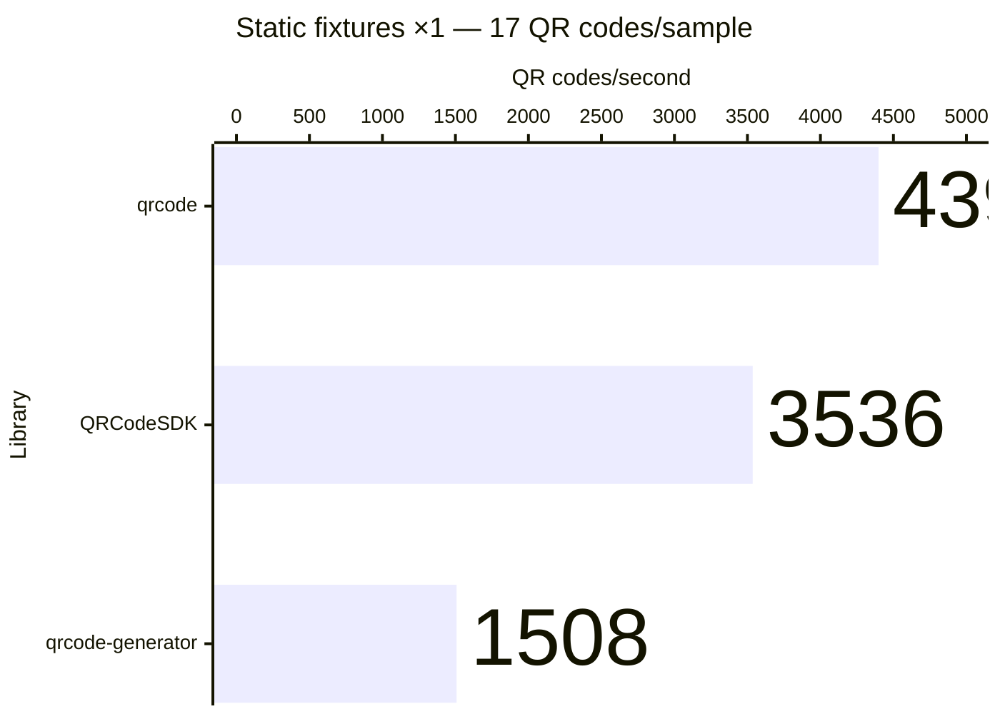

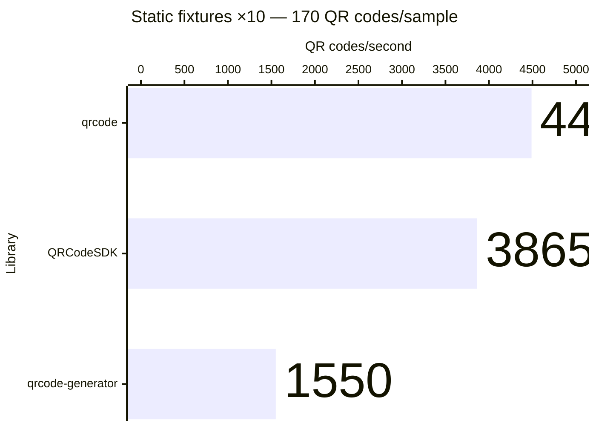

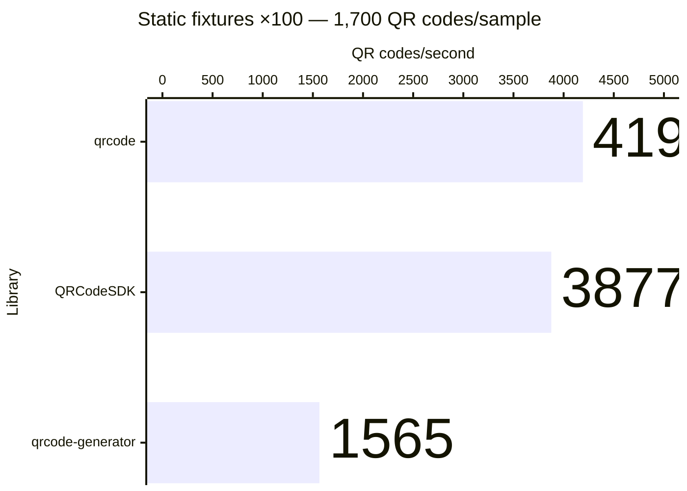

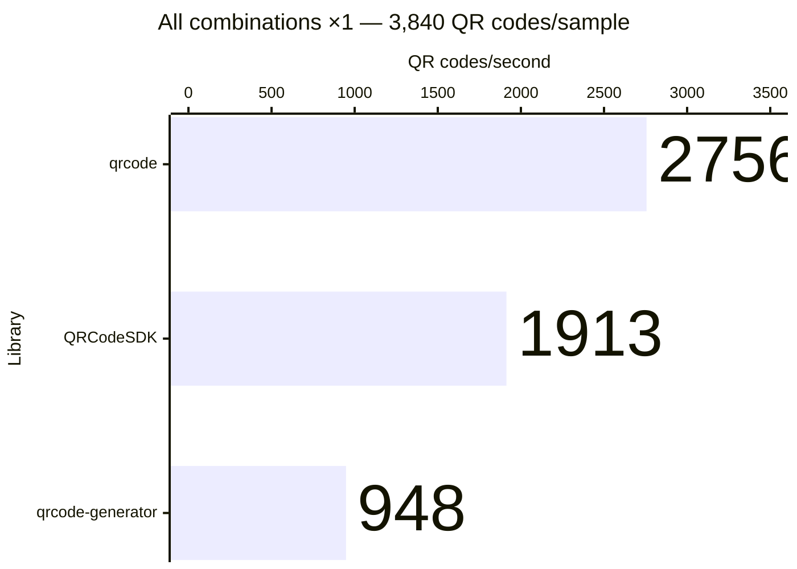

Exact benchmark data

| Workload             | QR codes/sample | Library                 | Median (ms) |      Min–max (ms) | QR codes/second |
| -------------------- | --------------: | ----------------------- | ----------: | ----------------: | --------------: |
| Static fixtures ×1   |              17 | QRCodeSDK v0.0.1        |       4.808 |       4.454–4.885 |           3,536 |
| Static fixtures ×1   |              17 | qrcode v1.5.4           |       3.865 |       3.762–3.899 |           4,398 |
| Static fixtures ×1   |              17 | qrcode-generator v2.0.4 |      11.276 |     11.179–11.326 |           1,508 |
| Static fixtures ×10  |             170 | QRCodeSDK v0.0.1        |      43.989 |     43.811–45.112 |           3,865 |
| Static fixtures ×10  |             170 | qrcode v1.5.4           |      37.868 |     37.294–38.408 |           4,489 |
| Static fixtures ×10  |             170 | qrcode-generator v2.0.4 |     109.649 |   109.064–110.089 |           1,550 |
| Static fixtures ×100 |           1,700 | QRCodeSDK v0.0.1        |     438.534 |   437.863–440.729 |           3,877 |
| Static fixtures ×100 |           1,700 | qrcode v1.5.4           |     405.575 |   369.939–408.809 |           4,192 |
| Static fixtures ×100 |           1,700 | qrcode-generator v2.0.4 |    1086.395 | 1083.452–1100.069 |           1,565 |
| All combinations ×1  |           3,840 | QRCodeSDK v0.0.1        |    2006.946 | 2005.611–2013.699 |           1,913 |
| All combinations ×1  |           3,840 | qrcode v1.5.4           |    1393.169 | 1273.148–1421.799 |           2,756 |
| All combinations ×1  |           3,840 | qrcode-generator v2.0.4 |    4051.163 | 4044.797–4061.705 |             948 |

## Styled SVG generation

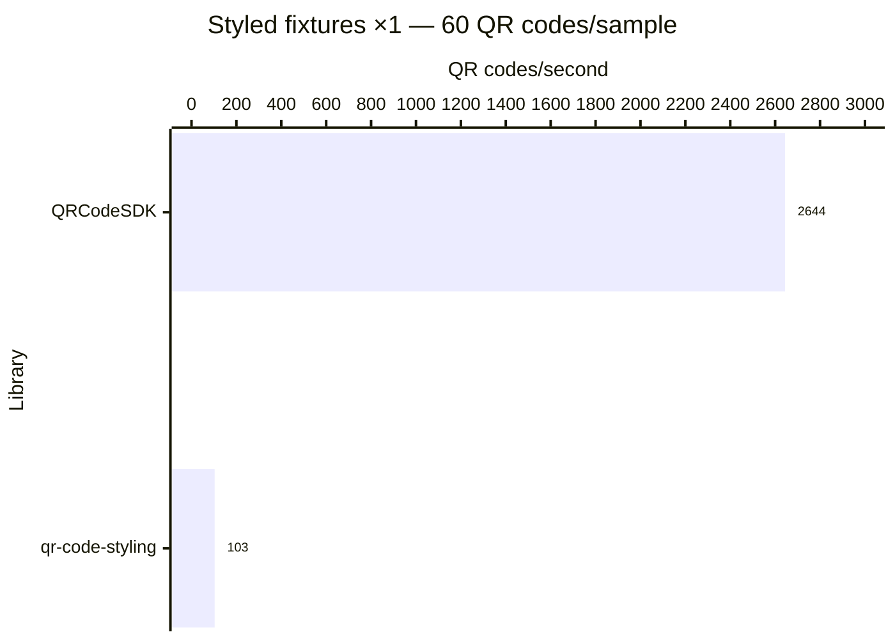

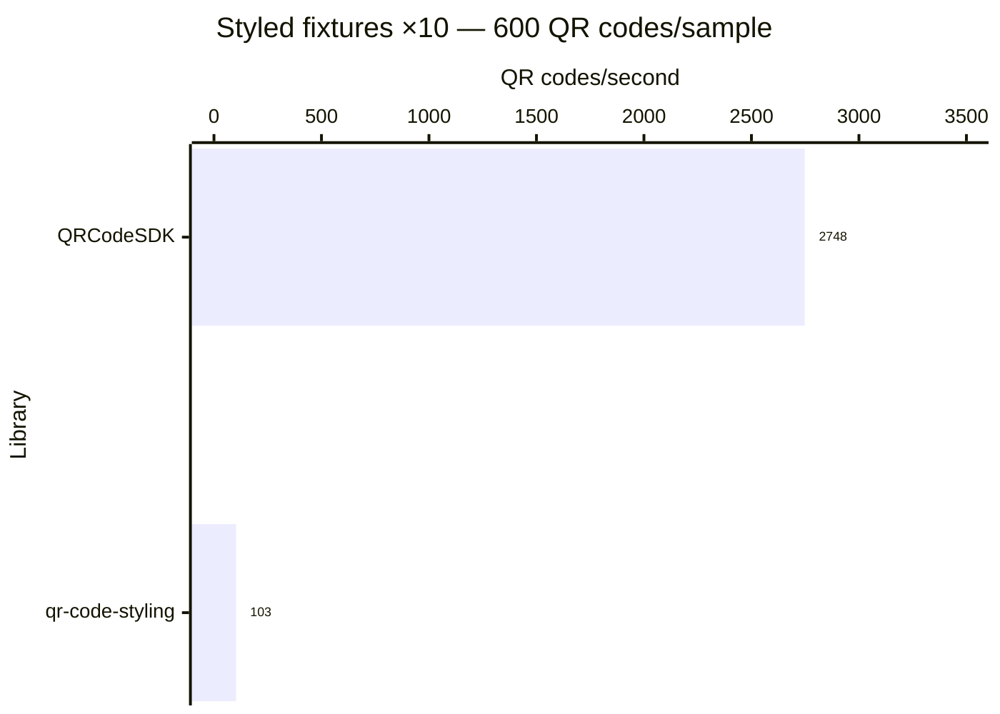

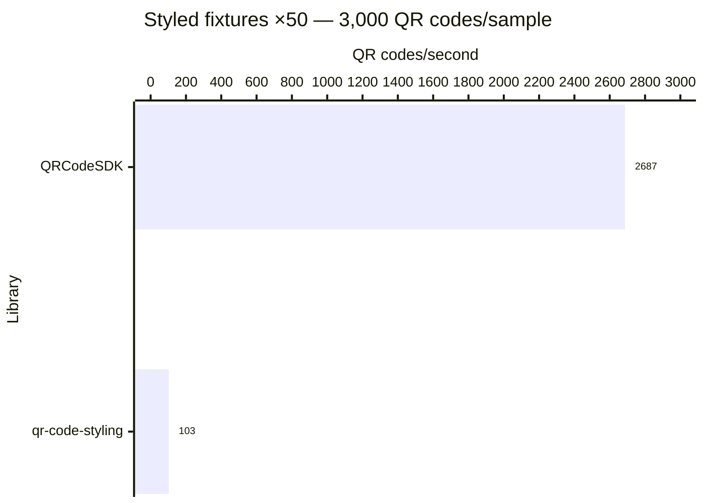

Exact benchmark data

| Workload            | QR codes/sample | Library                | Median (ms) |        Min–max (ms) | QR codes/second |
| ------------------- | --------------: | ---------------------- | ----------: | ------------------: | --------------: |
| Styled fixtures ×1  |              60 | QRCodeSDK v0.0.1       |      22.692 |       21.660–26.270 |           2,644 |
| Styled fixtures ×1  |              60 | qr-code-styling v1.9.2 |     581.053 |     579.910–582.921 |             103 |
| Styled fixtures ×10 |             600 | QRCodeSDK v0.0.1       |     218.341 |     210.060–224.326 |           2,748 |
| Styled fixtures ×10 |             600 | qr-code-styling v1.9.2 |    5814.482 |   5798.011–5829.651 |             103 |
| Styled fixtures ×50 |           3,000 | QRCodeSDK v0.0.1       |    1116.588 |   1054.815–1139.799 |           2,687 |
| Styled fixtures ×50 |           3,000 | qr-code-styling v1.9.2 |   29247.960 | 29162.984–29341.762 |             103 |

