<!-- Generated from benchmark-results/latest.json. Run `pnpm turbo run generate-performance --filter=docs` to update. -->

The matrix, automatic matrix, and SVG benchmarks compare QRCodeSDK with **qrcode** and **qrcode-generator** using its stock text encoder. Styled SVG generation compares QRCodeSDK with **qr-code-styling**. Benchmarks are environment-specific and should be read as relative comparisons, not universal guarantees.

The matrix and SVG fixtures supply explicit versions and masks. The **qrcode-generator** rows use the repository patch that applies each fixture's mask and skips automatic mask evaluation. The automatic matrix fixtures omit both options so every library selects them.

Styled SVG generation uses all 60 shared styling fixtures at 1, 10, 50 repetitions. Both libraries select the mask automatically because **qr-code-styling** has no public mask option. Fixture module size and margin determine the matching pixel dimensions passed to **qr-code-styling**, which renders SVG through a shared JSDOM environment initialized before measurement.

## Benchmark environment

- Generated: `2026-10-30T22:50:10.412Z`
- Runtime: `v26.13.0` on `darwin arm64`
- CPU: `Apple M2 Pro` (12 logical cores)
- Libraries: `qrcodesdk@0.0.4`, `qrcode@1.5.4`, `qrcode-generator@2.0.4`, `qr-code-styling@1.9.2`
- Samples: 3 timed samples after 5 static warm-up passes and 1 exhaustive warm-up pass
- SVG output: 4 px/module with a 4-module quiet zone
- Styled SVG fixtures: 60, with fixture-derived dimensions and automatic mask selection

The charts show throughput calculated from the median time. Higher is better, and each chart lists the fastest library first. Expand the exact benchmark data beneath each section for median time, min–max range, and throughput.

## Matrix generation

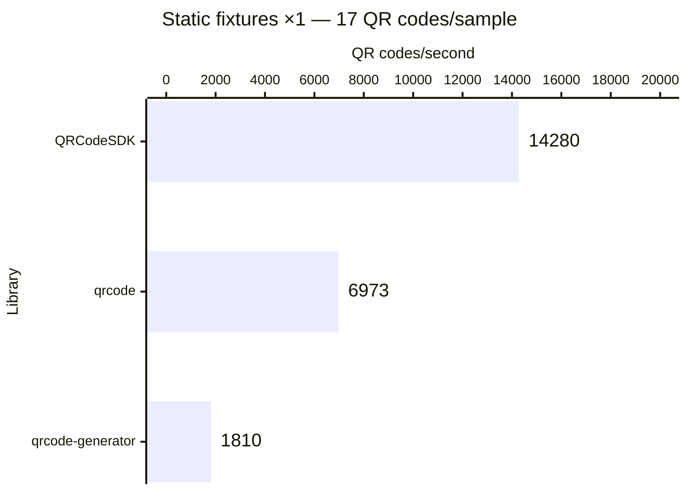
```mermaid
---
config:
  xyChart:
    showDataLabel: true
    showDataLabelOutsideBar: true
---
xychart horizontal
  accTitle: Matrix generation: Static fixtures ×1 — 17 QR codes/sample
  accDescr: Throughput calculated from median time. QRCodeSDK 14,280 QR codes per second, qrcode 6,973 QR codes per second, qrcode-generator 1,810 QR codes per second. Higher is better.
  title "Static fixtures ×1 — 17 QR codes/sample"
  x-axis "Library" ["QRCodeSDK", "qrcode", "qrcode-generator"]
  y-axis "QR codes/second" 0 --> 20000
  bar [14280, 6973, 1810]
```

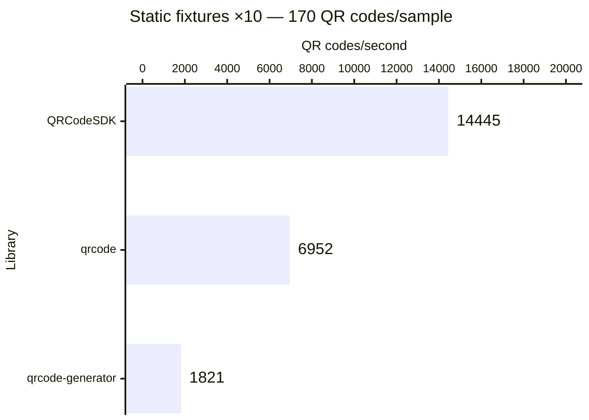
```mermaid
---
config:
  xyChart:
    showDataLabel: true
    showDataLabelOutsideBar: true
---
xychart horizontal
  accTitle: Matrix generation: Static fixtures ×10 — 170 QR codes/sample
  accDescr: Throughput calculated from median time. QRCodeSDK 14,445 QR codes per second, qrcode 6,952 QR codes per second, qrcode-generator 1,821 QR codes per second. Higher is better.
  title "Static fixtures ×10 — 170 QR codes/sample"
  x-axis "Library" ["QRCodeSDK", "qrcode", "qrcode-generator"]
  y-axis "QR codes/second" 0 --> 20000
  bar [14445, 6952, 1821]
```

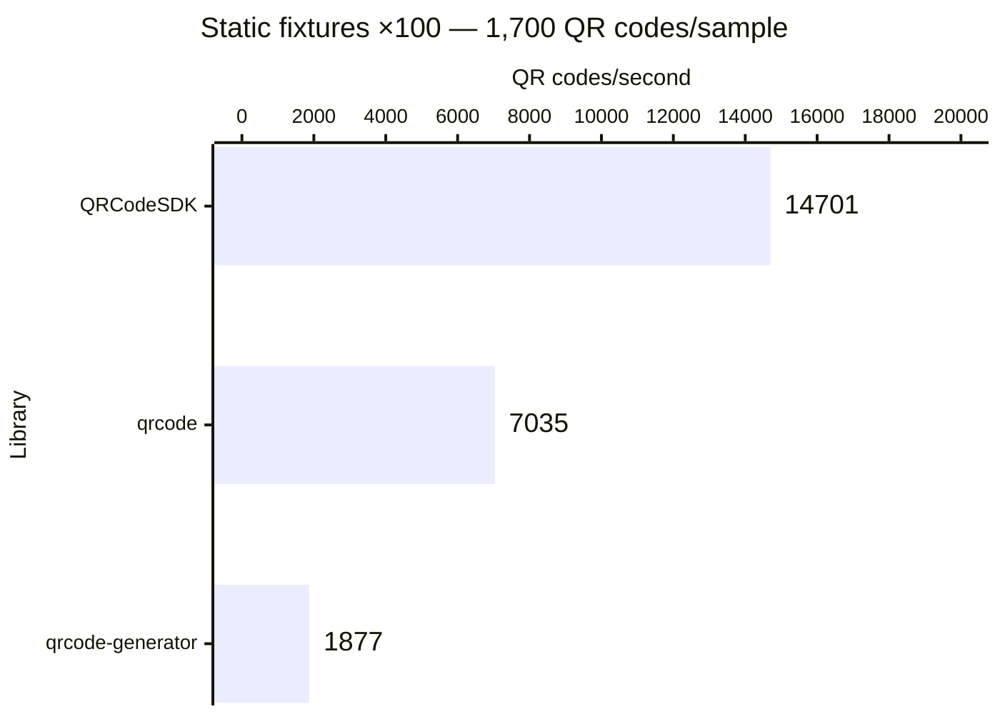
```mermaid
---
config:
  xyChart:
    showDataLabel: true
    showDataLabelOutsideBar: true
---
xychart horizontal
  accTitle: Matrix generation: Static fixtures ×100 — 1,700 QR codes/sample
  accDescr: Throughput calculated from median time. QRCodeSDK 14,701 QR codes per second, qrcode 7,035 QR codes per second, qrcode-generator 1,877 QR codes per second. Higher is better.
  title "Static fixtures ×100 — 1,700 QR codes/sample"
  x-axis "Library" ["QRCodeSDK", "qrcode", "qrcode-generator"]
  y-axis "QR codes/second" 0 --> 20000
  bar [14701, 7035, 1877]
```

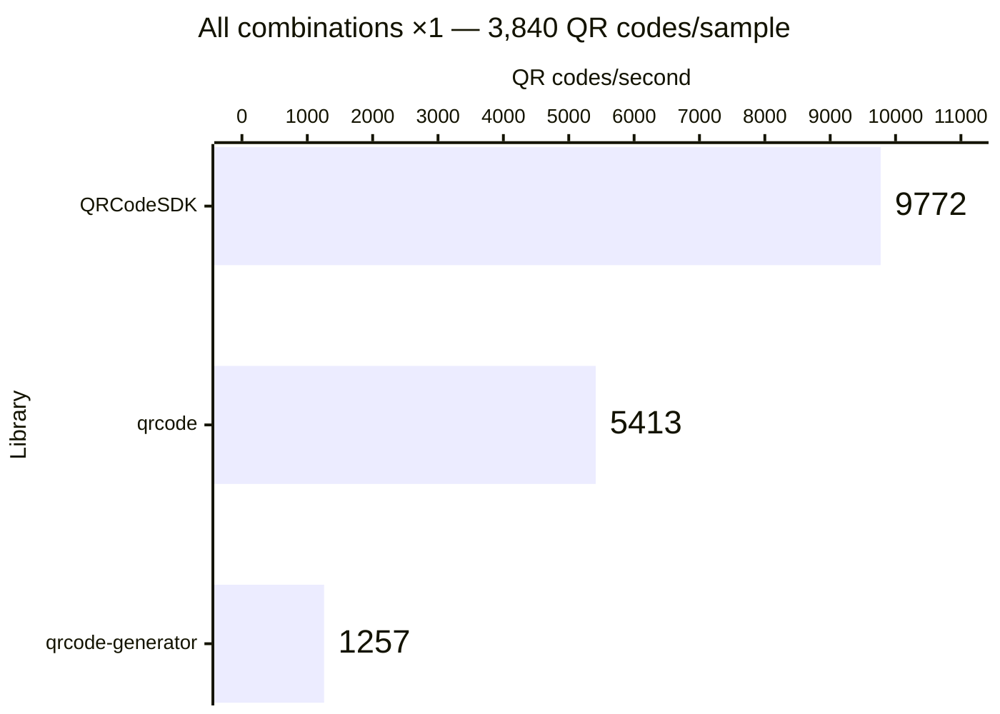
```mermaid
---
config:
  xyChart:
    showDataLabel: true
    showDataLabelOutsideBar: true
---
xychart horizontal
  accTitle: Matrix generation: All combinations ×1 — 3,840 QR codes/sample
  accDescr: Throughput calculated from median time. QRCodeSDK 9,772 QR codes per second, qrcode 5,413 QR codes per second, qrcode-generator 1,257 QR codes per second. Higher is better.
  title "All combinations ×1 — 3,840 QR codes/sample"
  x-axis "Library" ["QRCodeSDK", "qrcode", "qrcode-generator"]
  y-axis "QR codes/second" 0 --> 11000
  bar [9772, 5413, 1257]
```

Exact benchmark data

| Workload             | QR codes/sample | Library                 | Median (ms) |      Min–max (ms) | QR codes/second |
| -------------------- | --------------: | ----------------------- | ----------: | ----------------: | --------------: |
| Static fixtures ×1   |              17 | QRCodeSDK v0.0.4        |       1.190 |       1.182–1.349 |          14,280 |
| Static fixtures ×1   |              17 | qrcode v1.5.4           |       2.438 |       2.420–2.770 |           6,973 |
| Static fixtures ×1   |              17 | qrcode-generator v2.0.4 |       9.393 |       9.222–9.531 |           1,810 |
| Static fixtures ×10  |             170 | QRCodeSDK v0.0.4        |      11.769 |     11.600–11.959 |          14,445 |
| Static fixtures ×10  |             170 | qrcode v1.5.4           |      24.453 |     23.937–24.788 |           6,952 |
| Static fixtures ×10  |             170 | qrcode-generator v2.0.4 |      93.343 |     91.306–93.617 |           1,821 |
| Static fixtures ×100 |           1,700 | QRCodeSDK v0.0.4        |     115.640 |   115.535–115.806 |          14,701 |
| Static fixtures ×100 |           1,700 | qrcode v1.5.4           |     241.641 |   241.278–256.268 |           7,035 |
| Static fixtures ×100 |           1,700 | qrcode-generator v2.0.4 |     905.537 |   901.886–907.392 |           1,877 |
| All combinations ×1  |           3,840 | QRCodeSDK v0.0.4        |     392.956 |   392.566–393.227 |           9,772 |
| All combinations ×1  |           3,840 | qrcode v1.5.4           |     709.360 |   708.843–712.951 |           5,413 |
| All combinations ×1  |           3,840 | qrcode-generator v2.0.4 |    3054.145 | 3052.658–3107.747 |           1,257 |

## Automatic matrix generation

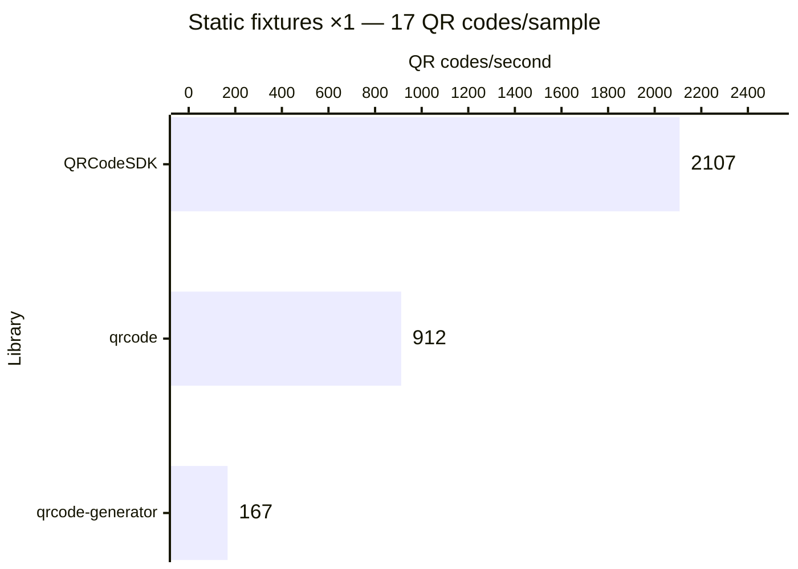
```mermaid
---
config:
  xyChart:
    showDataLabel: true
    showDataLabelOutsideBar: true
---
xychart horizontal
  accTitle: Automatic matrix generation: Static fixtures ×1 — 17 QR codes/sample
  accDescr: Throughput calculated from median time. QRCodeSDK 2,107 QR codes per second, qrcode 912 QR codes per second, qrcode-generator 167 QR codes per second. Higher is better.
  title "Static fixtures ×1 — 17 QR codes/sample"
  x-axis "Library" ["QRCodeSDK", "qrcode", "qrcode-generator"]
  y-axis "QR codes/second" 0 --> 2500
  bar [2107, 912, 167]
```

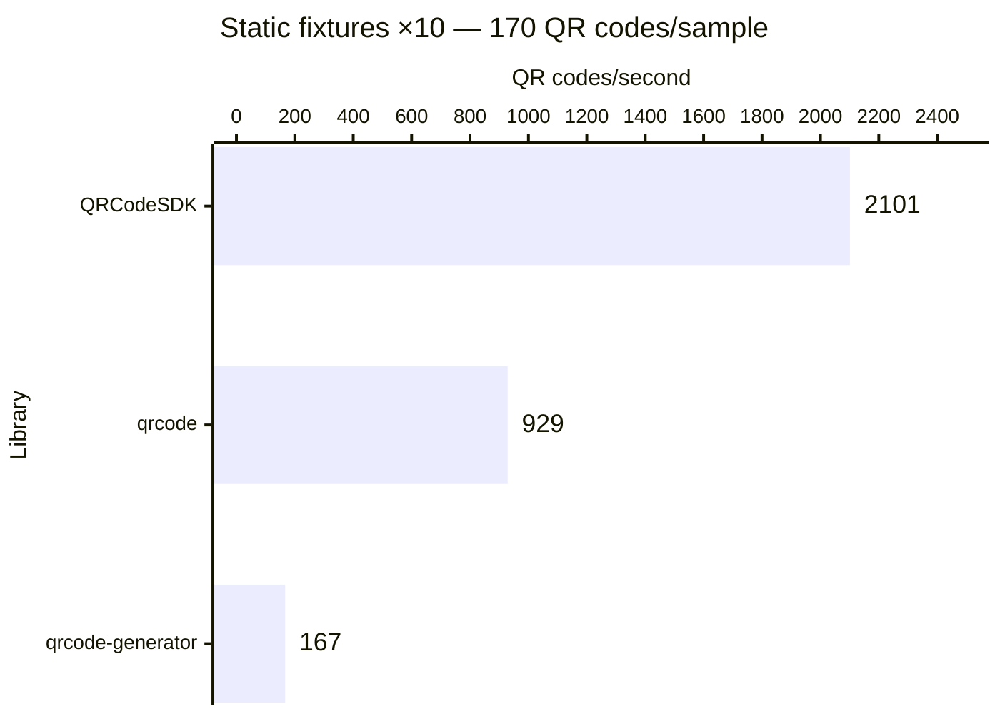
```mermaid
---
config:
  xyChart:
    showDataLabel: true
    showDataLabelOutsideBar: true
---
xychart horizontal
  accTitle: Automatic matrix generation: Static fixtures ×10 — 170 QR codes/sample
  accDescr: Throughput calculated from median time. QRCodeSDK 2,101 QR codes per second, qrcode 929 QR codes per second, qrcode-generator 167 QR codes per second. Higher is better.
  title "Static fixtures ×10 — 170 QR codes/sample"
  x-axis "Library" ["QRCodeSDK", "qrcode", "qrcode-generator"]
  y-axis "QR codes/second" 0 --> 2500
  bar [2101, 929, 167]
```

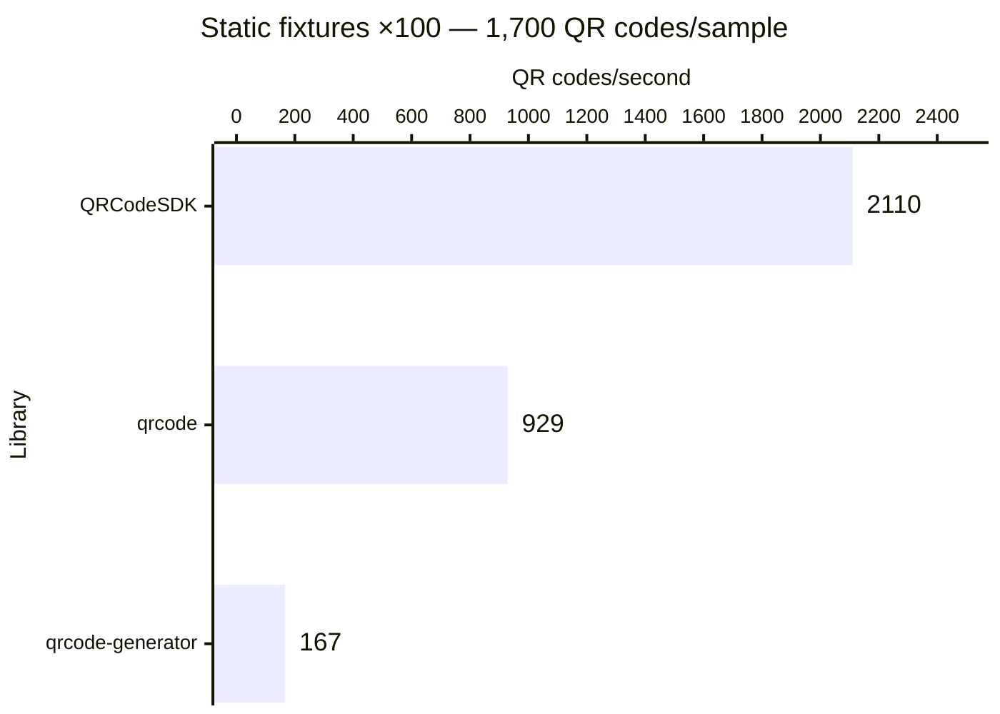
```mermaid
---
config:
  xyChart:
    showDataLabel: true
    showDataLabelOutsideBar: true
---
xychart horizontal
  accTitle: Automatic matrix generation: Static fixtures ×100 — 1,700 QR codes/sample
  accDescr: Throughput calculated from median time. QRCodeSDK 2,110 QR codes per second, qrcode 929 QR codes per second, qrcode-generator 167 QR codes per second. Higher is better.
  title "Static fixtures ×100 — 1,700 QR codes/sample"
  x-axis "Library" ["QRCodeSDK", "qrcode", "qrcode-generator"]
  y-axis "QR codes/second" 0 --> 2500
  bar [2110, 929, 167]
```

Exact benchmark data

| Workload             | QR codes/sample | Library                 | Median (ms) |        Min–max (ms) | QR codes/second |
| -------------------- | --------------: | ----------------------- | ----------: | ------------------: | --------------: |
| Static fixtures ×1   |              17 | QRCodeSDK v0.0.4        |       8.069 |         8.059–8.089 |           2,107 |
| Static fixtures ×1   |              17 | qrcode v1.5.4           |      18.640 |       18.254–22.279 |             912 |
| Static fixtures ×1   |              17 | qrcode-generator v2.0.4 |     101.650 |     101.612–103.382 |             167 |
| Static fixtures ×10  |             170 | QRCodeSDK v0.0.4        |      80.910 |       80.470–81.370 |           2,101 |
| Static fixtures ×10  |             170 | qrcode v1.5.4           |     182.993 |     182.449–183.498 |             929 |
| Static fixtures ×10  |             170 | qrcode-generator v2.0.4 |    1018.498 |   1016.183–1024.946 |             167 |
| Static fixtures ×100 |           1,700 | QRCodeSDK v0.0.4        |     805.698 |     804.034–808.198 |           2,110 |
| Static fixtures ×100 |           1,700 | qrcode v1.5.4           |    1829.531 |   1824.383–1831.448 |             929 |
| Static fixtures ×100 |           1,700 | qrcode-generator v2.0.4 |   10196.781 | 10193.282–10319.986 |             167 |

## SVG generation

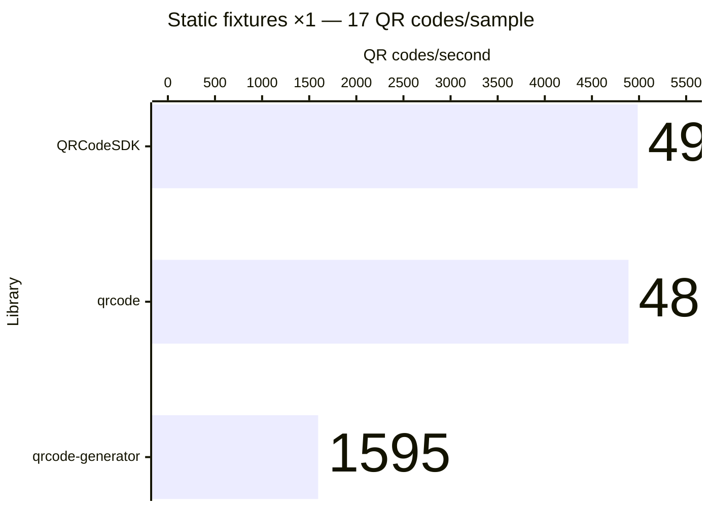
```mermaid
---
config:
  xyChart:
    showDataLabel: true
    showDataLabelOutsideBar: true
---
xychart horizontal
  accTitle: SVG generation: Static fixtures ×1 — 17 QR codes/sample
  accDescr: Throughput calculated from median time. QRCodeSDK 4,986 QR codes per second, qrcode 4,888 QR codes per second, qrcode-generator 1,595 QR codes per second. Higher is better.
  title "Static fixtures ×1 — 17 QR codes/sample"
  x-axis "Library" ["QRCodeSDK", "qrcode", "qrcode-generator"]
  y-axis "QR codes/second" 0 --> 5500
  bar [4986, 4888, 1595]
```

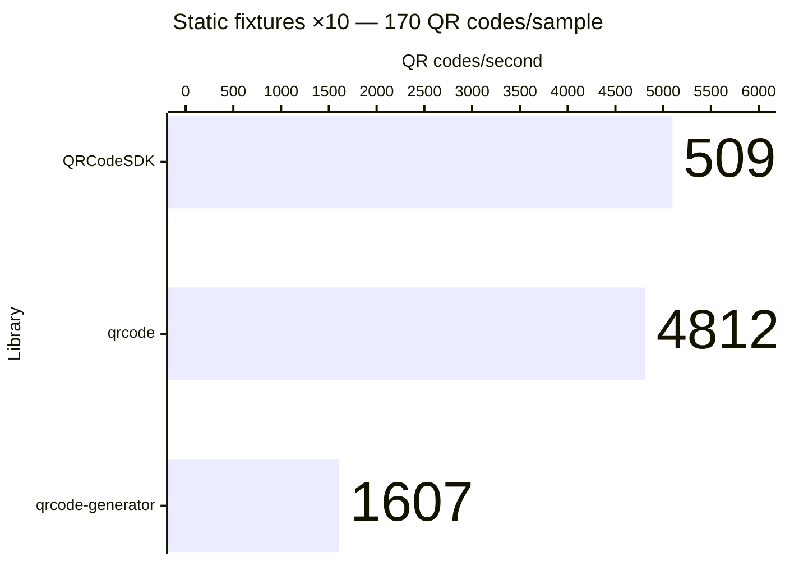
```mermaid
---
config:
  xyChart:
    showDataLabel: true
    showDataLabelOutsideBar: true
---
xychart horizontal
  accTitle: SVG generation: Static fixtures ×10 — 170 QR codes/sample
  accDescr: Throughput calculated from median time. QRCodeSDK 5,098 QR codes per second, qrcode 4,812 QR codes per second, qrcode-generator 1,607 QR codes per second. Higher is better.
  title "Static fixtures ×10 — 170 QR codes/sample"
  x-axis "Library" ["QRCodeSDK", "qrcode", "qrcode-generator"]
  y-axis "QR codes/second" 0 --> 6000
  bar [5098, 4812, 1607]
```

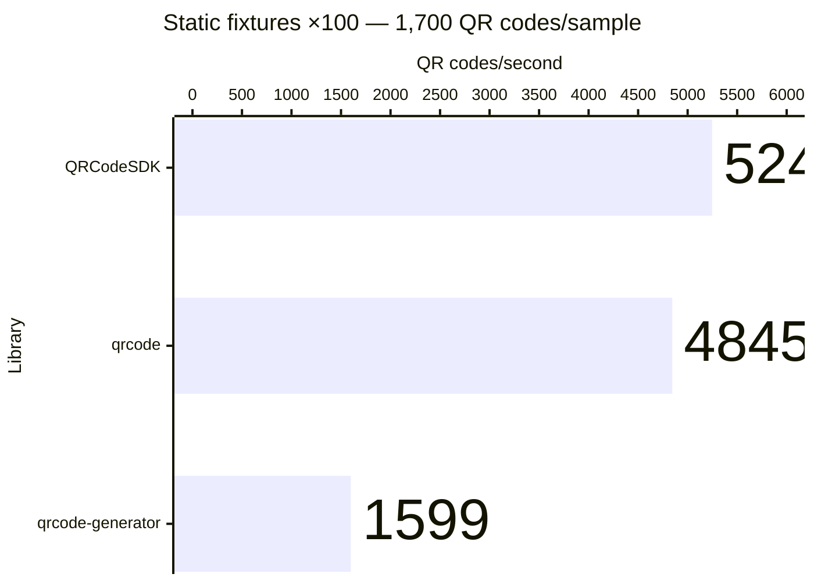
```mermaid
---
config:
  xyChart:
    showDataLabel: true
    showDataLabelOutsideBar: true
---
xychart horizontal
  accTitle: SVG generation: Static fixtures ×100 — 1,700 QR codes/sample
  accDescr: Throughput calculated from median time. QRCodeSDK 5,247 QR codes per second, qrcode 4,845 QR codes per second, qrcode-generator 1,599 QR codes per second. Higher is better.
  title "Static fixtures ×100 — 1,700 QR codes/sample"
  x-axis "Library" ["QRCodeSDK", "qrcode", "qrcode-generator"]
  y-axis "QR codes/second" 0 --> 6000
  bar [5247, 4845, 1599]
```

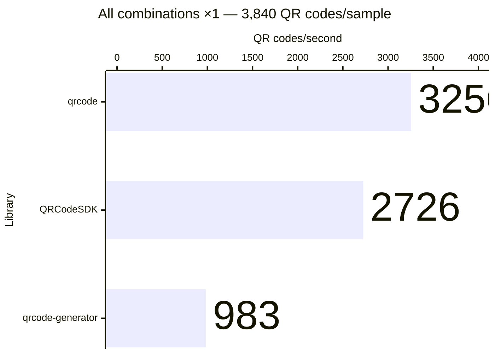
```mermaid
---
config:
  xyChart:
    showDataLabel: true
    showDataLabelOutsideBar: true
---
xychart horizontal
  accTitle: SVG generation: All combinations ×1 — 3,840 QR codes/sample
  accDescr: Throughput calculated from median time. qrcode 3,256 QR codes per second, QRCodeSDK 2,726 QR codes per second, qrcode-generator 983 QR codes per second. Higher is better.
  title "All combinations ×1 — 3,840 QR codes/sample"
  x-axis "Library" ["qrcode", "QRCodeSDK", "qrcode-generator"]
  y-axis "QR codes/second" 0 --> 4000
  bar [3256, 2726, 983]
```

Exact benchmark data

| Workload             | QR codes/sample | Library                 | Median (ms) |      Min–max (ms) | QR codes/second |
| -------------------- | --------------: | ----------------------- | ----------: | ----------------: | --------------: |
| Static fixtures ×1   |              17 | QRCodeSDK v0.0.4        |       3.409 |       3.271–3.751 |           4,986 |
| Static fixtures ×1   |              17 | qrcode v1.5.4           |       3.478 |       3.451–3.700 |           4,888 |
| Static fixtures ×1   |              17 | qrcode-generator v2.0.4 |      10.657 |     10.618–10.947 |           1,595 |
| Static fixtures ×10  |             170 | QRCodeSDK v0.0.4        |      33.348 |     33.157–33.524 |           5,098 |
| Static fixtures ×10  |             170 | qrcode v1.5.4           |      35.327 |     35.017–35.416 |           4,812 |
| Static fixtures ×10  |             170 | qrcode-generator v2.0.4 |     105.809 |   105.706–106.027 |           1,607 |
| Static fixtures ×100 |           1,700 | QRCodeSDK v0.0.4        |     324.003 |   323.638–325.428 |           5,247 |
| Static fixtures ×100 |           1,700 | qrcode v1.5.4           |     350.850 |   350.100–352.057 |           4,845 |
| Static fixtures ×100 |           1,700 | qrcode-generator v2.0.4 |    1063.370 | 1059.470–1075.482 |           1,599 |
| All combinations ×1  |           3,840 | QRCodeSDK v0.0.4        |    1408.550 | 1405.921–1410.036 |           2,726 |
| All combinations ×1  |           3,840 | qrcode v1.5.4           |    1179.285 | 1176.774–1180.548 |           3,256 |
| All combinations ×1  |           3,840 | qrcode-generator v2.0.4 |    3904.719 | 3902.278–3908.564 |             983 |

## Styled SVG generation

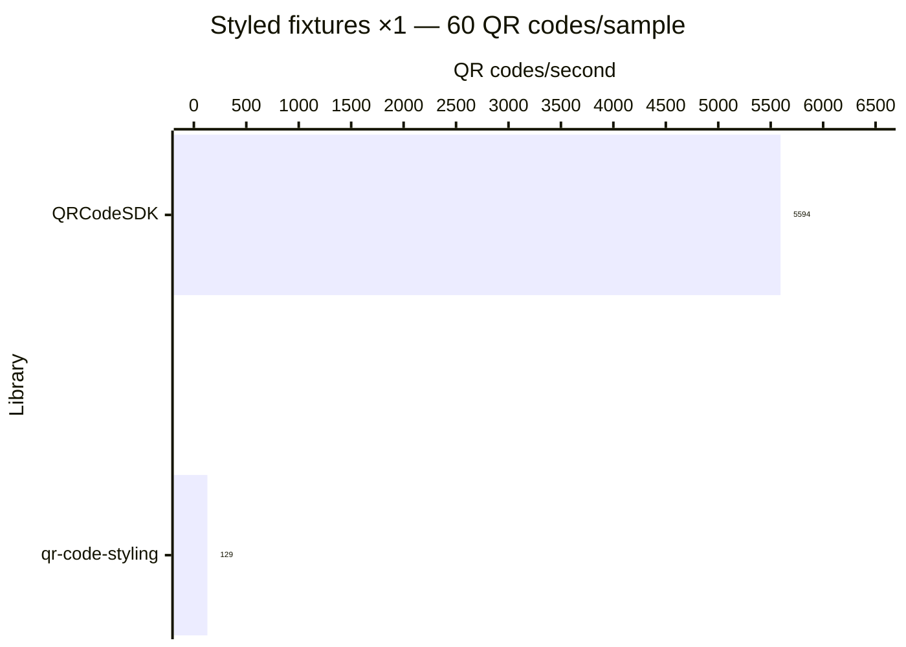
```mermaid
---
config:
  xyChart:
    showDataLabel: true
    showDataLabelOutsideBar: true
---
xychart horizontal
  accTitle: Styled SVG generation: Styled fixtures ×1 — 60 QR codes/sample
  accDescr: Throughput calculated from median time. QRCodeSDK 5,594 QR codes per second, qr-code-styling 129 QR codes per second. Higher is better.
  title "Styled fixtures ×1 — 60 QR codes/sample"
  x-axis "Library" ["QRCodeSDK", "qr-code-styling"]
  y-axis "QR codes/second" 0 --> 6500
  bar [5594, 129]
```

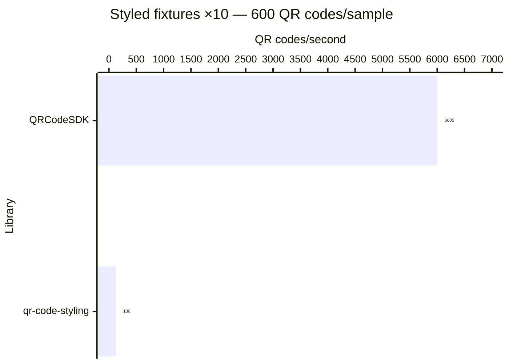
```mermaid
---
config:
  xyChart:
    showDataLabel: true
    showDataLabelOutsideBar: true
---
xychart horizontal
  accTitle: Styled SVG generation: Styled fixtures ×10 — 600 QR codes/sample
  accDescr: Throughput calculated from median time. QRCodeSDK 6,005 QR codes per second, qr-code-styling 130 QR codes per second. Higher is better.
  title "Styled fixtures ×10 — 600 QR codes/sample"
  x-axis "Library" ["QRCodeSDK", "qr-code-styling"]
  y-axis "QR codes/second" 0 --> 7000
  bar [6005, 130]
```

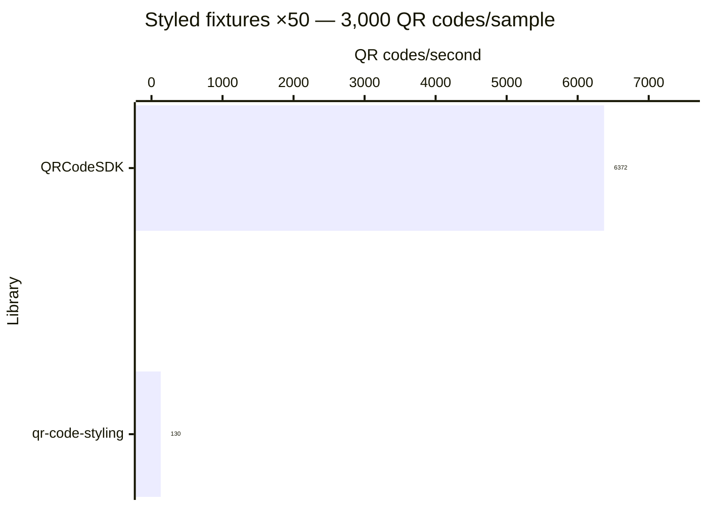
```mermaid
---
config:
  xyChart:
    showDataLabel: true
    showDataLabelOutsideBar: true
---
xychart horizontal
  accTitle: Styled SVG generation: Styled fixtures ×50 — 3,000 QR codes/sample
  accDescr: Throughput calculated from median time. QRCodeSDK 6,372 QR codes per second, qr-code-styling 130 QR codes per second. Higher is better.
  title "Styled fixtures ×50 — 3,000 QR codes/sample"
  x-axis "Library" ["QRCodeSDK", "qr-code-styling"]
  y-axis "QR codes/second" 0 --> 7500
  bar [6372, 130]
```

Exact benchmark data

| Workload            | QR codes/sample | Library                | Median (ms) |        Min–max (ms) | QR codes/second |
| ------------------- | --------------: | ---------------------- | ----------: | ------------------: | --------------: |
| Styled fixtures ×1  |              60 | QRCodeSDK v0.0.4       |      10.725 |       10.622–11.507 |           5,594 |
| Styled fixtures ×1  |              60 | qr-code-styling v1.9.2 |     465.860 |     461.376–466.638 |             129 |
| Styled fixtures ×10 |             600 | QRCodeSDK v0.0.4       |      99.911 |      97.963–103.361 |           6,005 |
| Styled fixtures ×10 |             600 | qr-code-styling v1.9.2 |    4615.165 |   4611.893–4621.013 |             130 |
| Styled fixtures ×50 |           3,000 | QRCodeSDK v0.0.4       |     470.793 |     455.552–481.559 |           6,372 |
| Styled fixtures ×50 |           3,000 | qr-code-styling v1.9.2 |   23050.092 | 23045.995–23075.004 |             130 |

