<!-- Generated from benchmark-results/latest.json. Run `pnpm turbo run generate-performance --filter=docs` to update. -->

The matrix, automatic matrix, and SVG benchmarks compare QRCodeSDK with **qrcode** and **qrcode-generator** using its stock text encoder. Styled SVG generation compares QRCodeSDK with **qr-code-styling**. Benchmarks are environment-specific and should be read as relative comparisons, not universal guarantees.

The matrix and SVG fixtures supply explicit versions and masks. The **qrcode-generator** rows use the repository patch that applies each fixture's mask and skips automatic mask evaluation. The automatic matrix fixtures omit both options so every library selects them.

Styled SVG generation uses all 60 shared styling fixtures at 1, 10, 50 repetitions. Both libraries select the mask automatically because **qr-code-styling** has no public mask option. Fixture module size and margin determine the matching pixel dimensions passed to **qr-code-styling**, which renders SVG through a shared JSDOM environment initialized before measurement.

## Benchmark environment

- Generated: `2026-11-01T16:07:27.221Z`
- Runtime: `v26.13.0` on `darwin arm64`
- CPU: `Apple M2 Pro` (12 logical cores)
- Libraries: `qrcodesdk@0.0.4`, `qrcode@1.5.4`, `qrcode-generator@2.0.4`, `qr-code-styling@1.9.2`
- Samples: 3 timed samples after 5 static warm-up passes and 1 exhaustive warm-up pass
- SVG output: 4 px/module with a 4-module quiet zone
- Styled SVG fixtures: 60, with fixture-derived dimensions and automatic mask selection

The charts show throughput calculated from the median time. Higher is better, and each chart lists the fastest library first. Expand the exact benchmark data beneath each section for median time, min–max range, and throughput.

## Matrix generation

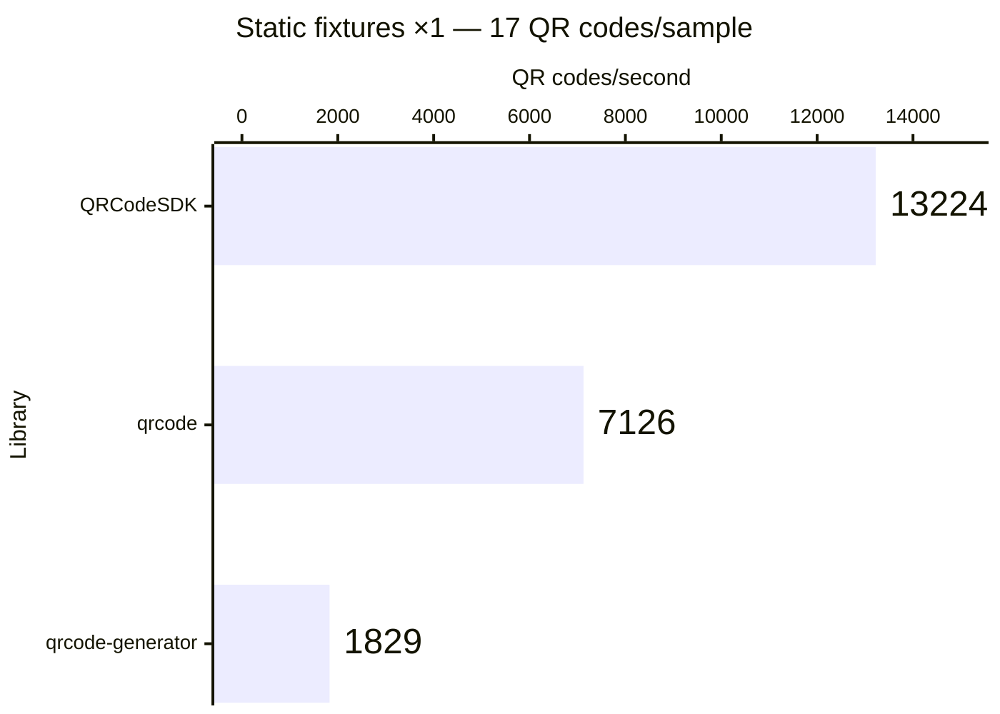
```mermaid
---
config:
  xyChart:
    showDataLabel: true
    showDataLabelOutsideBar: true
---
xychart horizontal
  accTitle: Matrix generation: Static fixtures ×1 — 17 QR codes/sample
  accDescr: Throughput calculated from median time. QRCodeSDK 13,224 QR codes per second, qrcode 7,126 QR codes per second, qrcode-generator 1,829 QR codes per second. Higher is better.
  title "Static fixtures ×1 — 17 QR codes/sample"
  x-axis "Library" ["QRCodeSDK", "qrcode", "qrcode-generator"]
  y-axis "QR codes/second" 0 --> 15000
  bar [13224, 7126, 1829]
```

```mermaid
---
config:
  xyChart:
    showDataLabel: true
    showDataLabelOutsideBar: true
---
xychart horizontal
  accTitle: Matrix generation: Static fixtures ×10 — 170 QR codes/sample
  accDescr: Throughput calculated from median time. QRCodeSDK 13,226 QR codes per second, qrcode 7,072 QR codes per second, qrcode-generator 1,852 QR codes per second. Higher is better.
  title "Static fixtures ×10 — 170 QR codes/sample"
  x-axis "Library" ["QRCodeSDK", "qrcode", "qrcode-generator"]
  y-axis "QR codes/second" 0 --> 15000
  bar [13226, 7072, 1852]
```

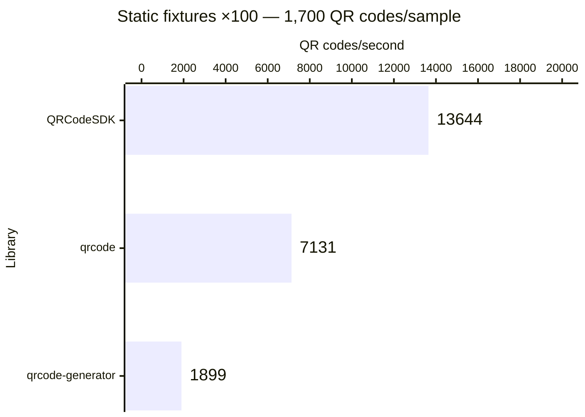
```mermaid
---
config:
  xyChart:
    showDataLabel: true
    showDataLabelOutsideBar: true
---
xychart horizontal
  accTitle: Matrix generation: Static fixtures ×100 — 1,700 QR codes/sample
  accDescr: Throughput calculated from median time. QRCodeSDK 13,644 QR codes per second, qrcode 7,131 QR codes per second, qrcode-generator 1,899 QR codes per second. Higher is better.
  title "Static fixtures ×100 — 1,700 QR codes/sample"
  x-axis "Library" ["QRCodeSDK", "qrcode", "qrcode-generator"]
  y-axis "QR codes/second" 0 --> 20000
  bar [13644, 7131, 1899]
```

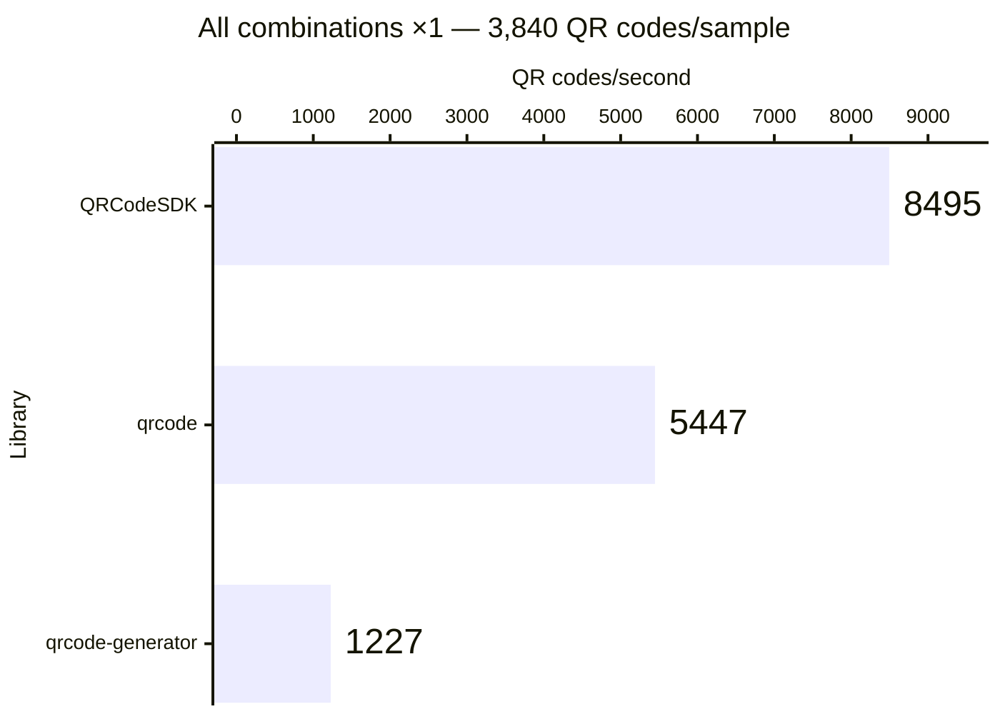
```mermaid
---
config:
  xyChart:
    showDataLabel: true
    showDataLabelOutsideBar: true
---
xychart horizontal
  accTitle: Matrix generation: All combinations ×1 — 3,840 QR codes/sample
  accDescr: Throughput calculated from median time. QRCodeSDK 8,495 QR codes per second, qrcode 5,447 QR codes per second, qrcode-generator 1,227 QR codes per second. Higher is better.
  title "All combinations ×1 — 3,840 QR codes/sample"
  x-axis "Library" ["QRCodeSDK", "qrcode", "qrcode-generator"]
  y-axis "QR codes/second" 0 --> 9500
  bar [8495, 5447, 1227]
```

Exact benchmark data

| Workload             | QR codes/sample | Library                 | Median (ms) |      Min–max (ms) | QR codes/second |
| -------------------- | --------------: | ----------------------- | ----------: | ----------------: | --------------: |
| Static fixtures ×1   |              17 | QRCodeSDK v0.0.4        |       1.286 |       1.277–1.735 |          13,224 |
| Static fixtures ×1   |              17 | qrcode v1.5.4           |       2.386 |       2.338–2.479 |           7,126 |
| Static fixtures ×1   |              17 | qrcode-generator v2.0.4 |       9.296 |       9.250–9.774 |           1,829 |
| Static fixtures ×10  |             170 | QRCodeSDK v0.0.4        |      12.853 |     12.449–13.036 |          13,226 |
| Static fixtures ×10  |             170 | qrcode v1.5.4           |      24.039 |     24.035–26.837 |           7,072 |
| Static fixtures ×10  |             170 | qrcode-generator v2.0.4 |      91.774 |     90.167–92.678 |           1,852 |
| Static fixtures ×100 |           1,700 | QRCodeSDK v0.0.4        |     124.599 |   123.969–125.517 |          13,644 |
| Static fixtures ×100 |           1,700 | qrcode v1.5.4           |     238.384 |   237.086–239.746 |           7,131 |
| Static fixtures ×100 |           1,700 | qrcode-generator v2.0.4 |     895.086 |   883.497–912.420 |           1,899 |
| All combinations ×1  |           3,840 | QRCodeSDK v0.0.4        |     452.019 |   441.609–485.007 |           8,495 |
| All combinations ×1  |           3,840 | qrcode v1.5.4           |     704.987 |   704.344–729.346 |           5,447 |
| All combinations ×1  |           3,840 | qrcode-generator v2.0.4 |    3129.359 | 3099.984–3151.896 |           1,227 |

## Automatic matrix generation

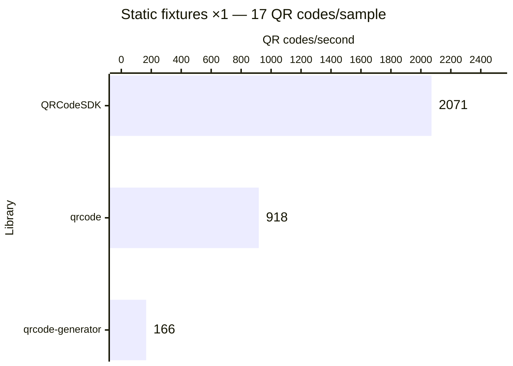
```mermaid
---
config:
  xyChart:
    showDataLabel: true
    showDataLabelOutsideBar: true
---
xychart horizontal
  accTitle: Automatic matrix generation: Static fixtures ×1 — 17 QR codes/sample
  accDescr: Throughput calculated from median time. QRCodeSDK 2,071 QR codes per second, qrcode 918 QR codes per second, qrcode-generator 166 QR codes per second. Higher is better.
  title "Static fixtures ×1 — 17 QR codes/sample"
  x-axis "Library" ["QRCodeSDK", "qrcode", "qrcode-generator"]
  y-axis "QR codes/second" 0 --> 2500
  bar [2071, 918, 166]
```

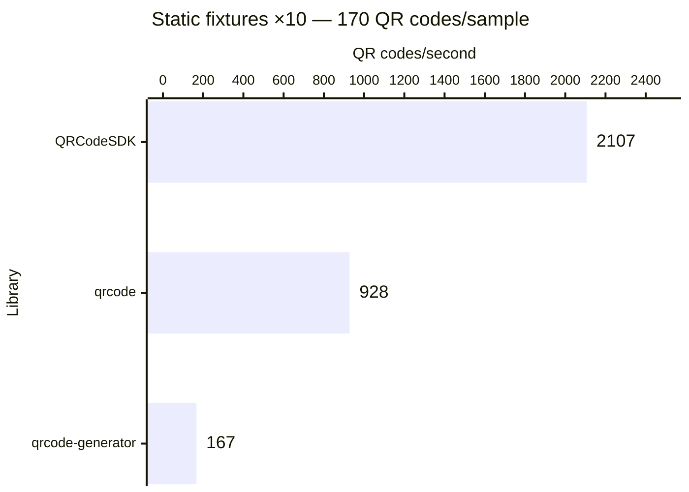
```mermaid
---
config:
  xyChart:
    showDataLabel: true
    showDataLabelOutsideBar: true
---
xychart horizontal
  accTitle: Automatic matrix generation: Static fixtures ×10 — 170 QR codes/sample
  accDescr: Throughput calculated from median time. QRCodeSDK 2,107 QR codes per second, qrcode 928 QR codes per second, qrcode-generator 167 QR codes per second. Higher is better.
  title "Static fixtures ×10 — 170 QR codes/sample"
  x-axis "Library" ["QRCodeSDK", "qrcode", "qrcode-generator"]
  y-axis "QR codes/second" 0 --> 2500
  bar [2107, 928, 167]
```

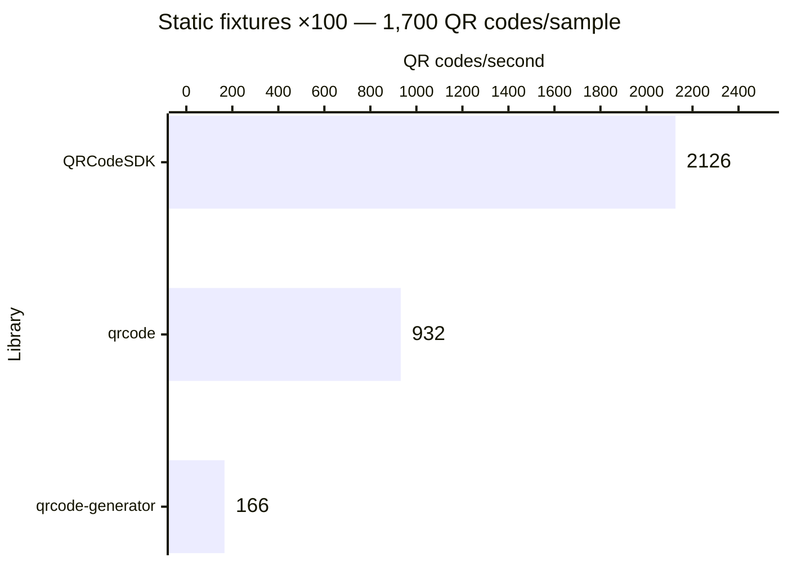
```mermaid
---
config:
  xyChart:
    showDataLabel: true
    showDataLabelOutsideBar: true
---
xychart horizontal
  accTitle: Automatic matrix generation: Static fixtures ×100 — 1,700 QR codes/sample
  accDescr: Throughput calculated from median time. QRCodeSDK 2,126 QR codes per second, qrcode 932 QR codes per second, qrcode-generator 166 QR codes per second. Higher is better.
  title "Static fixtures ×100 — 1,700 QR codes/sample"
  x-axis "Library" ["QRCodeSDK", "qrcode", "qrcode-generator"]
  y-axis "QR codes/second" 0 --> 2500
  bar [2126, 932, 166]
```

Exact benchmark data

| Workload             | QR codes/sample | Library                 | Median (ms) |        Min–max (ms) | QR codes/second |
| -------------------- | --------------: | ----------------------- | ----------: | ------------------: | --------------: |
| Static fixtures ×1   |              17 | QRCodeSDK v0.0.4        |       8.208 |         8.170–8.259 |           2,071 |
| Static fixtures ×1   |              17 | qrcode v1.5.4           |      18.521 |       18.462–25.948 |             918 |
| Static fixtures ×1   |              17 | qrcode-generator v2.0.4 |     102.161 |     102.085–105.267 |             166 |
| Static fixtures ×10  |             170 | QRCodeSDK v0.0.4        |      80.685 |       80.331–80.944 |           2,107 |
| Static fixtures ×10  |             170 | qrcode v1.5.4           |     183.159 |     182.824–187.209 |             928 |
| Static fixtures ×10  |             170 | qrcode-generator v2.0.4 |    1019.440 |   1009.202–1033.997 |             167 |
| Static fixtures ×100 |           1,700 | QRCodeSDK v0.0.4        |     799.624 |     798.930–801.987 |           2,126 |
| Static fixtures ×100 |           1,700 | qrcode v1.5.4           |    1824.140 |   1822.935–1828.900 |             932 |
| Static fixtures ×100 |           1,700 | qrcode-generator v2.0.4 |   10238.958 | 10214.907–10299.937 |             166 |

## SVG generation

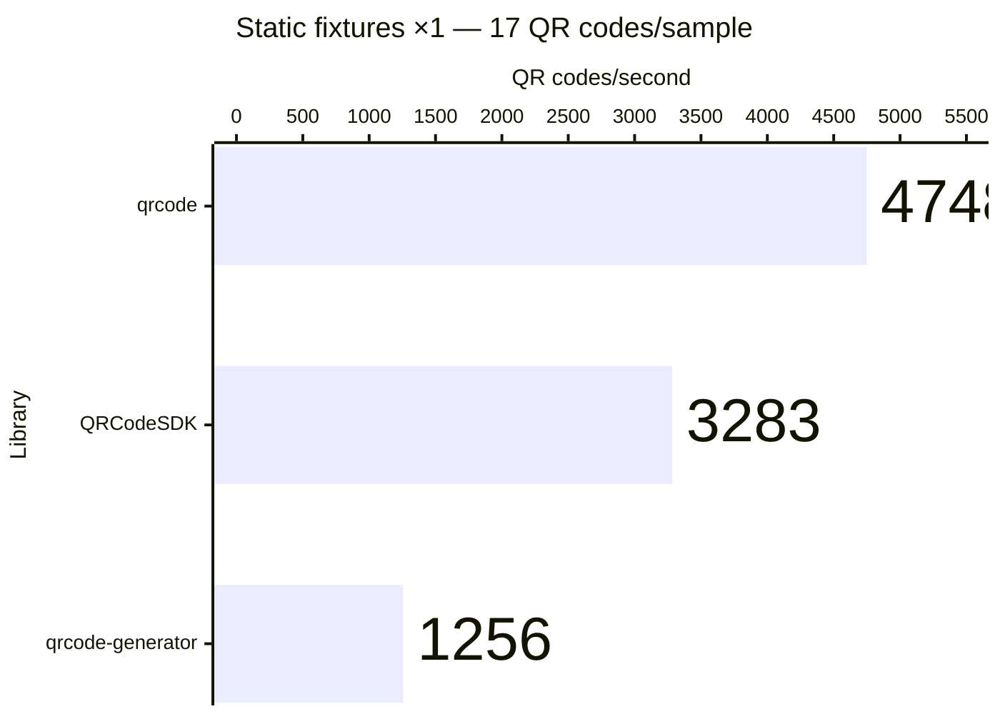
```mermaid
---
config:
  xyChart:
    showDataLabel: true
    showDataLabelOutsideBar: true
---
xychart horizontal
  accTitle: SVG generation: Static fixtures ×1 — 17 QR codes/sample
  accDescr: Throughput calculated from median time. qrcode 4,748 QR codes per second, QRCodeSDK 3,283 QR codes per second, qrcode-generator 1,256 QR codes per second. Higher is better.
  title "Static fixtures ×1 — 17 QR codes/sample"
  x-axis "Library" ["qrcode", "QRCodeSDK", "qrcode-generator"]
  y-axis "QR codes/second" 0 --> 5500
  bar [4748, 3283, 1256]
```

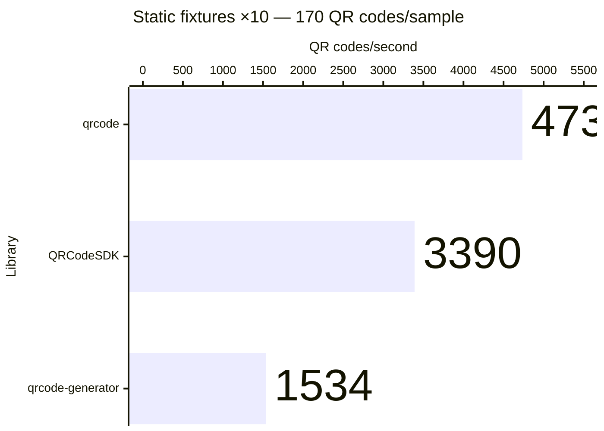
```mermaid
---
config:
  xyChart:
    showDataLabel: true
    showDataLabelOutsideBar: true
---
xychart horizontal
  accTitle: SVG generation: Static fixtures ×10 — 170 QR codes/sample
  accDescr: Throughput calculated from median time. qrcode 4,735 QR codes per second, QRCodeSDK 3,390 QR codes per second, qrcode-generator 1,534 QR codes per second. Higher is better.
  title "Static fixtures ×10 — 170 QR codes/sample"
  x-axis "Library" ["qrcode", "QRCodeSDK", "qrcode-generator"]
  y-axis "QR codes/second" 0 --> 5500
  bar [4735, 3390, 1534]
```

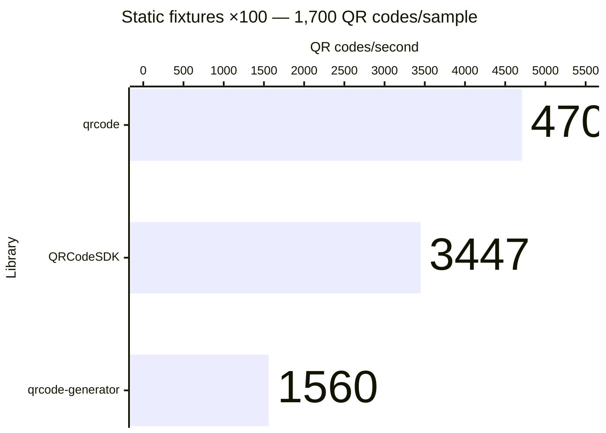
```mermaid
---
config:
  xyChart:
    showDataLabel: true
    showDataLabelOutsideBar: true
---
xychart horizontal
  accTitle: SVG generation: Static fixtures ×100 — 1,700 QR codes/sample
  accDescr: Throughput calculated from median time. qrcode 4,709 QR codes per second, QRCodeSDK 3,447 QR codes per second, qrcode-generator 1,560 QR codes per second. Higher is better.
  title "Static fixtures ×100 — 1,700 QR codes/sample"
  x-axis "Library" ["qrcode", "QRCodeSDK", "qrcode-generator"]
  y-axis "QR codes/second" 0 --> 5500
  bar [4709, 3447, 1560]
```

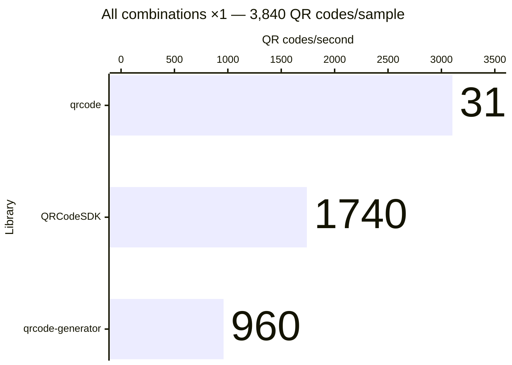
```mermaid
---
config:
  xyChart:
    showDataLabel: true
    showDataLabelOutsideBar: true
---
xychart horizontal
  accTitle: SVG generation: All combinations ×1 — 3,840 QR codes/sample
  accDescr: Throughput calculated from median time. qrcode 3,103 QR codes per second, QRCodeSDK 1,740 QR codes per second, qrcode-generator 960 QR codes per second. Higher is better.
  title "All combinations ×1 — 3,840 QR codes/sample"
  x-axis "Library" ["qrcode", "QRCodeSDK", "qrcode-generator"]
  y-axis "QR codes/second" 0 --> 3500
  bar [3103, 1740, 960]
```

Exact benchmark data

| Workload             | QR codes/sample | Library                 | Median (ms) |      Min–max (ms) | QR codes/second |
| -------------------- | --------------: | ----------------------- | ----------: | ----------------: | --------------: |
| Static fixtures ×1   |              17 | QRCodeSDK v0.0.4        |       5.178 |       5.091–5.837 |           3,283 |
| Static fixtures ×1   |              17 | qrcode v1.5.4           |       3.580 |       3.571–3.628 |           4,748 |
| Static fixtures ×1   |              17 | qrcode-generator v2.0.4 |      13.540 |     11.334–21.817 |           1,256 |
| Static fixtures ×10  |             170 | QRCodeSDK v0.0.4        |      50.144 |     49.328–50.144 |           3,390 |
| Static fixtures ×10  |             170 | qrcode v1.5.4           |      35.904 |     35.869–36.005 |           4,735 |
| Static fixtures ×10  |             170 | qrcode-generator v2.0.4 |     110.822 |   109.720–114.255 |           1,534 |
| Static fixtures ×100 |           1,700 | QRCodeSDK v0.0.4        |     493.164 |   491.952–493.250 |           3,447 |
| Static fixtures ×100 |           1,700 | qrcode v1.5.4           |     360.984 |   360.590–362.269 |           4,709 |
| Static fixtures ×100 |           1,700 | qrcode-generator v2.0.4 |    1089.399 | 1085.461–1091.337 |           1,560 |
| All combinations ×1  |           3,840 | QRCodeSDK v0.0.4        |    2206.358 | 2202.123–2214.664 |           1,740 |
| All combinations ×1  |           3,840 | qrcode v1.5.4           |    1237.508 | 1233.285–1240.167 |           3,103 |
| All combinations ×1  |           3,840 | qrcode-generator v2.0.4 |    4000.323 | 3996.447–4021.201 |             960 |

## Styled SVG generation

```mermaid
---
config:
  xyChart:
    showDataLabel: true
    showDataLabelOutsideBar: true
---
xychart horizontal
  accTitle: Styled SVG generation: Styled fixtures ×1 — 60 QR codes/sample
  accDescr: Throughput calculated from median time. QRCodeSDK 4,611 QR codes per second, qr-code-styling 122 QR codes per second. Higher is better.
  title "Styled fixtures ×1 — 60 QR codes/sample"
  x-axis "Library" ["QRCodeSDK", "qr-code-styling"]
  y-axis "QR codes/second" 0 --> 5500
  bar [4611, 122]
```

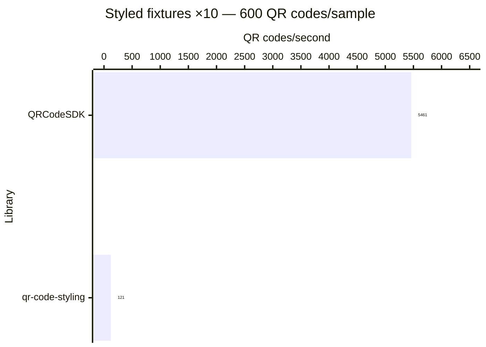
```mermaid
---
config:
  xyChart:
    showDataLabel: true
    showDataLabelOutsideBar: true
---
xychart horizontal
  accTitle: Styled SVG generation: Styled fixtures ×10 — 600 QR codes/sample
  accDescr: Throughput calculated from median time. QRCodeSDK 5,461 QR codes per second, qr-code-styling 121 QR codes per second. Higher is better.
  title "Styled fixtures ×10 — 600 QR codes/sample"
  x-axis "Library" ["QRCodeSDK", "qr-code-styling"]
  y-axis "QR codes/second" 0 --> 6500
  bar [5461, 121]
```

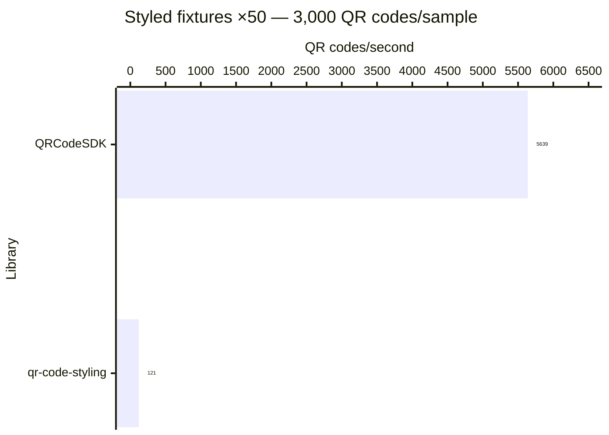
```mermaid
---
config:
  xyChart:
    showDataLabel: true
    showDataLabelOutsideBar: true
---
xychart horizontal
  accTitle: Styled SVG generation: Styled fixtures ×50 — 3,000 QR codes/sample
  accDescr: Throughput calculated from median time. QRCodeSDK 5,639 QR codes per second, qr-code-styling 121 QR codes per second. Higher is better.
  title "Styled fixtures ×50 — 3,000 QR codes/sample"
  x-axis "Library" ["QRCodeSDK", "qr-code-styling"]
  y-axis "QR codes/second" 0 --> 6500
  bar [5639, 121]
```

Exact benchmark data

| Workload            | QR codes/sample | Library                | Median (ms) |        Min–max (ms) | QR codes/second |
| ------------------- | --------------: | ---------------------- | ----------: | ------------------: | --------------: |
| Styled fixtures ×1  |              60 | QRCodeSDK v0.0.4       |      13.013 |       10.955–13.290 |           4,611 |
| Styled fixtures ×1  |              60 | qr-code-styling v1.9.2 |     491.347 |     491.026–492.282 |             122 |
| Styled fixtures ×10 |             600 | QRCodeSDK v0.0.4       |     109.870 |     105.329–110.946 |           5,461 |
| Styled fixtures ×10 |             600 | qr-code-styling v1.9.2 |    4943.056 |   4933.547–4948.572 |             121 |
| Styled fixtures ×50 |           3,000 | QRCodeSDK v0.0.4       |     532.041 |     523.035–541.854 |           5,639 |
| Styled fixtures ×50 |           3,000 | qr-code-styling v1.9.2 |   24699.199 | 24681.063–24725.037 |             121 |

